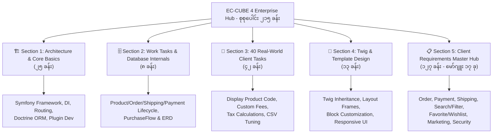

# 🛍️ EC-CUBE 4 Special Enterprise Track Overview

ဂျပန်နိုင်ငံ E-Commerce ဈေးကွက်တွင် ရေပန်းအစားဆုံး ဖြစ်သော **EC-CUBE 4 (4.2 / 4.3+)** ကို အခြေခံမှစ၍ ဂျပန် Client တိုက်ရိုက်လုပ်ငန်းခွင် (Genba) များတွင် အမှန်တကယ် ရေးသားရသော ကုဒ်များ၊ စနစ်ဗိသုကာများ၊ ဒေတာဘေ့စ်ဖွဲ့စည်းပုံများနှင့် Client တောင်းဆိုချက်များကို စနစ်တကျ သင်ယူလေ့လာနိုင်သော အထူးပြု သင်ရိုးဖြစ်ပါသည်။

---

## 🗺️ သင်ရိုးညွှန်းတမ်း မဟာဗျူဟာ မြေပုံ (5 Major Core Sections)

---

## 📑 အပိုင်း ၅ ပိုင်း အသေးစိတ် မာတိကာ (Course Sections)

### 🏗️ ၁။ Section 1: Core Architecture & Basics (၂၅ ခန်း)
EC-CUBE ၏ အခြေခံသဘောတရားများ၊ Symfony 4/5 Framework နှင့် Doctrine ORM ဖွဲ့စည်းပုံ၊ Controller၊ FormType၊ Event Subscribers နှင့် Debugging နည်းစနစ်များ။
- 🔗 **စတင်လေ့လာရန်**: [01. What is EC-CUBE & Architecture Overview](/eccube/01_basics/01-introduction/01-what-is-ec-cube/)
- **အဓိက ခေါင်းစဉ်များ**:
  - Symfony Routing & Dependency Injection Container
  - Doctrine Entity, Repository & Migrations
  - Plugin Development Architecture
  - Admin Screen & Store Settings
  - Japanese Workplace IT Terms & Coding Standards

---

### 🗄️ ၂။ Section 2: Work Tasks & Database Internals (၈ ခန်း)
E-Commerce ၏ နှလုံးသည်းပွတ်ဖြစ်သော Data Model များ၊ `PurchaseFlow` Pipeline Engine၊ Order Status သံသရာနှင့် Database Schema ERD အပြည့်အစုံ။
- 🔗 **စတင်လေ့လာရန်**: [00. Work Tasks & Database Architecture Overview](/eccube/10_work_tasks_and_database/readme/)
- **အဓိက ခေါင်းစဉ်များ**:
  - [01. Product Structure, Work Tasks & Database (`dtb_product`, `dtb_product_class`)](/eccube/10_work_tasks_and_database/01_product_structure_and_database/)
  - [02. Checkout Structure, Work Tasks & Database (`PurchaseFlow`, CartSession)](/eccube/10_work_tasks_and_database/02_checkout_structure_and_database/)
  - [03. Order Structure, Work Tasks & Database (`dtb_order`, `dtb_order_item`)](/eccube/10_work_tasks_and_database/03_order_structure_and_database/)
  - [04. Delivery Structure, Work Tasks & Database (`dtb_shipping`, `dtb_delivery_fee`)](/eccube/10_work_tasks_and_database/04_delivery_structure_and_database/)
  - [05. Payment Structure, Work Tasks & Database (Auth vs Capture, Gateways)](/eccube/10_work_tasks_and_database/05_payment_structure_and_database/)
  - [06. Integrated Lifecycle & Database ERD (Complete System ERD)](/eccube/10_work_tasks_and_database/06_integrated_lifecycle_and_erd/)
  - [07. Checkout Process & Payment Calculation Deep Dive (Tax, Formula)](/eccube/10_work_tasks_and_database/07_checkout_and_payment_calculation_deep_dive/)

---

### 💼 ၃။ Section 3: 40 Real-World Japanese Client Tasks (၄၂ ခန်း)
ဂျပန်ကုမ္ပဏီ Client များထံမှ အများဆုံး လက်ခံရရှိသော လက်တွေ့ လုပ်ငန်းခွင် Tasks ပေါင်း ၄၀ ကို Code အပြည့်အစုံ၊ ပြင်ဆင်ရမည့် နေရာများနှင့် ဖြေရှင်းနည်းများ။
- 🔗 **စတင်လေ့လာရန်**: [Task 01. Display Product Code on Detail Page](/eccube/02_client_tasks/01_display_product_code/)
- **ထင်ရှားသော Client Tasks များ**:
  - Delivery Fee Zero / Free Shipping Preprocessor
  - Point System Custom Calculation
  - Minimum & Maximum Order Quantity Rules
  - Favorite Wishlist CSV Export
  - Custom Form Field Extensions for Admin & Front

---

### 🎨 ၄။ Section 4: Twig & Template Design Customization (၁၃ ခန်း)
EC-CUBE ၏ Twig Template Engine၊ Layout Manager၊ Frame Block စနစ်၊ CSS/JS Asset Pipeline နှင့် Japanese E-Commerce UI/UX Conversion Optimization။
- 🔗 **စတင်လေ့လာရန်**: [00. Template Course Overview & Roadmap](/eccube/09_template_design/00-course-overview-and-roadmap/01-course-overview-and-roadmap/)
- **အဓိက ခေါင်းစဉ်များ**:
  - Twig Template Essentials & Layout Inheritance
  - Page & Block Management in Admin Console
  - Core Pages Deep Dive (Top, Product List, Detail, Cart, Checkout)
  - Custom Template Construction from Scratch
  - Conversion Rate Optimization (CVR) for Japanese Consumers

---

### 📋 ၅။ Section 5: Client Requirements Master Hub (၁၂၇ ခန်း - မော်ဂျူး ၁၇ ခု)
လုပ်ငန်းခွင် လိုအပ်ချက်များအလိုက် သီးသန့် အသေးစိတ် ခွဲထုတ်ထားသော အထူးပြု မော်ဂျူး ၁၇ ခု။
- 🔗 **စတင်လေ့လာရန်**: [📋 Open Client Requirements Hub →](/eccube/requirements/readme/)
- **ပါဝင်သော Module ၁၇ ခု**:
  1. [🛒 Order Management](/eccube/requirements/03_order_management/readme/)
  2. [💳 Payment Gateways & APIs](/eccube/requirements/04_payment/readme/)
  3. [📦 Shipping & Delivery](/eccube/requirements/05_shipping/readme/)
  4. [🏷️ Product Management](/eccube/requirements/product-management/readme/)
  5. [🔍 Search & Filtering](/eccube/requirements/search-filter/readme/)
  6. [🎁 Campaign & Coupons](/eccube/requirements/08_campaign_coupon/readme/)
  7. [❤️ Favorite & Wishlist](/eccube/requirements/favorite-wishlist/readme/)
  8. [👥 Customer Management](/eccube/requirements/06_customer_management/readme/)
  9. [💬 LINE Marketing](/eccube/requirements/line-marketing/readme/)
  10. [✉️ Email Management](/eccube/requirements/email-management/readme/)
  11. [📊 Sales & Analytics Reports](/eccube/requirements/sales-reports/readme/)
  12. [🔔 Event Subscribers & Hooks](/eccube/requirements/event-subscriber/readme/)
  13. [🔌 External API Integration](/eccube/requirements/api-integration/readme/)
  14. [🛡️ Auth Roles & Permissions](/eccube/requirements/auth-permission/readme/)
  15. [🔒 Security Hardening](/eccube/requirements/07_security/readme/)
  16. [⚡ Performance Tuning](/eccube/requirements/performance/readme/)
  17. [📑 Customization Reference List](/eccube/requirements/customization-list/readme/)

---

> 🚀 **အကြံပြုချက်**: သင်ခန်းစာ တစ်ခုချင်းစီကို အပေါ်ဘက်ရှိ **"📑 Course Structure & Lessons"** ခလုတ် သို့မဟုတ် **Chapter Jump Dropdown** ကို အသုံးပြု၍ ခေါင်းစဉ်နှင့် အခန်းအလိုက် အလွယ်တကူ ရှာဖွေသွားလာနိုင်ပါသည်။
