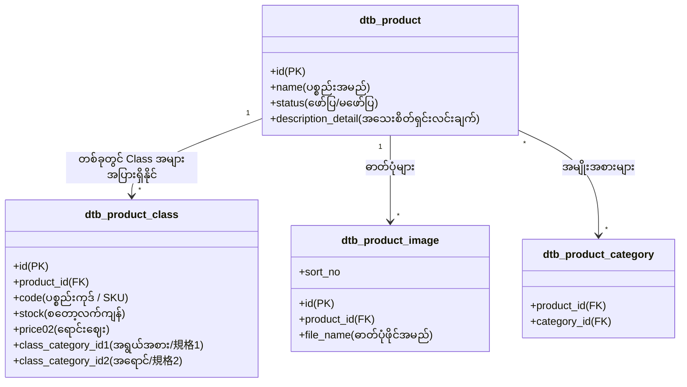

# 01 - Product Structure, Work Tasks & Database (ကုန်ပစ္စည်းစနစ်၊ အလုပ်တာဝန်များနှင့် ဒေတာဘေ့စ်)

> **အစပြုသူများအတွက် အခြေခံအနှစ်ချုပ် (Beginner Summary)**:  
> EC-CUBE တွင် ကုန်ပစ္စည်းတစ်ခုကို စီမံခန့်ခွဲရာတွင် အထူးသတိပြုရမည့် အချက်တစ်ခုရှိပါသည်။ ၎င်းမှာ **Product (ကုန်ပစ္စည်းအမည်/ဖော်ပြချက်)** နှင့် **ProductClass (အရွယ်အစား၊ အရောင်၊ ဈေးနှုန်း၊ စတော့လက်ကျန် စသည့် SKU အချက်အလက်များ)** ကို သီးခြားစီ ခွဲခြားထားခြင်း ဖြစ်ပါသည်။

---

## 🏛️ Product ၏ Working Structure (ဖွဲ့စည်းပုံ သဘောတရား)

အင်္ကျီ (T-Shirt) တစ်ထည်ကို ဥပမာထားကြည့်ပါ-
- အင်္ကျီအမည်- "Classic Cotton T-Shirt" -> **`dtb_product`**
- အနီရောင် (Red) / Size M (ဈေးနှုန်း ¥2,000 / စတော့ 10 ထည်) -> **`dtb_product_class`**
- အပြာရောင် (Blue) / Size L (ဈေးနှုန်း ¥2,200 / စတော့ 5 ထည်) -> **`dtb_product_class`**



> [!NOTE]
> **အရေးကြီးသော မေးခွန်း**: "အကယ်၍ ကုန်ပစ္စည်းတွင် အရွယ်အစား (Size) သို့မဟုတ် အရောင် (Color) ကဲ့သို့ ခွဲခြားစရာ မရှိလျှင်ကော?"  
> **အဖြေ**: EC-CUBE တွင် မည်သည့်ပစ္စည်းမဆို `dtb_product_class` အနည်းဆုံး **၁ ခု (Default Class Category ID = NULL)** မဖြစ်မနေ အလိုအလျောက် တည်ဆောက်ပေးပါသည်။ အကြောင်းမှာ ဈေးနှုန်း (`price02`) နှင့် စတော့ (`stock`) သည် `dtb_product_class` ထဲတွင်သာ တည်ရှိသောကြောင့် ဖြစ်ပါသည်။

---

## 📋 အဆင့်ဆင့် လုပ်ဆောင်ရသော Work Tasks (အလုပ်တာဝန်များ)

ကုန်ပစ္စည်းတစ်ခု ဖန်တီးချိန်မှ Customer က ဝယ်ယူချိန်အထိ လုပ်ဆောင်ရသော အလုပ်တာဝန်များကို အောက်ပါအတိုင်း ၃ ပိုင်း ခွဲခြားနိုင်ပါသည်:

```
[Admin လုပ်ငန်းစဉ်] ➔ ကုန်ပစ္စည်းတင်ခြင်း ➔ စတော့/ဈေးနှုန်းသတ်မှတ်ခြင်း ➔ အမျိုးအစား/ပုံ ထည့်သွင်းခြင်း
                            │
[Database သိမ်းဆည်းမှု] ➔ dtb_product ➔ dtb_product_class ➔ dtb_product_image ➔ dtb_tax_rule
                            │
[Customer လုပ်ငန်းစဉ်] ➔ ပစ္စည်းစာရင်းရှာဖွေခြင်း ➔ အသေးစိတ်ကြည့်ခြင်း ➔ Cart ထဲသို့ ထည့်သွင်းခြင်း
```

### အလုပ်တာဝန် ၁။ ကုန်ပစ္စည်း အခြေခံအချက်အလက် စာရင်းသွင်းခြင်း (Product Master Registration)
- **လုပ်ဆောင်သူ**: Admin (စီမံခန့်ခွဲသူ)
- **တာဝန်ခံ Controller**: `src/Eccube/Controller/Admin/Product/ProductEditController.php`
- **တာဝန်ခံ Form**: `src/Eccube/Form/Type/Admin/ProductType.php`
- **အလုပ်တာဝန် အသေးစိတ်**:
  1. ပစ္စည်းအမည် (`name`)၊ မိတ်ဆက်စာတို (`description_list`) နှင့် အသေးစိတ်ရှင်းပြချက် (`description_detail`) ကို ရိုက်ထည့်ခြင်း။
  2. ရှာဖွေရလွယ်စေရန် Search Word (`search_word`) ထည့်သွင်းခြင်း။
  3. ပစ္စည်းအား ဝဘ်ဆိုက်ပေါ်တွင် တင်မတင် အခြေအနေ (`status_id`: 1 = 公開 Display, 2 = 非公開 Hidden, 3 = 廃止 Discontinued) သတ်မှတ်ခြင်း။

---

### အလုပ်တာဝန် ၂။ SKU / 規格 (Variation) နှင့် ဈေးနှုန်း၊ စတော့ စီမံခြင်း (SKU & Stock Management)
- **လုပ်ဆောင်သူ**: Admin
- **အလုပ်တာဝန် အသေးစိတ်**:
  1. အကယ်၍ ပစ္စည်းတွင် အရွယ်အစား (規格1) နှင့် အရောင် (規格2) ရှိပါက 規格設定 (Class Setting) ပြုလုပ်ခြင်း။
  2. SKU တစ်ခုချင်းစီအလိုက် **ပစ္စည်းကုဒ် (`code`)**၊ **ပုံမှန်ဈေး (`price01`)**၊ **ရောင်းဈေး (`price02`)** တို့ကို သတ်မှတ်ခြင်း။
  3. **စတော့အရေအတွက် (`stock`)**: စတော့အရေအတွက် ရိုက်ထည့်နိုင်သလို ကုန်ခမ်းမှုမရှိ ရောင်းချလိုပါက စတော့အကန့်အသတ်မရှိ (`stock_unlimited = 1`) ဟု သတ်မှတ်နိုင်ပါသည်။
  4. တစ်ဦးလျှင် အများဆုံးဝယ်ယူနိုင်သော အရေအတွက် (`sale_limit`) သတ်မှတ်ခြင်း။

---

### အလုပ်တာဝန် ၃။ အမျိုးအစားနှင့် Tag များ ချိတ်ဆက်ခြင်း (Categories & Tags Linking)
- **လုပ်ဆောင်သူ**: Admin
- **အလုပ်တာဝန် အသေးစိတ်**:
  1. ကုန်ပစ္စည်းကို သက်ဆိုင်ရာ Category (ဥပမာ- Mens ➔ Clothing ➔ T-Shirts) သို့ ချိတ်ဆက်ခြင်း။ ပစ္စည်းတစ်ခုသည် Category တစ်ခုထက်မက ပါဝင်နိုင်ပါသည်။
  2. Tags များ (ဥပမာ- "New Arrival", "Best Seller", "Limited Edition") ရွေးချယ်ပေးခြင်း။

---

### အလုပ်တာဝန် ၄။ ဓာတ်ပုံတင်ခြင်းနှင့် ဦးစားပေး အစီအစဉ်ချခြင်း (Product Image Upload)
- **လုပ်ဆောင်သူ**: Admin
- **အလုပ်တာဝန် အသေးစိတ်**:
  1. ပစ္စည်းဓာတ်ပုံများကို အများအပြား (Multiple Upload) တင်ခြင်း။
  2. ဓာတ်ပုံများ၏ အစီအစဉ် (`sort_no`) ကို Drag & Drop ဖြင့် ပြောင်းလဲနိုင်ပြီး နံပါတ် ၁ နေရာတွင် ရှိသောပုံသည် ပင်မဓာတ်ပုံ (Main Thumbnail) ဖြစ်လာသည်။

---

### အလုပ်တာဝန် ၅။ အခွန်နှုန်းထား သတ်မှတ်ခြင်း (Tax Rule Management)
- **လုပ်ဆောင်သူ**: Admin / စနစ်၏ Auto Engine
- **အလုပ်တာဝန် အသေးစိတ်**:
  1. ဂျပန်နိုင်ငံ၏ စံအခွန်နှုန်းထား (Standard Tax: 10%) သို့မဟုတ် လျှော့ပေါ့အခွန် (Reduced Tax: 8% 軽減税率 - စားသောက်ကုန်များအတွက်) ကို သတ်မှတ်ခြင်း။
  2. `dtb_tax_rule` table တွင် ပစ္စည်းအလိုက် သို့မဟုတ် ProductClass အလိုက် အခွန်နှုန်းထားကို ချိတ်ဆက်ပေးသည်။

---

### အလုပ်တာဝန် ၆။ အသုံးပြုသူ (Customer) ဘက်မှ ကြည့်ရှုခြင်းနှင့် ဝယ်ယူရန် ရွေးချယ်ခြင်း
- **လုပ်ဆောင်သူ**: Customer (ဝယ်ယူသူ)
- **တာဝန်ခံ Controller**: `src/Eccube/Controller/ProductController.php` (`detail()` action)
- **အလုပ်တာဝန် အသေးစိတ်**:
  1. Customer သည် ကုန်ပစ္စည်း အသေးစိတ်စာမျက်နှာ (`/products/detail/{id}`) သို့ ရောက်ရှိလာသည်။
  2. အရွယ်အစားနှင့် အရောင် ရွေးချယ်လိုက်သည့်အခါ AJAX ဖြင့် သက်ဆိုင်ရာ `ProductClass` ၏ ဈေးနှုန်းနှင့် စတော့လက်ကျန် ရှိမရှိ စစ်ဆေးပြီး "Cart ထဲသို့ ထည့်ရန်" ခလုတ်ကို ဖွင့်ပေးသည်။

---

## 🗄️ သက်ဆိုင်ရာ Database Tables များ အသေးစိတ် (Database Schema)

### ၁။ `dtb_product` (ကုန်ပစ္စည်း အချက်အလက်ချုပ် ဇယား)
ပစ္စည်း၏ အဓိက အမည်နှင့် စာသားပိုင်းဆိုင်ရာ အချက်အလက်များကို သိမ်းဆည်းသည်။

| Column အမည် | Data Type | ဖော်ပြချက် (Description) | မှတ်ချက် |
|:---|:---|:---|:---|
| `id` | `INT (PK)` | Product ID (သီးသန့် နံပါတ်) | Auto Increment |
| `name` | `VARCHAR(255)` | ကုန်ပစ္စည်း အမည် (Product Name) | မဖြစ်မနေ လိုအပ် |
| `status_id` | `SMALLINT` | ပြသမှု အခြေအနေ (1: 公開, 2: 非公開, 3: 廃止) | `mtb_product_status` နှင့် ချိတ် |
| `note` | `TEXT` | စီမံခန့်ခွဲသူအတွက် မှတ်စု (Admin Internal Note) | Customer မမြင်ရပါ |
| `description_list` | `TEXT` | ပစ္စည်းစာရင်းတွင် ဖော်ပြမည့် မိတ်ဆက်စာတို | Short Summary |
| `description_detail` | `TEXT` | အသေးစိတ် စာမျက်နှာတွင် ဖော်ပြမည့် ရှင်းလင်းချက် | HTML ပါဝင်နိုင် |
| `search_word` | `TEXT` | ရှာဖွေရာတွင် အသုံးပြုမည့် စကားလုံးများ | Search Keywords |
| `free_area` | `TEXT` | စိတ်ကြိုက်ထည့်သွင်းနိုင်သော HTML နေရာ | Free HTML Area |
| `create_date` | `DATETIME` | ပစ္စည်း စတင်ဖန်တီးသည့် နေ့ရက် | Timestamp |
| `update_date` | `DATETIME` | နောက်ဆုံး ပြင်ဆင်သည့် နေ့ရက် | Timestamp |

---

### ၂။ `dtb_product_class` (SKU၊ ဈေးနှုန်းနှင့် စတော့ ဇယား)
ကုန်ပစ္စည်းတစ်ခု၏ လက်တွေ့ရောင်းချမည့် ဈေးနှုန်း၊ စတော့နှင့် အမျိုးကွဲများကို သိမ်းဆည်းသည့် **အရေးအကြီးဆုံး ဇယား** ဖြစ်သည်။

| Column အမည် | Data Type | ဖော်ပြချက် (Description) | မှတ်ချက် |
|:---|:---|:---|:---|
| `id` | `INT (PK)` | ProductClass ID (SKU ID) | အော်ဒါများတွင် ဤ ID ကို သုံးသည် |
| `product_id` | `INT (FK)` | မိခင် ကုန်ပစ္စည်း ID | `dtb_product.id` သို့ ညွှန်းဆို |
| `product_type_id` | `INT (FK)` | ပစ္စည်းအမျိုးအစား (1: 物販 ပစ္စည်း, 2: ダウンロード ဒေါင်းလုဒ်) | Delivery တွက်ချက်ရာတွင် သုံး |
| `class_category_id1` | `INT (FK)` | ပထမ အုပ်စု (ဥပမာ- အရွယ်အစား M, L) | `dtb_class_category.id` |
| `class_category_id2` | `INT (FK)` | ဒုတိယ အုပ်စု (ဥပမာ- အရောင် Red, Blue) | `dtb_class_category.id` |
| `delivery_duration_id` | `INT (FK)` | ပို့ဆောင်ရန် ကြာချိန် (ဥပမာ- 1~2 ရက်အတွင်း ပို့မည်) | `dtb_delivery_duration.id` |
| `code` | `VARCHAR(255)` | ကုန်ပစ္စည်းကုဒ် / SKU Code (ဥပမာ- `TSHIRT-RED-M`) | စာရင်းကိုင်/ဂိုဒေါင်သုံး ကုဒ် |
| `stock` | `NUMERIC(10,0)` | စတော့လက်ကျန် အရေအတွက် | ဝယ်ယူသည့်အခါ နုတ်သွားသည် |
| `stock_unlimited` | `SMALLINT` | စတော့အကန့်အသတ် မရှိရောင်းမည် (0: ကန့်သတ်, 1: မကန့်သတ်) | 1 ဖြစ်လျှင် စတော့မကုန်ပါ |
| `sale_limit` | `NUMERIC(10,0)` | တစ်ကြိမ်လျှင် အများဆုံး ဝယ်နိုင်သော အရေအတွက် | Maximum Purchase Limit |
| `price01` | `NUMERIC(12,2)` | ပုံမှန်ပေါက်ဈေး (Normal Price / Suggested Price) | ဈေးလျှော့ပြရာတွင် အသုံးဝင် |
| `price02` | `NUMERIC(12,2)` | အမှန်တကယ် ရောင်းချမည့်ဈေး (Selling Price) | အခွန်မပါသော မူရင်းဈေး |
| `delivery_fee` | `NUMERIC(12,2)` | ဤပစ္စည်းအတွက် သီးသန့် ကောက်ခံမည့် ပို့ခ (Individual Fee) | ရှိမှသာ ထည့်သွင်းသည် |

---

### ၃။ ဆက်စပ် အရန် ဇယားများ (Auxiliary Tables)

1. **`dtb_class_name` & `dtb_class_category`**:
   - `dtb_class_name`: 規格 အမည် (ဥပမာ- `Size`, `Color`)
   - `dtb_class_category`: 規格 အခွဲ (ဥပမာ- `S`, `M`, `L`, `Red`, `Blue`)
2. **`dtb_product_category` & `dtb_category`**:
   - `dtb_category`: Category အထပ်ထပ် (Tree structure with `parent_category_id`)
   - `dtb_product_category`: ပစ္စည်းနှင့် Category ချိတ်ဆက်ပေးသော Many-to-Many ဇယား
3. **`dtb_product_image`**:
   - `product_id`, `file_name`, `sort_no` တို့ ပါဝင်ပြီး ပုံများကို သိမ်းဆည်းသည်။
4. **`dtb_tax_rule`**:
   - ပစ္စည်းတစ်ခုချင်းစီ သို့မဟုတ် ProductClass တစ်ခုချင်းစီအတွက် အခွန်နှုန်း (`tax_rate`, ဥပမာ- 10.00%) ကို သတ်မှတ်သည်။

---

## 💡 Developer များအတွက် အရေးကြီးသော သတိပြုဖွယ်ရာများ (Developer Gotchas)

> [!WARNING]
> **၁။ `dtb_product` တွင် ဈေးနှုန်းကို တိုက်ရိုက် ရှာမရနိုင်ပါ**:  
> Product Entity ထဲတွင် `$product->getPrice02()` ဟု တိုက်ရိုက်ခေါ်၍ မရပါ။ အကြောင်းမှာ ဈေးနှုန်းသည် `ProductClass` ထဲတွင် ရှိသောကြောင့် ဖြစ်သည်။  
> ဖြေရှင်းနည်း: `$product->getProductClasses()` မှတဆင့် ရှာရသည် သို့မဟုတ် အနည်းဆုံး/အများဆုံး ဈေးနှုန်းကို `$product->getPrice02Min()` / `$product->getPrice02Max()` ဖြင့် ရယူရပါသည်။
> 
> **၂။ Stock နုတ်ခြင်းကို ProductClass တွင် ပြုလုပ်သည်**:  
> Customer က ဝယ်ယူလိုက်သည့်အခါ Database တွင် `dtb_product_class.stock` ကော်လံမှ အရေအတွက် နုတ်ယူသွားခြင်း ဖြစ်ပါသည်။
