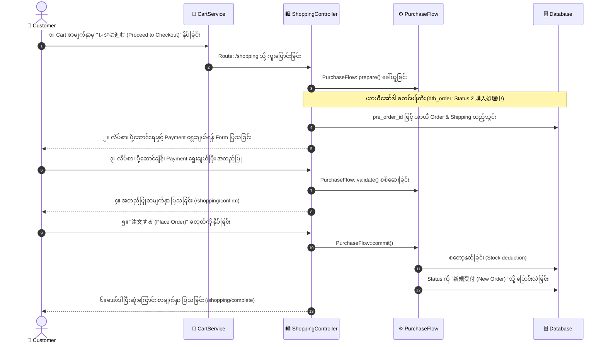

# 02 - Checkout Structure, Work Tasks & Database (ဝယ်ယူမှုလုပ်ငန်းစဉ်၊ အလုပ်တာဝန်များနှင့် ဒေတာဘေ့စ်)

> **အစပြုသူများအတွက် အခြေခံအနှစ်ချုပ် (Beginner Summary)**:  
> **Checkout (購入手続き)** ဆိုသည်မှာ ဝယ်ယူသူ (Customer) က Cart ထဲရှိ ပစ္စည်းများကို အမှန်တကယ် ငွေပေးချေ၍ အော်ဒါအဖြစ် အတည်ပြုလက်ခံရန် ဖြတ်သန်းရသော အဆင့်ဆင့် လုပ်ငန်းစဉ်ဖြစ်ပါသည်။  
> EC-CUBE 4 တွင် Checkout လုပ်ဆောင်ချိန်၌ အော်ဒါကို ချက်ချင်း အတည်မပြုသေးဘဲ **"ယာယီအော်ဒါ (Temporary Order with Status: 購入処理中)"** အဖြစ် Database တွင် အရင်ဆုံး တည်ဆောက်ပြီးမှသာ နောက်ဆုံး အတည်ပြုချက်ကို ရယူပါသည်။

---

## 🔄 Checkout ၏ အဆင့်ဆင့် အလုပ်လုပ်ပုံ (Checkout Flow Lifecycle)

---

## ⚙️ PurchaseFlow Engine ၏ အလုပ်လုပ်ပုံ (The Core Engine)

EC-CUBE 4 တွင် စျေးနှုန်း၊ အခွန်၊ စတော့နှင့် ပို့ဆောင်ခ တွက်ချက်မှု အားလုံးကို **`PurchaseFlow`** ဟုခေါ်သော ဗဟိုအင်ဂျင်က ထိန်းချုပ်ထားပါသည်။ ၎င်းတွင် အဓိက အဆင့် ၄ ဆင့် ရှိပါသည်:

| အဆင့် (Phase) | PHP Method | အလုပ်လုပ်ပုံ ရှင်းလင်းချက် |
|:---|:---|:---|
| **၁။ Prepare (ပြင်ဆင်ခြင်း)** | `PurchaseFlow::prepare()` | ပစ္စည်းများ၊ ပို့ဆောင်ခ၊ အခွန်နှုန်းနှင့် လျှော့စျေးများကို စုစည်းတွက်ချက်ပေးသည်။ |
| **၂။ Validate (စစ်ဆေးခြင်း)** | `PurchaseFlow::validate()` | စတော့လက်ကျန် ရှိမရှိ၊ ပစ္စည်းဈေးနှုန်း ပြောင်းလဲသွားခြင်း ရှိမရှိ၊ ဝယ်ယူခွင့် ကန့်သတ်ချက် ပြည့်မပြည့် စစ်ဆေးသည်။ |
| **၃။ Commit (အတည်ပြု အကောင်အထည်ဖော်ခြင်း)** | `PurchaseFlow::commit()` | Customer က နောက်ဆုံး "Confirm" နှိပ်ချိန်တွင် စတော့နုတ်ခြင်း၊ အမှတ် (Points) နုတ်ခြင်းများကို Database တွင် အပြီးသတ် သိမ်းဆည်းသည်။ |
| **၄။ Rollback (နောက်ပြန်လှည့်ခြင်း)** | `PurchaseFlow::rollback()` | အကယ်၍ Payment ကျရှုံးပါက သို့မဟုတ် Error တက်ပါက နုတ်ထားသော စတော့များကို မူလအတိုင်း ပြန်ဖြည့်ပေးသည်။ |

---

## 📋 အဆင့်ဆင့် လုပ်ဆောင်ရသော Work Tasks (အလုပ်တာဝန်များ)

### အလုပ်တာဝန် ၁။ Cart စစ်ဆေးခြင်းနှင့် Temporary Order စတင်ဖန်တီးခြင်း
- **လုပ်ဆောင်သူ**: System (ShoppingController & CartService)
- **တာဝန်ခံ Controller**: `src/Eccube/Controller/ShoppingController.php` (`index()` action)
- **အလုပ်တာဝန် အသေးစိတ်**:
  1. Cart ထဲတွင် ပစ္စည်း အမှန်တကယ် ရှိမရှိ စစ်ဆေးသည်။
  2. စနစ်က သီးသန့် Random String တစ်ခုဖြစ်သော **`pre_order_id`** ကို ထုတ်ပေးသည်။
  3. `dtb_order` ဇယားတွင် ယာယီအော်ဒါ Record တစ်ခုကို Status `2` (`購入処理中` - Processing) ဖြင့် စတင် Insert ပြုလုပ်သည်။

---

### အလုပ်တာဝန် ၂။ ပို့ဆောင်မည့် လိပ်စာ ရွေးချယ်ခြင်း (Shipping Address Selection)
- **လုပ်ဆောင်သူ**: Customer
- **အလုပ်တာဝန် အသေးစိတ်**:
  1. **အသင်းဝင် (Logged-in Member)**: မိမိ၏ သိမ်းဆည်းထားသော လိပ်စာ သို့မဟုတ် လိပ်စာစာရင်း (`dtb_customer_address`) မှ ရွေးချယ်နိုင်သည်။
  2. **ဧည့်သည် (Non-member / Guest)**: အမည်၊ ဖုန်းနံပါတ်၊ ဂျပန် စာတိုက်သင်္ကေတ (Postal Code) နှင့် လိပ်စာတို့ကို ကိုယ်တိုင် ရိုက်ထည့်ရသည်။
  3. ရွေးချယ်လိုက်သော လိပ်စာအချက်အလက်များကို `dtb_shipping` ဇယားတွင် သွားရောက် သိမ်းဆည်းသည်။

---

### အလုပ်တာဝန် ၃။ ပို့ဆောင်ရေးနည်းလမ်းနှင့် အချိန်ရွေးချယ်ခြင်း (Delivery Method & Timeslot)
- **လုပ်ဆောင်သူ**: Customer
- **အလုပ်တာဝန် အသေးစိတ်**:
  1. စနစ်က ရွေးချယ်ထားသော ပစ္စည်းအမျိုးအစား (Product Type) နှင့် ကိုက်ညီသော ပို့ဆောင်ရေး နည်းလမ်းများ (`dtb_delivery` ဥပမာ- Yamato Cool, Sagawa Regular) ကို ဖော်ပြပေးသည်။
  2. Customer က လိုချင်သော ပို့ဆောင်မည့် နေ့ရက် (`delivery_date`) နှင့် အချိန်အပိုင်းအခြား (`delivery_time_id` ဥပမာ- 14:00~16:00) ကို ရွေးချယ်သည်။
  3. စနစ်က ပို့ဆောင်မည့် ပြည်နယ်/ခရိုင် (`pref_id`) ပေါ်မူတည်၍ ပို့ဆောင်ခ (`delivery_fee`) ကို တွက်ချက်ပေးသည်။

---

### အလုပ်တာဝန် ၄။ ငွေပေးချေမှုစနစ် ရွေးချယ်ခြင်း (Payment Method Selection)
- **လုပ်ဆောင်သူ**: Customer
- **အလုပ်တာဝန် အသေးစိတ်**:
  1. ပို့ဆောင်ရေး နည်းလမ်းနှင့် တွဲဖက် အသုံးပြုနိုင်သော Payment နည်းလမ်းများကိုသာ `dtb_payment_option` ဇယားမှတဆင့် Filter ပြုလုပ်၍ ပြသပေးသည်။ (ဥပမာ- စာတိုက်ပို့စနစ်တွင် ပစ္စည်းရောက်မှ ငွေချေစနစ် COD ကို ပိတ်ထားခြင်း)
  2. ငွေပေးချေမှု ဝန်ဆောင်ခ (`dtb_payment.charge`) ရှိပါက အော်ဒါ စုစုပေါင်းထဲသို့ ပေါင်းထည့်သည်။

---

### အလုပ်တာဝန် ၅။ စုစုပေါင်းကုန်ကျငွေ အတည်ပြုခြင်း (Review & Confirmation Screen)
- **လုပ်ဆောင်သူ**: Customer & PurchaseFlow Engine
- **တာဝန်ခံ Route**: `/shopping/confirm`
- **အလုပ်တာဝန် အသေးစိတ်**:
  1. စနစ်က အောက်ပါ စာရင်းဇယား အားလုံးကို နောက်ဆုံးအကြိမ် တိကျစွာ ပြန်လည် ပေါင်းစပ် တွက်ချက်သည်:
     - ပစ္စည်းတန်ဖိုး စုစုပေါင်း (Subtotal)
     - ပို့ဆောင်ခ စုစုပေါင်း (Delivery Fee Total)
     - ငွေချေမှု အခကြေးငွေ (Payment Charge)
     - အခွန် စုစုပေါင်း (Tax: 10% Standard & 8% Reduced Tax)
     - လျှော့စျေး/အမှတ်များ (Discount / Used Points)
     - အပြီးသတ် ပေးချေရမည့်ငွေ (Payment Total)
  2. Customer အား စစ်ဆေးခွင့်ပေးပြီး "注文する (Confirm Order)" ခလုတ်ကို နှိပ်ခိုင်းသည်။

---

### အလုပ်တာဝန် ၆။ အော်ဒါ အတည်ပြုခြင်းနှင့် စတော့နုတ်ယူခြင်း (Order Finalization)
- **လုပ်ဆောင်သူ**: System (ShoppingController & Payment Gateway)
- **တာဝန်ခံ Route**: `/shopping/checkout`
- **အလုပ်တာဝန် အသေးစိတ်**:
  1. `PurchaseFlow::commit()` ကို ခေါ်ယူပြီး `dtb_product_class` မှ စတော့လက်ကျန်များကို နုတ်ယူသည်။
  2. Credit Card သို့မဟုတ် အခြား Online Payment ဖြစ်ပါက Payment Gateway စနစ်သို့ Token ပေးပို့ကာ အတည်ပြုချက် ရယူသည်။
  3. အားလုံး အောင်မြင်ပါက `dtb_order.order_status_id` ကို `1` (`新規受付` - New Order) သို့ ပြောင်းလဲပြီး CartSession ကို ရှင်းထုတ်ပစ်သည်။

---

## 🗄️ Checkout ကာလအတွင်း အသုံးပြုသော Database Tables များ

### ၁။ `dtb_order` (ယာယီ အဆင့်တွင် သိမ်းဆည်းပုံ)
Checkout စတင်ချိန်တွင် စနစ်က `dtb_order` ဇယားထဲသို့ စတင် သိမ်းဆည်းပုံ:

| Column အမည် | Checkout ကာလအတွင်း တန်ဖိုး | ရှင်းလင်းချက် |
|:---|:---|:---|
| `pre_order_id` | `e.g. 7a8f9c0b1d2e...` | Cart တစ်ခုစီအတွက် ထုတ်ပေးထားသော သီးသန့် Hash Key |
| `order_status_id` | `2` (`購入処理中`) | အော်ဒါမပြီးမချင်း "လုပ်ဆောင်နေဆဲ" အဖြစ် သတ်မှတ်ထားသည် |
| `subtotal` | တွက်ချက်ထားသော ပမာဏ | ပစ္စည်းများ၏ မူရင်းတန်ဖိုးပေါင်း |
| `delivery_fee_total` | ရွေးထားသော ပို့ဆောင်ခ | နေရာဒေသအလိုက် ပို့ခ |
| `charge` | Payment Fee | ရွေးထားသော Payment ၏ အခကြေးငွေ |
| `total` | စုစုပေါင်း ငွေပမာဏ | Subtotal + Delivery + Charge + Tax - Discount |

---

### ၂။ `dtb_shipping` (ပို့ဆောင်ရေး ယာယီ အချက်အလက်)
Checkout ပြုလုပ်နေစဉ် Customer ရွေးချယ်လိုက်သော လိပ်စာနှင့် အချိန်ကို ဤဇယားတွင် သိမ်းဆည်းသည်:

| Column အမည် | Data Type | ဖော်ပြချက် |
|:---|:---|:---|
| `order_id` | `INT (FK)` | သက်ဆိုင်ရာ `dtb_order.id` နှင့် ချိတ်ဆက်သည် |
| `delivery_id` | `INT (FK)` | ရွေးချယ်ထားသော ပို့ဆောင်ရေးကုမ္ပဏီ ID (`dtb_delivery`) |
| `name01`, `name02` | `VARCHAR` | ပစ္စည်းလက်ခံမည့်သူ၏ အမည် |
| `postal_code` | `VARCHAR` | စာတိုက်သင်္ကေတ (Japan Zip Code) |
| `pref_id` | `INT (FK)` | ပြည်နယ်/ခရိုင် ID (ဥပမာ- Tokyo = 13) |
| `addr01`, `addr02` | `VARCHAR` | မြို့နယ်နှင့် အသေးစိတ် လိပ်စာ |
| `delivery_date` | `DATETIME` | ပို့ဆောင်ပေးရန် တောင်းဆိုထားသော နေ့ရက် |
| `delivery_time_id` | `INT (FK)` | ပို့ဆောင်ပေးရန် ရွေးချယ်ထားသော အချိန်အပိုင်းအခြား ID |

---

### ၃။ `dtb_cart` နှင့် `dtb_cart_item` (အသင်းဝင်များအတွက် Persistent Cart)
- အသင်းဝင် (Logged-in Customer) များအတွက် Cart ထဲရှိ ပစ္စည်းများကို Session အပြင် Database ၏ `dtb_cart` နှင့် `dtb_cart_item` ဇယားများတွင်ပါ အလိုအလျောက် ထပ်တူသိမ်းဆည်းပေးထားသည်။  
- ထို့ကြောင့် Device အသစ်မှ ဝင်ရောက်သော်လည်း Cart ထဲရှိ ပစ္စည်းများ ပျောက်မသွားပါ။

---

## 💡 Developer များအတွက် အရေးကြီးသော သတိပြုဖွယ်ရာများ

> [!TIP]
> **၁။ Order Status `2` (購入処理中) ကို Admin တွင် ပြသလေ့မရှိပါ**:  
> Checkout အဆင့်တွင် ရောက်ရှိနေသော အော်ဒါများသည် မပြီးပြတ်သေးသောကြောင့် Admin ၏ ပုံမှန် အော်ဒါစာရင်းတွင် မပေါ်ပါ။ စနစ်၏ Cron Job သို့မဟုတ် သတ်မှတ်ထားသော သက်တမ်းကျော်လွန်ပါက ဤယာယီအော်ဒါများကို ရှင်းထုတ်လေ့ရှိပါသည်။
> 
> **၂။ Double Submit (ခလုတ် နှစ်ကြိမ်နှိပ်မိခြင်း) ကာကွယ်မှု**:  
> EC-CUBE သည် `pre_order_id` နှင့် CSRF Token ကို စစ်ဆေးထားသောကြောင့် ဝယ်ယူသူက "注文する" ခလုတ်ကို နှစ်ကြိမ် ဆက်တိုက် နှိပ်မိသော်လည်း အော်ဒါ နှစ်ခါကျသွားခြင်း သို့မဟုတ် စတော့ နှစ်ဆ နုတ်သွားခြင်း မဖြစ်ပွားအောင် ကာကွယ်ထားပါသည်။
