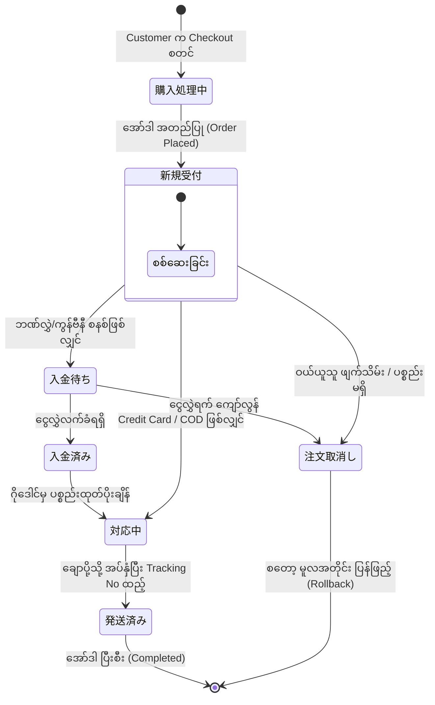

# 03 - Order Structure, Work Tasks & Database (အော်ဒါစနစ်၊ အလုပ်တာဝန်များနှင့် ဒေတာဘေ့စ်)

> **အစပြုသူများအတွက် အခြေခံအနှစ်ချုပ် (Beginner Summary)**:  
> ဝယ်ယူသူ (Customer) က Checkout စာမျက်နှာတွင် အတည်ပြုလိုက်သည်နှင့် တပြိုင်နက် EC-CUBE တွင် တရားဝင် **အော်ဒါ (Order - 注文)** တစ်ခု ဖြစ်ပေါ်လာပါသည်။  
> ဤအော်ဒါသည် ဝယ်ယူသူနှင့် ဆိုင်ပိုင်ရှင်ကြား တရားဝင် အရောင်းအဝယ် စာချုပ်တစ်ခု ဖြစ်သွားပြီး စတော့နုတ်ခြင်း၊ ငွေရှင်းခြင်း၊ ပစ္စည်းထုတ်ပိုးခြင်းနှင့် စာတိုက်သို့ အပ်နှံခြင်း လုပ်ငန်းစဉ်များအားလုံးသည် ဤ **Order** ကို ဗဟိုပြု၍ လည်ပတ်ပါသည်။

---

## 🔄 Order Lifecycle & Statuses (အော်ဒါ အခြေအနေ ပြောင်းလဲမှု သံသရာ)

EC-CUBE 4 တွင် အော်ဒါတစ်ခုသည် အစမှအဆုံး အောက်ပါ Status များအတိုင်း ပြောင်းလဲသွားပါသည်:

### အဓိက Order Status များနှင့် အဓိပ္ပာယ်များ (`mtb_order_status`)

| Status ID | အမည် (ဂျပန်/အင်္ဂလိပ်) | အဓိပ္ပာယ် ရှင်းလင်းချက် | နောက်ဆက်တွဲ စနစ်လုပ်ဆောင်ချက် |
|:---:|:---|:---|:---|
| **1** | **新規受付** (New) | အော်ဒါအသစ် ရောက်ရှိလာခြင်း | Customer ထံ အော်ဒါလက်ခံရရှိကြောင်း အလိုအလျောက် Mail ပို့သည်။ |
| **2** | **購入処理中** (Processing) | Customer က Checkout ပြုလုပ်နေဆဲ (ယာယီ) | ပုံမှန် Admin စာရင်းတွင် မပြပါ။ |
| **3** | **注文取消し** (Cancelled) | အော်ဒါကို ဖျက်သိမ်းလိုက်ခြင်း | နုတ်ထားသော စတော့များကို မူလအတိုင်း အလိုအလျောက် ပြန်ပေါင်းပေးသည်။ |
| **4** | **決済処理中** (Pending Payment) | Payment Gateway တွင် စစ်ဆေးနေဆဲ (3D Secure စသည်) | ငွေရှင်းအောင်မြင်မှသာ Status 1 သို့ ရောက်သည်။ |
| **5** | **対応中** (In Progress) | ဆိုင်ဘက်မှ ပစ္စည်း စတင်ထုတ်ပိုးနေခြင်း | ပစ္စည်းများ စစ်ဆေးပြီး ထုပ်ပိုးခြင်း စတင်သည်။ |
| **6** | **入金待ち** (Awaiting Payment) | Customer ဘက်မှ ငွေလွှဲပေးရန် စောင့်ဆိုင်းနေခြင်း | ဘဏ်လွှဲ/Convenience Store အော်ဒါများတွင် သုံးသည်။ |
| **7** | **入金済み** (Paid) | ငွေပေးချေမှု အောင်မြင်စွာ လက်ခံရရှိပြီး | Admin က ဘဏ်စာရင်းစစ်ပြီး Status ပြောင်းပေးရသည်။ |
| **8** | **発送済み** (Shipped) | ကုန်ပစ္စည်းကို ပို့ဆောင်ရေးယာဉ်ပေါ် တင်ပေးလိုက်ပြီး | ဝယ်ယူသူထံသို့ Tracking No ပါသော Shipping Mail ပို့ပေးသည်။ |

---

## 📋 အဆင့်ဆင့် လုပ်ဆောင်ရသော Work Tasks (အလုပ်တာဝန်များ)

### အလုပ်တာဝန် ၁။ အော်ဒါ အတည်ပြုခြင်းနှင့် အလိုအလျောက် Mail ပို့ခြင်း (Order Finalization & Mail)
- **လုပ်ဆောင်သူ**: System (`ShoppingController` & `MailService`)
- **အလုပ်တာဝန် အသေးစိတ်**:
  1. `dtb_order` တွင် Status ကို `1: 新規受付` ဟု သတ်မှတ်သည်။
  2. စနစ်က သီးသန့် အော်ဒါနံပါတ် (`order_no`) ကို ထုတ်ပေးသည်။
  3. `MailService` က ဝယ်ယူသူ၏ Email သို့ အော်ဒါအချက်အလက် အပြည့်အစုံပါသော "ご注文完了メール (Order Confirmation Email)" ကို အလိုအလျောက် ပေးပို့သည်။

---

### အလုပ်တာဝန် ၂။ ငွေပေးချေမှု အခြေအနေ စစ်ဆေးခြင်း (Payment Verification)
- **လုပ်ဆောင်သူ**: Admin (စီမံခန့်ခွဲသူ)
- **အလုပ်တာဝန် အသေးစိတ်**:
  1. အကယ်၍ ငွေပေးချေမှုနည်းလမ်းသည် **ဘဏ်လွှဲ (Bank Transfer)** ဖြစ်ပါက Admin သည် ကုမ္ပဏီ ဘဏ်စာအုပ်တွင် ငွေဝင်မဝင် စစ်ဆေးသည်။
  2. ငွေဝင်လာပါက Admin Console မှတဆင့် အော်ဒါ Status ကို `6: 入金待ち` မှ `7: 入金済み` သို့ လက်ဖြင့် ပြောင်းလဲပေးသည်။

---

### အလုပ်တာဝန် ၃။ အော်ဒါ အချက်အလက်များ ပြင်ဆင်ခြင်း (Admin Order Editing)
- **လုပ်ဆောင်သူ**: Admin
- **တာဝန်ခံ Controller**: `src/Eccube/Controller/Admin/Order/OrderEditController.php`
- **အလုပ်တာဝန် အသေးစိတ်**:
  1. Customer က ဖုန်းဆက်၍ "အရွယ်အစား ပြောင်းချင်သည်" သို့မဟုတ် "ပစ္စည်း ၁ ခု ထပ်တိုးချင်သည်" ဟု တောင်းဆိုလာသည့်အခါ Admin က အော်ဒါကို ဖွင့်ပြင်သည်။
  2. ပစ္စည်းအရေအတွက် ပြင်ခြင်း၊ ပို့ခ ပြင်ခြင်း သို့မဟုတ် အထူး လျှော့စျေး (Discount) ထည့်ပေးခြင်းတို့ကို ပြုလုပ်သည်။
  3. စနစ်က `PurchaseFlow` ကို ပြန်လည် ခေါ်ယူပြီး စုစုပေါင်း ငွေပမာဏနှင့် အခွန်များကို အလိုအလျောက် ပြန်တွက်ချက်ပေးသည်။

---

### အလုပ်တာဝန် ၄။ အော်ဒါ ဖျက်သိမ်းခြင်းနှင့် စတော့ ပြန်ဖြည့်ခြင်း (Cancellation & Stock Rollback)
- **လုပ်ဆောင်သူ**: Admin သို့မဟုတ် Customer (သတ်မှတ်ချိန်အတွင်း)
- **အလုပ်တာဝန် အသေးစိတ်**:
  1. အော်ဒါကို Cancel လုပ်လိုက်ပါက စနစ်က `PurchaseFlow::rollback()` ကို အလုပ်လုပ်စေသည်။
  2. ဤအော်ဒါတွင် နုတ်ယူထားခဲ့သော ပစ္စည်းများ၏ စတော့လက်ကျန် (`dtb_product_class.stock`) ကို မူလအတိုင်း အလိုအလျောက် ပြန်လည် တိုးမြှင့်ပေးသည်။

---

### အလုပ်တာဝန် ၅။ Customer ၏ ဝယ်ယူမှု မှတ်တမ်း ပြသခြင်း (Customer MyPage)
- **လုပ်ဆောင်သူ**: Customer
- **တာဝန်ခံ Controller**: `src/Eccube/Controller/Mypage/MypageController.php` (`history()` action)
- **အလုပ်တာဝန် အသေးစိတ်**:
  1. Customer သည် မိမိ၏ Account MyPage သို့ ဝင်ရောက်၍ ယခင် ဝယ်ယူခဲ့သော အော်ဒါများ၊ Status အခြေအနေနှင့် Tracking နံပါတ်များကို ကြည့်ရှုနိုင်သည်။

---

## 🗄️ သက်ဆိုင်ရာ Database Tables များ အသေးစိတ် (Database Schema)

### ၁။ `dtb_order` (အော်ဒါချုပ် ဇယား)
အော်ဒါတစ်ခုလုံး၏ ပင်မအချက်အလက်၊ ငွေပမာဏများနှင့် ဝယ်ယူသူ လိပ်စာကို သိမ်းဆည်းသည်။

| Column အမည် | Data Type | ဖော်ပြချက် (Description) |
|:---|:---|:---|
| `id` | `INT (PK)` | စနစ်တွင်း သုံးသော သီးသန့် အော်ဒါ ID |
| `order_no` | `VARCHAR(255)` | ဝယ်ယူသူထံ ပြသသော တရားဝင် အော်ဒါနံပါတ် |
| `customer_id` | `INT (FK)` | အသင်းဝင် ID (ဧည့်သည်ဖြစ်ပါက `NULL`) |
| `order_status_id` | `INT (FK)` | လက်ရှိ အော်ဒါ အခြေအနေ (`mtb_order_status.id`) |
| `name01`, `name02` | `VARCHAR(255)` | ဝယ်ယူသူ၏ မျိုးရိုးအမည် နှင့် အမည် |
| `email` | `VARCHAR(255)` | ဝယ်ယူသူ၏ Email လိပ်စာ |
| `phone_number` | `VARCHAR(32)` | ဆက်သွယ်ရန် ဖုန်းနံပါတ် |
| `postal_code` | `VARCHAR(8)` | ဝယ်ယူသူ၏ စာတိုက်သင်္ကေတ |
| `pref_id` | `INT (FK)` | ပြည်နယ်/ခရိုင် (`mtb_pref.id`) |
| `addr01`, `addr02` | `VARCHAR(255)` | ဝယ်ယူသူ၏ နေရပ်လိပ်စာ |
| `subtotal` | `NUMERIC(12,2)` | ပစ္စည်းများ တန်ဖိုးပေါင်း (အခွန်မပါ) |
| `delivery_fee_total` | `NUMERIC(12,2)` | ပို့ဆောင်ခ စုစုပေါင်း |
| `charge` | `NUMERIC(12,2)` | ငွေချေမှု အခကြေးငွေ (Payment Commission) |
| `discount` | `NUMERIC(12,2)` | လျှော့စျေး စုစုပေါင်း |
| `tax` | `NUMERIC(12,2)` | အခွန် စုစုပေါင်း (Consumption Tax) |
| `total` | `NUMERIC(12,2)` | အခွန်ပါ စုစုပေါင်း ကုန်ကျငွေ |
| `payment_total` | `NUMERIC(12,2)` | အမှန်တကယ် ပေးချေရမည့် အပြီးသတ် ငွေပမာဏ |
| `payment_id` | `INT (FK)` | ရွေးချယ်ခဲ့သော Payment နည်းလမ်း ID (`dtb_payment`) |
| `payment_method_name`| `VARCHAR(255)` | ငွေချေနည်းလမ်း အမည် (အနာဂတ်တွင် နည်းလမ်းပျက်သော်လည်း မှတ်တမ်းကျန်ရန်) |
| `order_date` | `DATETIME` | အော်ဒါ ကျသွားသော အချိန် |
| `payment_date` | `DATETIME` | ငွေချေမှု ပြီးစီးသော အချိန် |

---

### ၂။ `dtb_order_item` (အော်ဒါပါ အကြောင်းအရာများ ဇယား - CRITICAL!)

> [!IMPORTANT]
> **EC-CUBE 4 ၏ အလွန်ထူးခြားသော Architecture Concept**:  
> EC-CUBE 4 တွင် `dtb_order_item` သည် **ကုန်ပစ္စည်း (Product)** တစ်ခုတည်းကိုသာ သိမ်းဆည်းခြင်း မဟုတ်ပါ။  
> **ပို့ဆောင်ခ (Delivery Fee)**၊ **ငွေချေမှု အခကြေးငွေ (Payment Charge)** နှင့် **လျှော့စျေး (Discount)** များကိုပါ `dtb_order_item` ထဲတွင် Row တစ်ခုစီအဖြစ် သိမ်းဆည်းထားပါသည်! ၎င်းကို **`order_item_type_id`** ဖြင့် ခွဲခြားပါသည်။

#### `order_item_type_id` ခွဲခြားပုံ ဇယား:
- `1` = **Product (商品)**: ကုန်ပစ္စည်း
- `2` = **Delivery Fee (送料)**: ပို့ဆောင်ခ
- `3` = **Charge (手数料)**: ငွေချေမှု အခကြေးငွေ
- `4` = **Discount (値引き)**: လျှော့စျေး
- `5` = **Tax Rounding (税端数調整)**: အခွန်ပြေလည်မှု ပိုငွေ/လိုငွေ

| Column အမည် | Data Type | ဖော်ပြချက် (Description) |
|:---|:---|:---|
| `id` | `INT (PK)` | Order Item ID |
| `order_id` | `INT (FK)` | မိခင် အော်ဒါ ID (`dtb_order.id`) |
| `product_id` | `INT (FK)` | ကုန်ပစ္စည်း ID (ပို့ခ/အခကြေးငွေ ဖြစ်လျှင် `NULL`) |
| `product_class_id` | `INT (FK)` | SKU ID (ပို့ခ/အခကြေးငွေ ဖြစ်လျှင် `NULL`) |
| `order_item_type_id` | `INT (FK)` | Item အမျိုးအစား (1: Product, 2: Delivery, 3: Charge, 4: Discount) |
| `product_name` | `VARCHAR(255)` | ဝယ်ယူချိန်က ပစ္စည်းအမည် (သို့မဟုတ် "送料", "手数料") |
| `product_code` | `VARCHAR(255)` | ပစ္စည်းကုဒ် / SKU Code |
| `class_category_name1` | `VARCHAR(255)` | အရွယ်အစား အမည် (ဥပမာ- "Size M") |
| `class_category_name2` | `VARCHAR(255)` | အရောင် အမည် (ဥပမာ- "Blue") |
| `price` | `NUMERIC(12,2)` | ဝယ်ယူချိန်က တစ်ခုချင်း ဈေးနှုန်း (Snapshot) |
| `quantity` | `NUMERIC(10,0)` | အရေအတွက် (ပို့ခဆိုလျှင် 1) |
| `tax` | `NUMERIC(12,2)` | ကျသင့်သော အခွန်ငွေ |
| `tax_rate` | `NUMERIC(5,2)` | အခွန်နှုန်းထား (ဥပမာ- 10.00 သို့မဟုတ် 8.00) |

---

## 💡 အစပြုသူများ မကြာခဏ မေးလေ့ရှိသော မေးခွန်းများ (FAQ)

### မေးခွန်း- နောင်တစ်ချိန်တွင် ပစ္စည်း၏ ဈေးနှုန်း သို့မဟုတ် အမည်ကို Admin မှ ပြောင်းလိုက်ပါက ယခင်က ဝယ်ထားပြီးသား အော်ဒါဟောင်းများထဲတွင် ဈေးနှုန်း လိုက်ပြောင်းသွားပါသလား?
**အဖြေ- လုံးဝ မပြောင်းသွားပါ။**  
`dtb_order_item` ထဲတွင် ဝယ်ယူခဲ့သည့် အချိန်က `product_name`, `price`, `tax_rate`, `class_category_name` များကို Snapshot အဖြစ် တိုက်ရိုက် ကူးယူသိမ်းဆည်းထားသောကြောင့် မူရင်း `dtb_product` တွင် ပြင်ဆင်သော်လည်း အော်ဒါဟောင်းများ၏ စာရင်းအင်း လုံးဝ ပျက်စီးမသွားပါ။
