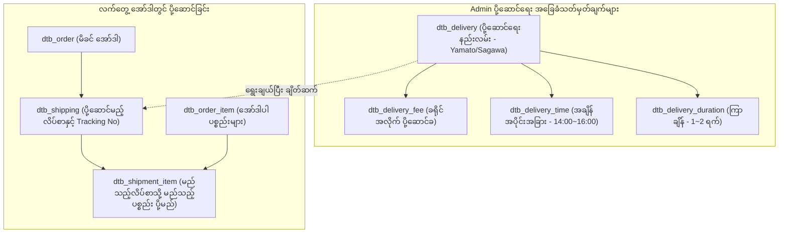

# 04 - Delivery Structure, Work Tasks & Database (ပို့ဆောင်ရေးစနစ်၊ အလုပ်တာဝန်များနှင့် ဒေတာဘေ့စ်)

> **အစပြုသူများအတွက် အခြေခံအနှစ်ချုပ် (Beginner Summary)**:  
> **Delivery (配送・出荷)** စနစ်သည် Customer ဝယ်ယူလိုက်သော ကုန်ပစ္စည်းများကို သတ်မှတ်ထားသော ပို့ဆောင်ရေးကုမ္ပဏီ (ဥပမာ- Yamato, Sagawa, Japan Post) မှတဆင့် Customer ၏ အိမ်တံခါးဝသို့ ရောက်ရှိအောင် ပို့ဆောင်ပေးသည့် စနစ်ဖြစ်ပါသည်။  
> EC-CUBE တွင် ပို့ဆောင်ခ (Shipping Fee)၊ ပို့ဆောင်မည့် နေ့ရက်/အချိန် (Delivery Time)၊ ခြေရာခံနံပါတ် (Tracking Number) နှင့် လိပ်စာခွဲပို့ခြင်း (Multiple Shipping Destinations) တို့ကို စနစ်တကျ ဖွဲ့စည်းထားပါသည်။

---

## 🏛️ Delivery ၏ Working Structure (ဖွဲ့စည်းပုံ သဘောတရား)



> [!NOTE]
> **အော်ဒါ ၁ ခုတွင် ပို့ဆောင်မည့် လိပ်စာ ၁ ခုထက်မက ရှိနိုင်ပါသလား (Multiple Shipping)?**  
> ဟုတ်ကဲ့၊ ရှိနိုင်ပါသည်။ EC-CUBE တွင် လက်ဆောင်ပေးပို့ခြင်း (Gift) ကဲ့သို့သော အခြေအနေများအတွက် အော်ဒါ ၁ ခုတည်း (`dtb_order`) တွင် လိပ်စာ ၂ ခု သို့မဟုတ် ၃ ခုသို့ ခွဲပို့နိုင်သော **複数配送 (Multiple Shipping)** စနစ် ပါဝင်ပါသည်။ ထို့ကြောင့် `dtb_order` နှင့် `dtb_shipping` သည် **One-to-Many (1:N)** ဆက်ဆံရေး ရှိပါသည်။

---

## 📋 အဆင့်ဆင့် လုပ်ဆောင်ရသော Work Tasks (အလုပ်တာဝန်များ)

```
[အဆင့် ၁] ပို့ဆောင်ရေးစနစ်နှင့် ပို့ခ သတ်မှတ်ခြင်း (Admin)
    │
[အဆင့် ၂] Customer က Checkout တွင် လိပ်စာနှင့် အချိန်ရွေးချယ်ခြင်း
    │
[အဆင့် ၃] ဂိုဒေါင်မှ ပစ္စည်းထုတ်ပိုးပြီး ချောစာရွက် (CSV) ထုတ်ယူခြင်း (Admin)
    │
[အဆင့် ၄] ချောပို့ယာဉ်သို့ အပ်နှံပြီး Tracking No ထည့်သွင်းခြင်း (Admin)
    │
[အဆင့် ၅] Customer ထံ ချောပို့ပြီးစီးကြောင်း Mail အလိုအလျောက် ပေးပို့ခြင်း (System)
```

### အလုပ်တာဝန် ၁။ ပို့ဆောင်ရေး နည်းလမ်းများနှင့် ပို့ခများ သတ်မှတ်ခြင်း (Carrier & Fee Setup)
- **လုပ်ဆောင်သူ**: Admin
- **တာဝန်ခံ နေရာ**: Admin Console ➔ 設定 ➔ 店舗設定 ➔ 配送設定
- **အလုပ်တာဝန် အသေးစိတ်**:
  1. ချောပို့ကုမ္ပဏီ အမည် (ဥပမာ- "ヤマト宅急便 (Yamato Takkyubin)") ကို သတ်မှတ်သည်။
  2. ဂျပန်နိုင်ငံ၏ ပြည်နယ် ၄၇ ခု (`mtb_pref`) အလိုက် ကျသင့်မည့် ပို့ဆောင်ခများကို `dtb_delivery_fee` တွင် ထည့်သွင်းသည် (ဥပမာ- Tokyo: ¥700, Hokkaido: ¥1,200)။
  3. ဝယ်ယူငွေ သတ်မှတ်ပမာဏ ကျော်လွန်ပါက ပို့ခ အခမဲ့ (Free Shipping - ဥပမာ- ¥5,000 အထက်) စနစ်ကို သတ်မှတ်သည်။

---

### အလုပ်တာဝန် ၂။ ပို့ဆောင်မည့် အချိန်အပိုင်းအခြားများ သတ်မှတ်ခြင်း (Delivery Time Slots)
- **လုပ်ဆောင်သူ**: Admin
- **အလုပ်တာဝန် အသေးစိတ်**:
  1. ချောပို့ကုမ္ပဏီအလိုက် ရရှိနိုင်သော အချိန်များကို `dtb_delivery_time` တွင် သတ်မှတ်သည် (ဥပမာ- 午前中 Morning, 14:00~16:00, 16:00~18:00, 19:00~21:00)။

---

### အလုပ်တာဝန် ၃။ Checkout တွင် Customer က ရွေးချယ်ခြင်း
- **လုပ်ဆောင်သူ**: Customer
- **အလုပ်တာဝန် အသေးစိတ်**:
  1. Checkout စာမျက်နှာတွင် ပို့ဆောင်စေလိုသော နေ့ရက် (`delivery_date`) နှင့် အချိန် (`delivery_time_id`) ကို ရွေးချယ်သည်။
  2. စနစ်က ရွေးချယ်လိုက်သော ပြည်နယ် (`pref_id`) ကို ကြည့်၍ ပို့ဆောင်ခကို အလိုအလျောက် တွက်ချက်ကာ အော်ဒါထဲ ထည့်သွင်းပေးသည်။

---

### အလုပ်တာဝန် ၄။ ချောပို့ စာရွက်များ ထုတ်ယူခြင်း (Warehouse Slip CSV Export)
- **လုပ်ဆောင်သူ**: Admin / Warehouse Manager
- **အလုပ်တာဝန် အသေးစိတ်**:
  1. Admin စာရင်းမှ "対応中" ဖြစ်နေသော အော်ဒါများကို ရွေးချယ်ပြီး Yamato B2 Cloud သို့မဟုတ် Sagawa e-Hiden စနစ်များသို့ တင်သွင်းရန် ချောပို့ CSV ဖိုင်ကို Export ထုတ်ယူသည်။
  2. ချောပို့ စာရွက်များ ရိုက်ထုတ်ပြီး ပစ္စည်းများကို ထုပ်ပိုး ကပ်လှူသည်။

---

### အလုပ်တာဝန် ၅။ ခြေရာခံနံပါတ် ထည့်သွင်းပြီး "発送済み" သို့ ပြောင်းလဲခြင်း (Tracking Number & Shipped Status)
- **လုပ်ဆောင်သူ**: Admin
- **တာဝန်ခံ Controller**: `src/Eccube/Controller/Admin/Order/OrderEditController.php`
- **အလုပ်တာဝန် အသေးစိတ်**:
  1. ချောပို့ကုမ္ပဏီမှ ရရှိလာသော ချောစာရင်း ခြေရာခံနံပါတ် (**Tracking Number / 伝票番号**) ကို `dtb_shipping.tracking_number` တွင် ရိုက်ထည့်သည်။
  2. အော်ဒါ Status ကို `8: 発送済み (Shipped)` သို့ ပြောင်းလဲလိုက်သည်။
  3. စနစ်က Customer ထံသို့ "発送完了メール (Shipping Complete Email)" ကို ခြေရာခံ Tracking Link နှင့်အတူ အလိုအလျောက် ပေးပို့ပေးသည်။

---

## 🗄️ သက်ဆိုင်ရာ Database Tables များ အသေးစိတ် (Database Schema)

### ၁။ `dtb_delivery` (ပို့ဆောင်ရေး နည်းလမ်းများ ဇယား)
စတိုးဆိုင်တွင် အသုံးပြုသော ပို့ဆောင်ရေး ကုမ္ပဏီ အမျိုးအစားများကို သိမ်းဆည်းသည်။

| Column အမည် | Data Type | ဖော်ပြချက် (Description) |
|:---|:---|:---|
| `id` | `INT (PK)` | ပို့ဆောင်ရေး နည်းလမ်း ID |
| `name` | `VARCHAR(255)` | ဝယ်ယူသူ မြင်တွေ့ရမည့် နာမည် (ဥပမာ- "宅配便", "ネコポス") |
| `service_name` | `VARCHAR(255)` | ဝန်ဆောင်မှု အမည် (ဥပမာ- "ヤマト運輸") |
| `description` | `TEXT` | ရှင်းလင်းဖော်ပြချက် (ဥပမာ- "အေးခဲကုန်ပစ္စည်းများအတွက် သီးသန့်") |
| `confirm_url` | `VARCHAR(255)` | ချောပို့ခြေရာခံ စစ်ဆေးရန် URL (Tracking URL Template) |
| `sort_no` | `INT` | ပြသမှု ဦးစားပေး အစီအစဉ် |
| `visible` | `SMALLINT` | ဖွင့်/ပိတ် (1: ဖွင့်, 0: ပိတ်) |

---

### ၂။ `dtb_delivery_fee` (ဒေသအလိုက် ပို့ခ ဇယား)
ပို့ဆောင်ရေး နည်းလမ်းနှင့် ဂျပန် ၄၇ ခရိုင် ချိတ်ဆက်ထားသော ဇယားဖြစ်သည်။

| Column အမည် | Data Type | ဖော်ပြချက် (Description) |
|:---|:---|:---|
| `id` | `INT (PK)` | Delivery Fee ID |
| `delivery_id` | `INT (FK)` | သက်ဆိုင်ရာ `dtb_delivery.id` |
| `pref_id` | `INT (FK)` | သက်ဆိုင်ရာ ခရိုင် ID (`mtb_pref.id` ဥပမာ- 13 = Tokyo) |
| `fee` | `NUMERIC(12,2)` | ကျသင့်မည့် ပို့ဆောင်ခ ငွေပမာဏ (ဥပမာ- 700.00) |

---

### ၃။ `dtb_shipping` (လက်တွေ့ ပို့ဆောင်မည့် အချက်အလက် ဇယား)
အော်ဒါတစ်ခုချင်းစီတွင် ပစ္စည်းလက်ခံမည့်သူ၊ လိပ်စာနှင့် ပို့ဆောင်ပြီးစီးမှု အခြေအနေများကို သိမ်းဆည်းသည်။

| Column အမည် | Data Type | ဖော်ပြချက် (Description) |
|:---|:---|:---|
| `id` | `INT (PK)` | Shipping ID |
| `order_id` | `INT (FK)` | မိခင် အော်ဒါ ID (`dtb_order.id`) |
| `delivery_id` | `INT (FK)` | အသုံးပြုသော ပို့ဆောင်ရေး ID (`dtb_delivery.id`) |
| `name01`, `name02` | `VARCHAR(255)` | ပစ္စည်းလက်ခံမည့်သူ၏ အမည် |
| `postal_code` | `VARCHAR(8)` | လက်ခံမည့်သူ၏ စာတိုက်သင်္ကေတ |
| `pref_id` | `INT (FK)` | လက်ခံမည့်သူ၏ ပြည်နယ်/ခရိုင် (`mtb_pref.id`) |
| `addr01`, `addr02` | `VARCHAR(255)` | လက်ခံမည့်သူ၏ လိပ်စာ အသေးစိတ် |
| `phone_number` | `VARCHAR(32)` | ဆက်သွယ်ရန် ဖုန်းနံပါတ် |
| `delivery_date` | `DATETIME` | ပို့ဆောင်ပေးရန် တောင်းဆိုထားသော နေ့ရက် |
| `delivery_time_id` | `INT (FK)` | ရွေးချယ်ထားသော အချိန် ID (`dtb_delivery_time.id`) |
| `tracking_number` | `VARCHAR(255)` | ချောပို့ ကုမ္ပဏီ၏ ခြေရာခံနံပါတ် (伝票番号) |
| `shipping_date` | `DATETIME` | ပစ္စည်း အမှန်တကယ် ပို့ဆောင်လိုက်သော နေ့ရက် |

---

### ၄။ `dtb_shipment_item` (ပို့ဆောင်မည့် ပစ္စည်းခွဲဝေမှု ဇယား)
လိပ်စာခွဲပို့ခြင်း (Multiple Shipping) ပြုလုပ်သည့်အခါ မည်သည့်လိပ်စာသို့ မည်သည့်ပစ္စည်း အရေအတွက် မည်မျှ ပို့ရမည်ကို ချိတ်ဆက်ပေးသည်။

| Column အမည် | Data Type | ဖော်ပြချက် (Description) |
|:---|:---|:---|
| `id` | `INT (PK)` | Shipment Item ID |
| `shipping_id` | `INT (FK)` | သက်ဆိုင်ရာ `dtb_shipping.id` |
| `order_item_id` | `INT (FK)` | သက်ဆိုင်ရာ `dtb_order_item.id` |
| `quantity` | `NUMERIC(10,0)` | ဤလိပ်စာသို့ ပို့ရမည့် အရေအတွက် |

---

## 💡 Developer များအတွက် အရေးကြီးသော သတိပြုဖွယ်ရာများ

> [!TIP]
> **ပစ္စည်းသီးသန့် ပို့ခ (Individual Delivery Fee)**:  
> အကယ်၍ ကုန်ပစ္စည်းသည် အလွန်ကြီးမားသော ပရိဘောဂ (သို့မဟုတ်) ရေခဲသေတ္တာ ဖြစ်ပါက `dtb_product_class.delivery_fee` တွင် သီးသန့် ပို့ခ ထည့်သွင်းထားနိုင်ပါသည်။ ထိုအခါ `DeliveryFeeProcessor` သည် ပုံမှန် ဒေသပို့ခအပြင် ဤသီးသန့်ပို့ခကိုပါ ထပ်ပေါင်း တွက်ချက်ပေးပါသည်။
