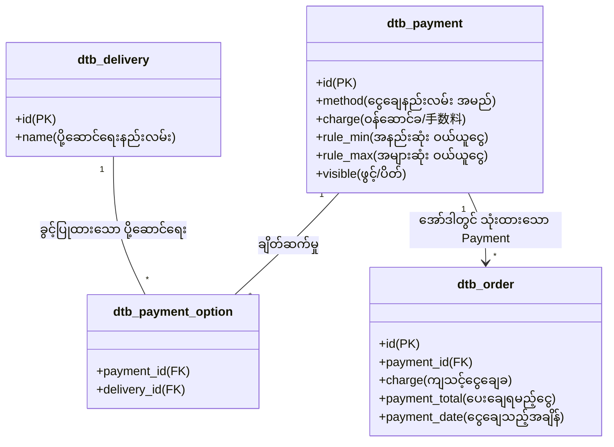

# 05 - Payment Structure, Work Tasks & Database (ငွေပေးချေမှုစနစ်၊ အလုပ်တာဝန်များနှင့် ဒေတာဘေ့စ်)

> **အစပြုသူများအတွက် အခြေခံအနှစ်ချုပ် (Beginner Summary)**:  
> **Payment (決済)** စနစ်သည် Customer ထံမှ ကုန်ပစ္စည်းတန်ဖိုး ငွေကြေးကို ဘေးကင်းလုံခြုံစွာ လက်ခံရယူသော စနစ်ဖြစ်ပါသည်။  
> ဂျပန်နိုင်ငံ E-Commerce တွင် Credit Card တစ်ခုတည်းသာမက **ဘဏ်လွှဲ (銀行振込)**၊ **ပစ္စည်းရောက်မှငွေချေ (代金引換 - COD)**၊ **Convenience Store (コンビニ決済)** စသည့် ငွေချေနည်းလမ်း ပေါင်းစုံကို အသုံးပြုကြပြီး နည်းလမ်းတစ်ခုချင်းစီအလိုက် ငွေရှင်းပုံ သံသရာ မတူညီကြပါ။

---

## 🏛️ Payment ၏ Working Structure (ဖွဲ့စည်းပုံ သဘောတရား)



---

## 💳 Credit Card ငွေချေမှု၏ အလွန်အရေးကြီးသော သဘောတရား (Auth vs Capture)

ဂျပန်နိုင်ငံ E-Commerce တွင် Credit Card ဖြင့် ငွေချေရာ၌ ပစ္စည်း မပို့မီ ငွေကို ချက်ချင်း အပြီးသတ် မဖြတ်ယူဘဲ အဆင့် ၂ ဆင့်ဖြင့် လုပ်ဆောင်လေ့ရှိပါသည်:

```
[အော်ဒါ တင်ချိန်] ➔ 与信 / 仮売上 (Authorization) ➔ Customer ကတ်ထဲမှ ငွေပမာဏကို ခေတ္တ Lock ခတ်ထားသည် (မဖြတ်သေးပါ)
                            │
[ဂိုဒေါင်မှ ပစ္စည်းပို့ချိန်] ➔ 売上確定 (Capture) ➔ ပစ္စည်း အမှန်တကယ် ပို့လိုက်ပြီဖြစ်၍ ငွေကို အပြီးသတ် ဖြတ်ယူလိုက်သည်
```

> [!TIP]
> **အဘယ်ကြောင့် ဤသို့ လုပ်ဆောင်ရသနည်း?**  
> အကယ်၍ ကုန်ပစ္စည်း ဂိုဒေါင်တွင် စတော့ပြတ်လပ်သွားခြင်း သို့မဟုတ် ပို့ဆောင်မရနိုင်တော့ပါက "與信 (Auth)" အဆင့်တွင် Cancel လုပ်လိုက်ပါက Customer ထံမှ ငွေလုံးဝ မဖြတ်ရသေးသဖြင့် Refund (ငွေပြန်အမ်းခ) မကုန်ကျဘဲ ချက်ချင်း ပယ်ဖျက်နိုင်သောကြောင့် ဖြစ်ပါသည်။

---

## 🔗 Delivery နှင့် Payment ၏ ဆက်စပ်မှု (`dtb_payment_option`)

> [!IMPORTANT]
> **အလွန်အရေးကြီးသော မေးခွန်း**: "အဘယ်ကြောင့် Delivery နှင့် Payment ကို `dtb_payment_option` ဖြင့် ကြားခံ တွဲဆက်ပေးထားရသနည်း?"  
> **အဖြေ**: ပို့ဆောင်ရေး နည်းလမ်းအားလုံးတွင် ငွေချေနည်းလမ်း အားလုံးကို သုံး၍မရနိုင်သောကြောင့် ဖြစ်ပါသည်။  
> ဥပမာ- စာတိုက်ပုံးထဲသို့ ထည့်ပေးခဲ့သော **"စာတိုက်ပို့စနစ် (メール便)"** တွင် စာပို့လုလင်က ပိုက်ဆံ တောင်းခံ၍ မရနိုင်သဖြင့် **"ပစ္စည်းရောက်မှငွေချေ (代金引換 - COD)"** ကို ရွေးချယ်ခွင့် ပိတ်ထားရပါမည်။ ဤစည်းမျဉ်းကို `dtb_payment_option` ဇယားက ထိန်းချုပ်ပေးပါသည်။

---

## 📋 အဆင့်ဆင့် လုပ်ဆောင်ရသော Work Tasks (အလုပ်တာဝန်များ)

### အလုပ်တာဝန် ၁။ ငွေချေနည်းလမ်းများနှင့် ဝန်ဆောင်ခများ သတ်မှတ်ခြင်း (Payment Method & Commission Setup)
- **လုပ်ဆောင်သူ**: Admin
- **တာဝန်ခံ နေရာ**: Admin Console ➔ 設定 ➔ 店舗設定 ➔ 支払方法設定
- **အလုပ်တာဝန် အသေးစိတ်**:
  1. နည်းလမ်းအသစ် ထည့်သွင်းခြင်း (ဥပမာ- "代金引換 (Cash on Delivery)")။
  2. ငွေကောက်ခံမှု ဝန်ဆောင်ခ (`charge` ဥပမာ- ¥330) ကို သတ်မှတ်ခြင်း။
  3. အသုံးပြုနိုင်သော ငွေပမာဏ ကန့်သတ်ချက် (ဥပမာ- `rule_max` = ¥300,000 ထက်ကျော်ပါက COD အသုံးမပြုနိုင်စေရန်) သတ်မှတ်ခြင်း။

---

### အလုပ်တာဝန် ၂။ Payment Gateway Plugin ထည့်သွင်းခြင်း (PG Integration)
- **လုပ်ဆောင်သူ**: Admin / Developer
- **အလုပ်တာဝန် အသေးစိတ်**:
  1. EC-CUBE Store မှတဆင့် Stripe, GMO Payment Gateway, SB Payment Service စသည့် Payment Plugin များကို ထည့်သွင်းသည်။
  2. Merchant API Key, Secret Key နှင့် Webhook URL များကို Plugin Setting တွင် ချိတ်ဆက်သည်။

---

### အလုပ်တာဝန် ၃။ Customer ဘက်မှ Checkout တွင် ငွေပေးချေခြင်း
- **လုပ်ဆောင်သူ**: Customer
- **အလုပ်တာဝန် အသေးစိတ်**:
  1. Customer က မိမိ လိုလားသော Payment နည်းလမ်းကို ရွေးချယ်သည်။
  2. Credit Card ဖြစ်ပါက Card နံပါတ်၊ သက်တမ်းကုန်ဆုံးရက်နှင့် CVV တို့ကို Token စနစ်ဖြင့် လုံခြုံစွာ ပေးပို့၍ **3D Secure 2.0 (OTP)** စစ်ဆေးမှုကို ဖြတ်သန်းသည်။

---

### အလုပ်တာဝန် ၄။ အပြိုင် အချက်အလက်ဖလှယ်ခြင်း စနစ် (Asynchronous Webhook Processing)
- **လုပ်ဆောင်သူ**: System (Payment Gateway ➔ EC-CUBE Webhook Controller)
- **အလုပ်တာဝန် အသေးစိတ်**:
  1. Customer က Convenience Store (7-Eleven / Lawson) တွင် ငွေသွားရောက် ပေးချေလိုက်သည့်အခါ Payment Gateway က EC-CUBE ၏ Webhook URL သို့ အချက်အလက် အလိုအလျောက် ပေးပို့သည်။
  2. စနစ်က အဆိုပါ Webhook ကို လက်ခံပြီး သက်ဆိုင်ရာ အော်ဒါ၏ Status ကို `6: 入金待ち` မှ `7: 入金済み` သို့ အလိုအလျောက် ပြောင်းလဲပေးသည်။

---

### အလုပ်တာဝန် ၅။ ပစ္စည်းပို့ဆောင်ချိန်တွင် ငွေအပြီးသတ် ဖြတ်ယူခြင်း (Capture upon Shipment)
- **လုပ်ဆောင်သူ**: Admin / System Plugin
- **အလုပ်တာဝန် အသေးစိတ်**:
  1. Admin က အော်ဒါကို "発送済み" အဖြစ် ပြောင်းလဲလိုက်ချိန်တွင် Payment Plugin က အလိုအလျောက် Gateway API သို့ "Capture (売上確定)" Request ပေးပို့ကာ Customer ၏ ဘဏ်အကောင့်ထဲမှ ငွေကို အပြီးသတ် ဖြတ်ယူသည်။

---

## 🗄️ သက်ဆိုင်ရာ Database Tables များ အသေးစိတ် (Database Schema)

### ၁။ `dtb_payment` (ငွေပေးချေမှု နည်းလမ်းများ ဇယား)

| Column အမည် | Data Type | ဖော်ပြချက် (Description) |
|:---|:---|:---|
| `id` | `INT (PK)` | Payment နည်းလမ်း ID |
| `method` | `VARCHAR(255)` | ဝယ်ယူသူ မြင်တွေ့ရမည့် အမည် (ဥပမာ- "クレジットカード決済", "銀行振込") |
| `charge` | `NUMERIC(12,2)` | ဝန်ဆောင်ခ ကော်မရှင်ငွေ (Payment Commission Fee) |
| `rule_min` | `NUMERIC(12,2)` | ဤနည်းလမ်းကို သုံးနိုင်သော အနည်းဆုံး ဝယ်ယူငွေ |
| `rule_max` | `NUMERIC(12,2)` | ဤနည်းလမ်းကို သုံးနိုင်သော အများဆုံး ဝယ်ယူငွေ |
| `sort_no` | `INT` | စာရင်းတွင် ပြသမည့် ဦးစားပေး အစီအစဉ် |
| `visible` | `SMALLINT` | ဖွင့်/ပိတ် (1: ဖွင့်, 0: ပိတ်) |
| `fixed` | `SMALLINT` | Core စနစ်၏ မူလ နည်းလမ်း ဟုတ်/မဟုတ် (1: Core, 0: Custom) |

---

### ၂။ `dtb_payment_option` (Payment နှင့် Delivery ချိတ်ဆက်မှု ဇယား)

| Column အမည် | Data Type | ဖော်ပြချက် (Description) |
|:---|:---|:---|
| `delivery_id` | `INT (PK, FK)` | သက်ဆိုင်ရာ ပို့ဆောင်ရေး ID (`dtb_delivery.id`) |
| `payment_id` | `INT (PK, FK)` | သက်ဆိုင်ရာ ငွေချေနည်းလမ်း ID (`dtb_payment.id`) |

---

### ၃။ Payment Gateway Plugin များ၏ Database Tables (ဥပမာ)
Payment Plugin များ ထည့်သွင်းလိုက်သည့်အခါ Database တွင် နောက်ထပ် သီးသန့် ဇယားများ တိုးလာလေ့ရှိပါသည်:
- `plg_stripe_customer`: Customer ID နှင့် Stripe Customer Token ချိတ်ဆက်မှု
- `plg_gmo_order_payment`: အော်ဒါ ID နှင့် GMO Order ID, Access ID, Transaction Status
- `plg_sbps_order`: SoftBank Payment Service ၏ Transaction မှတ်တမ်းများ

---

## 💡 Developer များအတွက် အရေးကြီးသော သတိပြုဖွယ်ရာများ

> [!WARNING]
> **PCI DSS လုံခြုံရေး စည်းမျဉ်း (Credit Card အချက်အလက်များ သိမ်းဆည်းခြင်း မပြုရ)**:  
> EC-CUBE ၏ မည်သည့် Database Table (`dtb_order`, `dtb_customer`) တွင်မျှ ဝယ်ယူသူ၏ Credit Card နံပါတ် ၁၆ လုံး သို့မဟုတ် CVV ကို သိမ်းဆည်းထားခြင်း **လုံးဝ မရှိပါ** (သိမ်းဆည်းခွင့်လည်း ဥပဒေအရ မရှိပါ)။  
> ကတ်အချက်အလက်များကို Token အဖြစ် ပြောင်းလဲကာ Payment Gateway ဘက်တွင်သာ လုံခြုံစွာ သိမ်းဆည်းထားပြီး EC-CUBE ဘက်တွင် ယာယီ Token သို့မဟုတ် Transaction ID ကိုသာ မှတ်သားထားပါသည်။
