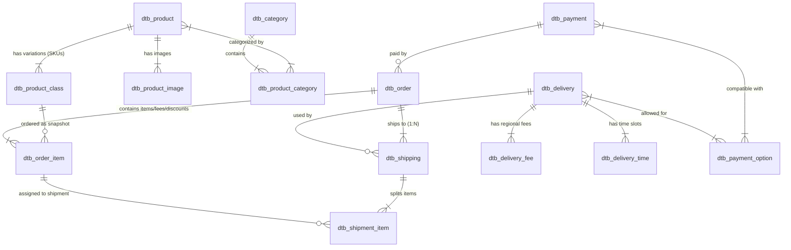

# 06 - Integrated Lifecycle, Complete ERD & Case Study (ပေါင်းစပ်သံသရာ၊ ပြည့်စုံသော ERD နှင့် လက်တွေ့ဇာတ်လမ်း)

> **ခြုံငုံသုံးသပ်ချက် (Overview)**:  
> ယခင်အခန်းများတွင် Product, Checkout, Order, Delivery နှင့် Payment တစ်ခုချင်းစီ၏ တာဝန်များနှင့် Database များကို လေ့လာခဲ့ပြီး ဖြစ်ပါသည်။  
> ဤအခန်းတွင် အဆိုပါ အစိတ်အပိုင်း ၅ ခုလုံး **တစ်ခုနှင့်တစ်ခု မည်သို့ လက်တွဲ၍ ချိတ်ဆက် အလုပ်လုပ်ကြသည်ကို ပြည့်စုံသော Master ERD** နှင့် **လက်တွေ့ ဇာတ်လမ်းနမူနာ** ဖြင့် အစမှအဆုံး သရုပ်ဖော် တင်ပြထားပါသည်။

---

## 🗺️ Master Database ERD (ပြည့်စုံသော ဆက်နွယ်မှုပြ ပုံကြမ်း)

---

## 🎬 လက်တွေ့ နမူနာ ဇာတ်လမ်းဖြင့် Data ပြောင်းလဲပုံကို ခြေရာခံခြင်း (Real-World Case Study)

**ဇာတ်လမ်း အခြေအနေ**:  
ဝယ်ယူသူ **Mr. Tanaka (Tokyo တွင် နေထိုင်သူ)** သည် အပြာရောင် T-Shirt (Size M) **၁ ထည်** (တန်ဖိုး **¥2,200**) ကို ဝယ်ယူရန် ဆုံးဖြတ်လိုက်သည်။  
ပို့ဆောင်ရေးအတွက် **Yamato 宅配便** (Tokyo ပို့ခ **¥700**) ကို ရွေးချယ်ပြီး **Credit Card** ဖြင့် ငွေပေးချေမည်။

---

### အဆင့် ၁။ ပစ္စည်း ရွေးချယ်ခြင်းနှင့် Cart ထဲ ထည့်ခြင်း (Add to Cart)
1. **စနစ်လုပ်ဆောင်ချက်**:  
   - Mr. Tanaka က Size M / Blue ကို ရွေးချယ်သည်။
   - `dtb_product_class` တွင် Stock လက်ကျန် ရှိမရှိ စစ်ဆေးသည် (လက်ရှိ Stock = `10` ထည် ရှိသည်)။
   - Session ထဲရှိ `Cart` ထဲသို့ `product_class_id = 45` ကို အရေအတွက် `1` ဖြင့် ထည့်သွင်းလိုက်သည်။

---

### အဆင့် ၂။ Checkout စတင်ခြင်း (Proceed to Checkout)
1. **စနစ်လုပ်ဆောင်ချက်**:  
   - Mr. Tanaka က `/shopping` သို့ ရောက်ရှိလာသည်။
   - စနစ်က `pre_order_id` (ဥပမာ- `tanaka_pre_123`) ထုတ်ပေးပြီး `dtb_order` တွင် **ယာယီ Record** စတင် ဆောက်သည်:
     - `order_status_id = 2 (購入処理中)`
     - `subtotal = 2000` (အခွန်မပါ)
     - `tax = 200` (10% Tax)

---

### အဆင့် ၃။ လိပ်စာ၊ ပို့ဆောင်ရေးနှင့် Payment ရွေးချယ်ခြင်း
1. **စနစ်လုပ်ဆောင်ချက်**:  
   - Mr. Tanaka က Tokyo လိပ်စာကို ရွေးချယ်သည်။
   - `dtb_shipping` တွင် Tokyo လိပ်စာ သိမ်းဆည်းသည်။
   - Tokyo အတွက် `dtb_delivery_fee` (fee = ¥700) ကို တွက်ထုတ်သည်။
   - `dtb_payment` မှ Credit Card ကို ရွေးချယ်သည် (Card fee = ¥0)။
   - `dtb_order` ၏ စုစုပေါင်း ငွေပမာဏ တွက်ချက်မှု:
     $$\text{Total} = \text{Subtotal (¥2,200)} + \text{Delivery (¥700)} = \text{¥2,900}$$
   - `dtb_order_item` ထဲတွင် အောက်ပါအတိုင်း Row ၂ ခု တည်ဆောက်သည်:
     1. Type 1 (Product): Blue T-Shirt (Price: ¥2,200, Qty: 1)
     2. Type 2 (Delivery): 送料 (Price: ¥700, Qty: 1)

---

### အဆင့် ၄။ အော်ဒါ အတည်ပြုခြင်း ("注文する" နှိပ်ချိန်)
1. **စနစ်လုပ်ဆောင်ချက်**:  
   - Payment Gateway သို့ Credit Card Auth (与信) တောင်းခံသည် ➔ **အောင်မြင်သည်**။
   - `PurchaseFlow::commit()` အလုပ်လုပ်သည်:
     - `dtb_product_class.stock`: မူလ `10` မှ `9` သို့ **၁ ခု နုတ်ယူသွားသည်**။
     - `dtb_order.order_status_id`: `2 (購入処理中)` မှ `1 (新規受付)` သို့ ပြောင်းလဲသွားသည်။
     - `dtb_order.order_no`: တရားဝင် အော်ဒါနံပါတ် `ORD-20261008-001` ထွက်ပေါ်လာသည်။
   - Customer ထံသို့ အော်ဒါလက်ခံရရှိကြောင်း အတည်ပြု Email ပို့ဆောင်သည်။

---

### အဆင့် ၅။ ဂိုဒေါင်မှ ပစ္စည်းထုတ်ပိုးခြင်း (Warehouse Processing)
1. **စနစ်လုပ်ဆောင်ချက်**:  
   - Admin က အော်ဒါစာရင်းတွင် `ORD-20261008-001` အား မြင်တွေ့ရသည်။
   - Status ကို `5 (対応中)` သို့ ပြောင်းကာ ဂိုဒေါင်သို့ ပစ္စည်းထုတ်ရန် ညွှန်ကြားသည်။

---

### အဆင့် ၆။ ချောပို့ယာဉ်သို့ အပ်နှံပြီး ပြီးစီးခြင်း (Shipping & Capture)
1. **စနစ်လုပ်ဆောင်ချက်**:  
   - Yamato ချောပို့မှ ရရှိလာသော Tracking No `1234-5678-9012` ကို `dtb_shipping.tracking_number` တွင် Admin က ရိုက်ထည့်သည်။
   - အော်ဒါ Status ကို `8 (発送済み)` သို့ ပြောင်းလိုက်သည်။
   - Payment Gateway သို့ `Capture (売上確定)` Request ပေးပို့၍ Tanaka ၏ Credit Card ထဲမှ **¥2,900** ကို အပြီးသတ် ဖြတ်ယူလိုက်သည်။
   - Tanaka ထံသို့ Tracking Link ပါသော **"Shipping Confirmation Email"** ရောက်ရှိသွားပြီး အော်ဒါ အောင်မြင်စွာ ပြီးဆုံးသွားသည်။

---

## 📊 Database State Transition Table (ဇယားများအတွင်း တန်ဖိုးများ ပြောင်းလဲပုံ ဇယား)

| အဆင့် (Stage) | `dtb_product_class.stock` | `dtb_order.order_status_id` | `dtb_shipping.tracking_number` | Payment Gateway State |
|:---|:---:|:---:|:---:|:---:|
| **၁။ Cart ထဲထည့်ချိန်** | 10 | (မရှိသေးပါ) | (မရှိသေးပါ) | (မရှိသေးပါ) |
| **၂။ Checkout စတင်ချိန်** | 10 | 2 (購入処理中) | NULL | (မရှိသေးပါ) |
| **၃။ Confirm နှိပ်ချိန်** | **9 (နုတ်လိုက်သည်)** | **1 (新規受付)** | NULL | **與信 (Authorized)** |
| **၄။ ဂိုဒေါင်ထုတ်ပိုးချိန်** | 9 | 5 (対応中) | NULL | 與信 (Authorized) |
| **၅။ စာတိုက်ပို့ပြီးချိန်** | 9 | **8 (発送済み)** | **1234-5678-9012** | **売上確定 (Captured)** |
| *(အကယ်၍ Cancel ဖြစ်ပါက)* | **10 (ပြန်ပေါင်းပေးသည်)** | **3 (注文取消し)** | - | **取消 (Voided / Refunded)** |

---

## 📖 ဂျပန် E-Commerce နည်းပညာ ဝေါဟာရများ အဘိဓာန် (Glossary for Beginners)

EC-CUBE Project များတွင် နေ့စဉ်နှင့်အမျှ တွေ့ကြုံရမည့် ဂျပန် ဝေါဟာရများ ဖြစ်ပါသည်:

| ဂျပန် ဝေါဟာရ (Kanji) | အသံထွက် (Romaji) | မြန်မာလို အဓိပ္ပာယ် | E-Commerce စနစ်တွင်း အသုံးဝင်ပုံ |
|:---|:---|:---|:---|
| **商品** | Shōhin | ကုန်ပစ္စည်း | `dtb_product` (Product Master) |
| **規格** | Kikaku | ပစ္စည်းအမျိုးကွဲ (SKU) | အရွယ်အစား (Size)၊ အရောင် (Color) ခွဲခြားမှု |
| **在庫** | Zaiko | စတော့လက်ကျန် | `dtb_product_class.stock` (Inventory) |
| **購入手続き / レジ** | Kōnyū Tetsuzuki / Reji | Checkout (ဝယ်ယူမှုလုပ်ငန်းစဉ်) | Shopping flow စာမျက်နှာများ |
| **注文** | Chūmon | အော်ဒါ (Order) | `dtb_order` |
| **新規受付** | Shinki Uketsuke | အော်ဒါအသစ် ရောက်ရှိခြင်း | Initial Order Status (ID: 1) |
| **送料** | Sōryō | ပို့ဆောင်ခ (Shipping Fee) | `dtb_delivery_fee` |
| **手数料** | Tesūryō | ဝန်ဆောင်ခ (Payment Fee) | COD သို့မဟုတ် ကတ်အတွက် အပိုကောက်ခံငွေ |
| **配送業者** | Haisō Gyōsha | ချောပို့ကုမ္ပဏီ (Carrier) | Yamato, Sagawa, Japan Post |
| **伝票番号 / 追跡番号** | Denpyō Bangō / Tsuiseki Bangō | ချောစာရင်း / ခြေရာခံနံပါတ် | Tracking Number |
| **出荷 / 発送** | Shukka / Hassō | ပစ္စည်းပို့ဆောင်ခြင်း (Shipping) | ဂိုဒေါင်မှ ပစ္စည်းထွက်ခွာခြင်း |
| **与信 / 仮売上** | Yoshin / Kari-uriage | ကြိုတင် ခွင့်ပြုချက်ယူခြင်း (Auth) | Credit Card ငွေခေတ္တ ထိန်းထားခြင်း |
| **売上確定** | Uriage Kakutei | ငွေအပြီးသတ် ဖြတ်ယူခြင်း (Capture) | ပစ္စည်းပို့ပြီးမှ ငွေအပြီး ဖြတ်ခြင်း |
| **注文取消し** | Chūmon Torikeshi | အော်ဒါ ဖျက်သိမ်းခြင်း (Cancel) | Order Cancellation & Stock Rollback |
| **複数配送** | Fukusū Haisō | လိပ်စာခွဲပို့ခြင်း | Multiple Shipping destinations |
| **軽減税率** | Keigen Zeiritsu | လျှော့ပေါ့အခွန် (8%) | အစားအသောက်များအတွက် ၈% အခွန် |
