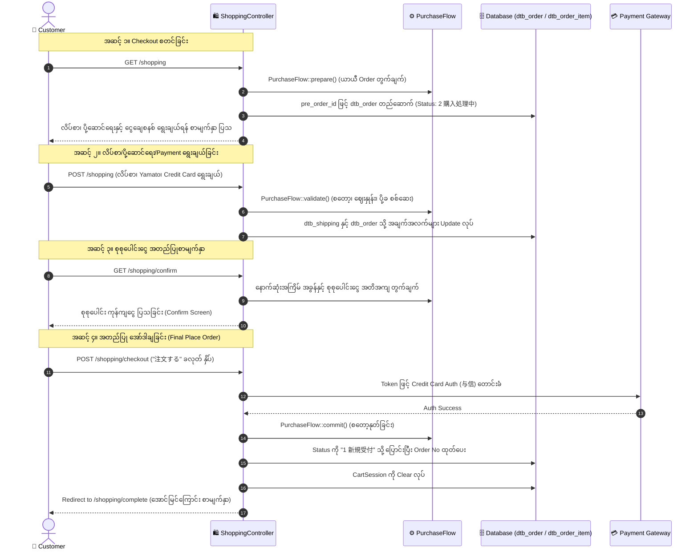
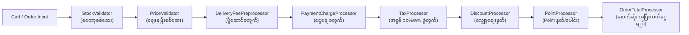

# 07 - Checkout Process & Payment Calculation Deep Dive (Checkout လုပ်ငန်းစဉ်နှင့် ငွေတွက်ချက်မှုစနစ် အသေးစိတ်)

> **အစပြုသူများအတွက် အခြေခံအနှစ်ချုပ် (Beginner Summary)**:  
> E-Commerce စနစ်တစ်ခုတွင် အရေးအကြီးဆုံးနှင့် အမှားအယွင်း လုံးဝမခံနိုင်သော နေရာမှာ **Checkout (ဝယ်ယူမှုလုပ်ငန်းစဉ်)** နှင့် **Payment Calculation (ငွေပမာဏ တွက်ချက်မှုစနစ်)** ဖြစ်ပါသည်။  
> ဂျပန်နိုင်ငံ၏ စားသုံးသူအခွန်စနစ် (Consumption Tax) တွင် **ပုံမှန်အခွန် (Standard Tax: 10%)** နှင့် အစားအသောက်များအတွက် **လျှော့ပေါ့အခွန် (Reduced Tax: 8% 軽減税率)** ဟူ၍ အခွန်နှုန်း ၂ မျိုးရှိသဖြင့် ပို့ဆောင်ခ၊ ငွေချေခနှင့် လျှော့စျေးများကို တိကျစွာ တွက်ချက်သိမ်းဆည်းရပါသည်။

---

## 🔄 အပြည့်အစုံ Checkout Pipeline (URL & Request Lifecycle)

ဝယ်ယူသူ (Customer) က Cart ထဲရှိ ပစ္စည်းများကို စတင် ဝယ်ယူချိန်မှ အော်ဒါ ပြီးဆုံးသည်အထိ အောက်ပါ URL လမ်းကြောင်းများအတိုင်း အဆင့်ဆင့် ဖြတ်သန်းရပါသည်:



---

## 🧮 Payment Total Master Formula (ငွေတွက်ချက်မှု မူသေနည်းချုပ်)

EC-CUBE တွင် အပြီးသတ် ပေးချေရမည့် ငွေပမာဏ (`payment_total`) ကို အောက်ပါ တရားဝင် မူသေနည်းဖြင့် တွက်ချက်ပါသည်:

$$\mathbf{Payment\ Total} = \mathbf{Subtotal} + \mathbf{Delivery\ Fee} + \mathbf{Payment\ Charge} + \mathbf{Tax} - \mathbf{Discount} - \mathbf{Points}$$

```
┌────────────────────────────────────────────────────────────────────────┐
│                        စုစုပေါင်း ကျသင့်ငွေတွက်ချက်မှု                  │
├────────────────────────────────────────────────────────────────────────┤
│  (+) Subtotal (小計)             : ကုန်ပစ္စည်းများ၏ မူရင်းတန်ဖိုးပေါင်း  │
│  (+) Delivery Fee (送料)         : ပို့ဆောင်ခ စုစုပေါင်း                │
│  (+) Payment Charge (決済手数料) : ငွေချေမှု ဝန်ဆောင်ခ (COD စသည်)      │
│  (+) Total Tax (消費税合計)      : ၁၀% နှင့် ၈% အခွန် စုစုပေါင်း       │
│  (-) Discount (値引き)           : ကူပွန် သို့မဟုတ် လျှော့စျေး            │
│  (-) Use Points (利用ポイント)   : သုံးစွဲလိုက်သော အမှတ် (1pt = ¥1)     │
├────────────────────────────────────────────────────────────────────────┤
│  (=) Payment Total (お支払い合計): Customer အမှန်တကယ် ပေးချေရမည့်ငွေ  │
└────────────────────────────────────────────────────────────────────────┘
```

---

## 🔍 တွက်ချက်မှု အစိတ်အပိုင်း တစ်ခုချင်းစီ၏ အတွင်းပိုင်း Logic (Calculation Breakdown)

### ၁။ Subtotal (小計 - ကုန်ပစ္စည်း တန်ဖိုးပေါင်း)
- **Database Column**: `dtb_order.subtotal`
- **တွက်ချက်ပုံ**: Cart ထဲရှိ ပစ္စည်းတစ်ခုချင်းစီ၏ မူရင်းဈေးနှုန်း (`price02`) $\times$ အရေအတွက် (`quantity`) ပေါင်းလဒ် ဖြစ်ပါသည်။
- **အခွန်ပါ/မပါ**: EC-CUBE 4 ၏ `dtb_order.subtotal` သည် အခွန်မပါသော ပစ္စည်းတန်ဖိုး သီးသန့် ဖြစ်သည်။

---

### ၂။ Consumption Tax Calculation (消費税 တွက်ချက်မှု - 10% vs 8%)
ဂျပန်နိုင်ငံ၏ ၂၀၁၉ အခွန်ဥပဒေအရ စတိုးဆိုင်တစ်ခုတွင် အခွန်နှုန်း ၂ မျိုး ရောနှော ဝယ်ယူနိုင်ပါသည်:

| အခွန်အမျိုးအစား | ဂျပန်အမည် | သက်ဆိုင်သော ကုန်ပစ္စည်းများ | အခွန်နှုန်း |
|:---|:---|:---|:---:|
| **Standard Tax** | 標準税率 | အဝတ်အထည်၊ လူသုံးကုန်၊ ပရိဘောဂ၊ **ပို့ဆောင်ခ (送料)**၊ **ငွေချေခ (手数料)** | **10%** |
| **Reduced Tax** | 軽減税率 | စားသောက်ကုန်၊ အဖျော်ယမကာ (အရက်မပါ) | **8%** |

#### အခွန် တွက်ချက်ပုံ သဘောတရား:
$$\text{Tax Amount} = \text{Taxable Price} \times \frac{\text{Tax Rate}}{100}$$

#### အခွန်အပိုင်းအစ ရှင်းတမ်း (Rounding Rule - `mtb_round_type`):
အခွန်တွက်ရာတွင် ဒသမကိန်း (ဥပမာ- ¥185.6) ထွက်လာပါက ဆိုင်၏ Setting အတိုင်း ပြုပြင်ပါသည်:
- **1 (切り捨て - Floor)**: ဒသမကိန်းကို ဖြုတ်ပစ်သည် (¥185.6 ➔ ¥185) - *ဂျပန်တွင် အသုံးအများဆုံး*
- **2 (四捨五入 - Round)**: ၅ အထက်ဆို တင်ပြီး ၄ အောက်ဆို ဖြုတ်သည် (¥185.6 ➔ ¥186)
- **3 (切り上げ - Ceil)**: အမြဲ အပေါ်သို့ တင်သည် (¥185.1 ➔ ¥186)

---

### ၃။ Delivery Fee Calculation (送料 တွက်ချက်မှု)
- **Database Column**: `dtb_order.delivery_fee_total`
- **တာဝန်ခံ Class**: `src/Eccube/Service/PurchaseFlow/Processor/DeliveryFeePreprocessor.php`
- **တွက်ချက်ပုံ စည်းမျဉ်း ၃ ဆင့်**:
  1. **အခြေခံ ပို့ခ**: ပို့ဆောင်မည့် ခရိုင် (`pref_id`) ကို ကြည့်၍ `dtb_delivery_fee` မှ မူရင်းပို့ခကို ယူသည် (ဥပမာ- Tokyo = ¥700)။
  2. **သီးသန့် ပို့ခ (Individual Fee)**: အကယ်၍ ဝယ်ယူသော ပစ္စည်းတွင် သီးသန့်ပို့ခ (`dtb_product_class.delivery_fee`) ပါဝင်ပါက အခြေခံပို့ခထဲသို့ ပေါင်းထည့်သည်။
  3. **ပို့ခ အခမဲ့ စည်းမျဉ်း (Free Shipping)**: အကယ်၍ ပစ္စည်းတန်ဖိုး စုစုပေါင်းသည် ဆိုင်၏ သတ်မှတ်ချက် (ဥပမာ- ¥5,000 အထက်) ပြည့်မီပါက ပို့ခကို **¥0** အဖြစ် ပြောင်းလဲပေးသည်။
  4. **အခွန်**: ပို့ဆောင်ခသည် ဝန်ဆောင်မှု ဖြစ်သောကြောင့် **၁၀% အခွန်** အမြဲ အကျုံးဝင်ပါသည်။

---

### ၄။ Payment Charge (決済手数料 - ငွေချေမှု ဝန်ဆောင်ခ)
- **Database Column**: `dtb_order.charge`
- **တာဝန်ခံ Class**: `src/Eccube/Service/PurchaseFlow/Processor/PaymentChargeProcessor.php`
- **အလုပ်လုပ်ပုံ**:
  - ဝယ်ယူသူ ရွေးချယ်လိုက်သော Payment နည်းလမ်း၏ သတ်မှတ် ကော်မရှင်ခ (`dtb_payment.charge`) ကို အော်ဒါထဲ ပေါင်းထည့်သည်။
  - ဥပမာ- **代金引換 (COD)** ရွေးချယ်ပါက စာပို့သမား ကောက်ခံခအတွက် **¥330** ပေါင်းထည့်သည်။ Credit Card သို့မဟုတ် Bank Transfer ဖြစ်ပါက ပုံမှန်အားဖြင့် **¥0** ဖြစ်သည်။
  - ငွေချေခသည်လည်း **၁၀% အခွန်** အကျုံးဝင်ပါသည်။

---

### ၅။ Discount & Coupons (値引き - လျှော့စျေး)
- **Database Column**: `dtb_order.discount`
- Customer က Coupon ကုဒ် ရိုက်ထည့်လိုက်ပါက ကူပွန်တန်ဖိုး (ဥပမာ- ¥500) ကို စုစုပေါင်းငွေထဲမှ နှုတ်ပေးပါသည်။
- EC-CUBE တွင် လျှော့စျေးကို `dtb_order_item` ထဲ၌ `order_item_type_id = 4` ဖြင့် အနှုတ်လက္ခဏာ (Negative value: `-500`) အဖြစ် သီးသန့် Row ဖြင့် သိမ်းဆည်းပါသည်။

---

### ၆။ Points (ポイント利用 - ရမှတ်များ)
- **Database Column**: `dtb_order.use_point`
- အသင်းဝင် Customer သည် မိမိ စုဆောင်းထားသော Point များကို သုံးစွဲနိုင်သည် (1 Point = 1 Yen တန်ဖိုးရှိသည်)။
- အကယ်၍ ဝယ်သူက Point 300 သုံးပါက ပေးချေရမည့်ငွေထဲမှ ¥300 ချက်ချင်း လျော့ကျသွားပါသည်။

---

## ⚙️ PurchaseFlow Processors Pipeline (နောက်ကွယ် Engine ၏ တွက်ချက်မှု အစဉ်)

EC-CUBE 4 တွင် တွက်ချက်မှုများကို Class တစ်ခုချင်းစီအလိုက် သီးခြားစီ တာဝန်ခွဲဝေ ထမ်းဆောင်စေသော **Pipeline Pattern** ဖြင့် တည်ဆောက်ထားပါသည်:



---

## 📊 လက်တွေ့ ကိန်းဂဏန်း တွက်ချက်မှု စံပြဥပမာ (Concrete Numerical Example)

ဝယ်ယူသူတစ်ဦးက အောက်ပါအတိုင်း ဈေးဝယ်ယူသည်ဟု ယူဆပါစို့:

1. **ပစ္စည်း ၁ (အဝတ်အထည်)**: Shirt = **¥3,000** (Standard Tax: 10%)
2. **ပစ္စည်း ၂ (အစားအစာ)**: Japanese Green Tea = **¥1,000** (Reduced Tax: 8%)
3. **ပို့ဆောင်ရေး**: Yamato Takkyubin (Tokyo) = **¥700** (10% Tax)
4. **ငွေပေးချေမှု**: 代金引換 (COD) = **¥300** (10% Tax)
5. **လျှော့စျေး**: ကူပွန်လျှော့ငွေ = **-¥500**

---

### အဆင့်ဆင့် တွက်ချက်မှု ရှင်းတမ်း:

#### အဆင့် ၁။ မူရင်းကုန်ပစ္စည်းတန်ဖိုး ပေါင်းခြင်း (Subtotal)
$$\text{Subtotal} = 3000 + 1000 = \mathbf{¥4,000}$$

#### အဆင့် ၂။ အခွန် ခွဲခြားတွက်ချက်ခြင်း (Tax Breakdown)
- **၁၀% အခွန် အကျုံးဝင်သော ကဏ္ဍများ**:
  - Shirt (¥3,000) + ပို့ခ (¥700) + COD ငွေချေခ (¥300) = **¥4,000**
  - ၁၀% အခွန်ငွေ = $4000 \times 10\% = \mathbf{¥400}$
- **၈% အခွန် အကျုံးဝင်သော ကဏ္ဍများ**:
  - Green Tea (¥1,000)
  - ၈% အခွန်ငွေ = $1000 \times 8\% = \mathbf{¥80}$
- **စုစုပေါင်း အခွန် (Total Tax)**:
  $$\text{Total Tax} = 400 + 80 = \mathbf{¥480}$$

#### အဆင့် ၃။ အပြီးသတ် ပေးချေရမည့်ငွေ ပေါင်းချုပ်ခြင်း (Payment Total)
$$\begin{aligned}
\text{Payment Total} &= \text{Subtotal (¥4,000)} + \text{Delivery (¥700)} + \text{Charge (¥300)} \\
&\quad + \text{Tax (¥480)} - \text{Discount (¥500)} \\
&= \mathbf{¥4,980}
\end{aligned}$$

---

## 🗄️ Database တွင် တိကျစွာ ဝင်ရောက်သွားသော Record များ

အထက်ပါ ဝယ်ယူမှုသည် Database ဇယားများတွင် အောက်ပါအတိုင်း Rows များအဖြစ် သိမ်းဆည်းသွားပါသည်:

### ၁။ `dtb_order` Record (အော်ဒါချုပ် ဇယား)

| Column အမည် | Database ထဲ ဝင်သွားသော တန်ဖိုး | အဓိပ္ပာယ် |
|:---|:---:|:---|
| `subtotal` | `4000.00` | ပစ္စည်းတန်ဖိုး စုစုပေါင်း |
| `delivery_fee_total` | `700.00` | ပို့ဆောင်ခ |
| `charge` | `300.00` | COD ငွေချေမှု အခကြေးငွေ |
| `discount` | `500.00` | ကူပွန် လျှော့စျေး |
| `tax` | `480.00` | စုစုပေါင်း အခွန် (10% + 8%) |
| `total` | `4980.00` | အခွန်ပါ စုစုပေါင်း ကုန်ကျငွေ |
| `payment_total` | `4980.00` | Customer အမှန်တကယ် ပေးချေရမည့် ငွေ |

---

### ၂။ `dtb_order_item` Records (အကြောင်းအရာ အသေးစိတ် ဇယား)

ဤဇယားတွင် ပစ္စည်းများသာမက ပို့ခနှင့် လျှော့စျေးများပါ Row တစ်ခုစီအဖြစ် အောက်ပါအတိုင်း ဝင်သွားပါသည်:

| ID | `order_item_type_id` | `product_name` | `price` | `quantity` | `tax_rate` | `tax` | အမျိုးအစား ခွဲခြားချက် |
|:---:|:---:|:---|:---:|:---:|:---:|:---:|:---|
| 101 | **1** | Classic Shirt | 3000.00 | 1 | **10.00** | 300.00 | ကုန်ပစ္စည်း (Standard Tax) |
| 102 | **1** | Japanese Green Tea | 1000.00 | 1 | **8.00** | 80.00 | ကုန်ပစ္စည်း (Reduced Tax) |
| 103 | **2** | 送料 (Delivery Fee) | 700.00 | 1 | **10.00** | 70.00 | ပို့ဆောင်ခ (Standard Tax) |
| 104 | **3** | 手数料 (Payment Fee) | 300.00 | 1 | **10.00** | 30.00 | ငွေချေခ (Standard Tax) |
| 105 | **4** | 値引き (Discount) | -500.00 | 1 | 0.00 | 0.00 | လျှော့စျေး |

---

## 💡 Developer များ သတိပြုရမည့် အရေးကြီး Calculation Tips

> [!TIP]
> **၁။ ၁ ယန်း ကွာဟမှု ပြဿနာ (Tax Rounding Drift / 1円の端数ズレ)**:  
> ပစ္စည်းတစ်ခုချင်းစီ၏ အခွန်ကို အရင်ပေါင်းပြီးမှ ဒသမဖြတ်သလား၊ သို့မဟုတ် ပစ္စည်းအားလုံး ပေါင်းပြီးမှ အခွန်ကို ဒသမဖြတ်သလားပေါ် မူတည်၍ တစ်ခါတစ်ရံ ၁ ယန်း ကွာခြားတတ်ပါသည်။  
> EC-CUBE 4 တွင် ဂျပန်နိုင်ငံ၏ **Qualified Invoice System (インボイス制度)** စည်းမျဉ်းအရ အခွန်နှုန်းထားတစ်ခုစီအလိုက် စုစုပေါင်းကို အရင်ပေါင်းပြီးမှ အခွန်ကို တစ်ကြိမ်တည်း ဒသမဖြတ် (Round) ရန် ထောက်ခံထားပါသည်။
> 
> **၂။ အော်ဒါတန်ဖိုး ¥0 ဖြစ်သွားသည့်အခါ (Zero-Yen Order)**:  
> အကယ်၍ ကူပွန် သို့မဟုတ် Points များ သုံးလိုက်သဖြင့် `payment_total` သည် **¥0** ဖြစ်သွားပါက Credit Card Gateway သို့ ငွေတောင်းခံမှု (Auth API) မပို့စေဘဲ အော်ဒါကို ချက်ချင်း အောင်မြင်စွာ အတည်ပြုပေးရပါမည်။
