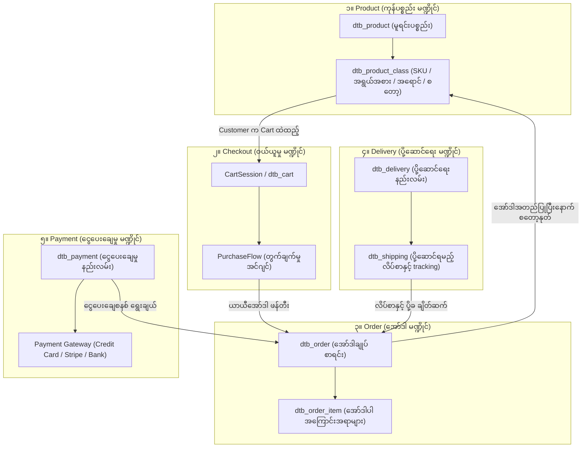

# 10 - Core Work Tasks & Database Architecture (အဓိက အလုပ်တာဝန်များနှင့် ဒေတာဘေ့စ် ဖွဲ့စည်းပုံ)

> **ခြုံငုံသုံးသပ်ချက် (Overview)**:  
> EC-CUBE 4.x သည် E-Commerce စနစ်တစ်ခုဖြစ်ပြီး ၎င်း၏ အဓိကလည်ပတ်မှုသည် **Product (ကုန်ပစ္စည်း)**၊ **Checkout (ဝယ်ယူမှုလုပ်ငန်းစဉ်)**၊ **Order (အော်ဒါ)**၊ **Delivery (ပို့ဆောင်ရေး)** နှင့် **Payment (ငွေပေးချေမှု)** ဟူသော အဓိကမဏ္ဍိုင်ကြီး ၅ ခုပေါ်တွင် အခြေခံထားပါသည်။  
> ဤအခန်းတွင် အစပြုသူ (Beginner) developer များအတွက် နားလည်ရလွယ်ကူစေရန် အဆိုပါ မဏ္ဍိုင် ၅ ခု၏ **Working Structure (အလုပ်လုပ်ပုံဖွဲ့စည်းပုံ)**၊ **Work Tasks (အဆင့်ဆင့်လုပ်ဆောင်ရသော အလုပ်တာဝန်များ)** နှင့် **Related Database Tables (သက်ဆိုင်ရာ ဒေတာဘေ့စ်များ)** ကို ရှင်းလင်းစွာ လမ်းညွှန်တင်ပြထားပါသည်။

---

## 🗺️ အဓိက မဏ္ဍိုင် ၅ ရပ်၏ အပြန်အလှန် ချိတ်ဆက်ပုံ (The 5 Core Pillars)

---

## 📊 အဓိက မဏ္ဍိုင် ၅ ခု၏ တာဝန်နှင့် အဓိက Database Tables ဇယား

| မဏ္ဍိုင် (Pillar) | ဂျပန်အသုံးအနှုန်း | အဓိက ရည်ရွယ်ချက် (Core Objective) | အဓိက Database Tables | စီမံခန့်ခွဲသူ (Admin) နှင့် အသုံးပြုသူ (User) ဆက်ဆံမှု |
|:---|:---|:---|:---|:---|
| **၁။ Product** | 商品管理 | ကုန်ပစ္စည်းအချက်အလက်၊ စတော့ (Stock)၊ ဈေးနှုန်း၊ SKU (အရောင်/အရွယ်အစား) စီမံခြင်း | `dtb_product` `dtb_product_class` `dtb_category` `dtb_product_image` | Admin က ပစ္စည်းတင်/ပြင်၊ Customer က ကြည့်ရှု/ရွေးချယ် |
| **၂။ Checkout** | 購入手続き | Cart ထဲရှိပစ္စည်းများကို အော်ဒါအဖြစ် မပြောင်းမီ စစ်ဆေးခြင်း၊ ပို့ခ/အခွန်တွက်ခြင်း | Session Cache `dtb_cart` `dtb_cart_item` `PurchaseFlow` | Customer က လိပ်စာ/ပို့ဆောင်ရေး/ငွေချေစနစ် ရွေးချယ် အတည်ပြု |
| **၃။ Order** | 注文管理 | စာချုပ်သဘောအတည်ပြုပြီးသော အော်ဒါများ၊ Status ပြောင်းလဲမှုနှင့် ငွေစာရင်းချုပ်ခြင်း | `dtb_order` `dtb_order_item` `mtb_order_status` | Customer က ဝယ်ယူမှတ်တမ်းကြည့်၊ Admin က အော်ဒါကို စစ်ဆေး/ကိုင်တွယ် |
| **၄။ Delivery** | 配送・出荷管理 | ပို့ဆောင်မည့်ကုမ္ပဏီ (Yamato/Sagawa)၊ နေ့ရက်/အချိန်၊ ပို့ဆောင်ခနှင့် ပို့ဆောင်ပြီးစီးမှု ခြေရာခံခြင်း | `dtb_delivery` `dtb_delivery_fee` `dtb_shipping` `dtb_shipment_item` | Admin က ချောပို့ကုမ္ပဏီသတ်မှတ်ပြီး ချောစာရွက် (Slip) ထုတ်/Tracking No ထည့် |
| **၅။ Payment** | 決済管理 | ငွေလွှဲစနစ်၊ ကတ်စနစ် (Credit Card)၊ ကုန်ပစ္စည်းရောက်မှငွေချေစနစ် (COD) နှင့် အခကြေးငွေများ စီမံခြင်း | `dtb_payment` `dtb_payment_option` Payment Plugins | Customer က ငွေချေ၊ Payment Gateway က ငွေလက်ခံပြီး Status ပြန်ပို့ |

---

## 🗂️ အခန်းခွဲများ လမ်းညွှန် (Course Navigation)

ဤအခန်းတွင် အသေးစိတ်ကို Module တစ်ခုချင်းစီအလိုက် ခွဲခြမ်းစိတ်ဖြာ ရှင်းပြထားပါသည်-

1. **[01. Product Structure, Work Tasks & Database](/eccube/10_work_tasks_and_database/01_product_structure_and_database/)**  
   - Product နှင့် ProductClass ကွာခြားချက် (SKU Concept)
   - Product ဘဝသံသရာနှင့် အလုပ်တာဝန်များ (Registration, Stock, Category, Image)
   - `dtb_product`, `dtb_product_class`, `dtb_class_category` ဒေတာဘေ့စ်ဖွဲ့စည်းပုံ

2. **[02. Checkout Structure, Work Tasks & Database](/eccube/10_work_tasks_and_database/02_checkout_structure_and_database/)**  
   - Shopping Flow တစ်ဆင့်ချင်းစီ၏ နောက်ကွယ်မှ အလုပ်တာဝန်များ
   - `PurchaseFlow` Engine (`prepare` -> `validate` -> `commit`)
   - CartSession မှ `dtb_order` ယာယီအဆင့်သို့ ကူးပြောင်းပုံ

3. **[03. Order Structure, Work Tasks & Database](/eccube/10_work_tasks_and_database/03_order_structure_and_database/)**  
   - အော်ဒါတစ်ခု ဖြစ်တည်လာပုံနှင့် Status ပြောင်းလဲမှု သံသရာ
   - `dtb_order` နှင့် `dtb_order_item` ၏ အရေးကြီး Columns များ
   - အော်ဒါဖျက်သိမ်းခြင်း (Cancel) နှင့် စတော့ပြန်လည်ဖြည့်တင်းခြင်း (Rollback)

4. **[04. Delivery Structure, Work Tasks & Database](/eccube/10_work_tasks_and_database/04_delivery_structure_and_database/)**  
   - ချောပို့ကုမ္ပဏီများ (Yamato, Sagawa, Japan Post) နှင့် ပို့ခတွက်နည်း
   - နေရာဒေသအလိုက် ပို့ခ (`dtb_delivery_fee`) နှင့် အချိန်သတ်မှတ်ချက် (`dtb_delivery_time`)
   - လိပ်စာခွဲပို့ခြင်း (Multiple Delivery) နှင့် `dtb_shipping` ဆက်နွယ်မှု

5. **[05. Payment Structure, Work Tasks & Database](/eccube/10_work_tasks_and_database/05_payment_structure_and_database/)**  
   - Payment Methods (Credit Card, Bank Transfer, COD, Convenience Store)
   - အခွင့်ပြုချက်ယူခြင်း (Auth / 与信) နှင့် ငွေအပြီးသတ်ဖြတ်ခြင်း (Capture / 売上確定)
   - `dtb_payment`, `dtb_payment_option` နှင့် Payment Gateway Webhook ပေါင်းစပ်မှု

6. **[06. Integrated Lifecycle & Database ERD](/eccube/10_work_tasks_and_database/06_integrated_lifecycle_and_erd/)**  
   - စနစ် ၅ ခုလုံး ပေါင်းစပ်အလုပ်လုပ်ပုံ ERD (Entity Relationship Diagram)
   - လက်တွေ့ နမူနာ ဇာတ်လမ်းဖြင့် အစမှအဆုံး Data ပြောင်းလဲသွားပုံ ခြေရာခံခြင်း
   - အသုံးများသော ဂျပန် E-Commerce နည်းပညာ ဝေါဟာရများ အဘိဓာန်

7. **[07. Checkout Process & Payment Calculation Deep Dive](/eccube/10_work_tasks_and_database/07_checkout_and_payment_calculation_deep_dive/)**  
   - Checkout URL Pipeline နှင့် Request Lifecycle (/shopping/confirm, checkout)
   - Payment Total Master Formula တွက်ချက်မှု မူသေနည်းချုပ်
   - ၁၀% Standard Tax vs ၈% Reduced Tax (軽減税率) ခွဲခြားတွက်ချက်ပုံ
   - ပို့ဆောင်ခ၊ Payment Charge၊ လျှော့စျေးနှင့် Point များ တွက်ချက်မှု အသေးစိတ်
   - လက်တွေ့ ဂဏန်းတွက်ချက်မှု စံပြဥပမာနှင့် Database Rows များ သိုလှောင်ပုံ

