# 📋 EC-CUBE 4 Client Requirements Master Hub

ဂျပန်နိုင်ငံ E-Commerce လုပ်ငန်းခွင် (Genba) များတွင် Client များ အများဆုံး တောင်းဆိုသော လုပ်ငန်းလိုအပ်ချက် (**Client Requirements**) များနှင့် စနစ်အင်္ဂါရပ် (**Business Feature Modules**) **၁၇ ခု** ကို စနစ်တကျ ခွဲခြားလေ့လာနိုင်သော ဗဟိုအချက်အချာ မာတိကာ ဖြစ်ပါသည်။

---

## 🗂️ Requirements Category Map (အမျိုးအစားအလိုက် ခွဲခြားမှု)

```mermaid
graph TD
    EC[EC-CUBE 4 Client Requirements]
    
    EC --> Core[Core E-Commerce Features]
    EC --> Growth[Marketing & Customer Engagement]
    EC --> System[Architecture, Security & Performance]
    
    Core --> R1[01. Order Management]
    Core --> R2[02. Payment Gateways]
    Core --> R3[03. Shipping & Delivery]
    Core --> R4[04. Product Management]
    Core --> R5[05. Search & Filtering]
    
    Growth --> R6[06. Campaign & Coupons]
    Growth --> R7[07. Favorite & Wishlist]
    Growth --> R8[08. Customer Management]
    Growth --> R9[09. LINE Marketing Integration]
    Growth --> R10[10. Email System & Templates]
    Growth --> R11[11. Sales & Analytics Reports]
    
    System --> R12[12. Event Subscribers & Hooks]
    System --> R13[13. External API Integration]
    System --> R14[14. Auth Roles & Permissions]
    System --> R15[15. Security Hardening]
    System --> R16[16. Performance & Large CSV]
    System --> R17[17. Customization List Guide]
```

---

## 📚 Complete Requirements Directory (မော်ဂျူး ၁၇ ခု အသေးစိတ်)

| စဉ် | Module အမည် | အဓိက ပါဝင်သော အကြောင်းအရာများ | စတင်လေ့လာရန် |
|---|---|---|---|
| **01** | **🛒 Order Management** | အော်ဒါသံသရာ၊ Status ပြောင်းလဲမှု၊ Stock ပြန်ဖြည့်ခြင်း၊ Order CSV | [လေ့လာရန် →](/eccube/requirements/03_order_management/readme/) |
| **02** | **💳 Payment Gateways** | Credit Card, Webhooks, Auth vs Capture, 返金 (Refund) Logic | [လေ့လာရန် →](/eccube/requirements/04_payment/readme/) |
| **03** | **📦 Shipping & Delivery** | နေရာဒေသအလိုက် ပို့ခ၊ Yamato/Sagawa ချိတ်ဆက်မှု၊ အချိန်သတ်မှတ်ချက် | [လေ့လာရန် →](/eccube/requirements/05_shipping/readme/) |
| **04** | **🏷️ Product Management** | SKU / ProductClass စီမံခန့်ခွဲမှု၊ စတော့ထိန်းချုပ်မှု၊ CSV Batch Import | [လေ့လာရန် →](/eccube/requirements/product-management/readme/) |
| **05** | **🔍 Search & Filter** | QueryBuilder စနစ်၊ စျေးနှုန်း Range ရှာဖွေမှု၊ ရှာဖွေမှုရလဒ် CSV ထုတ်ယူခြင်း | [လေ့လာရန် →](/eccube/requirements/search-filter/readme/) |
| **06** | **🎁 Campaign & Coupon** | ရာခိုင်နှုန်း/ငွေပမာဏ ကူပွန်၊ ကမ်ပိန်း Banner၊ ၈% vs ၁၀% အခွန်တွက်ချက်မှု | [လေ့လာရန် →](/eccube/requirements/08_campaign_coupon/readme/) |
| **07** | **❤️ Favorite & Wishlist** | AJAX Favorite စနစ်၊ N+1 Query ကာကွယ်မှု၊ Ranking နှင့် CSV Export | [လေ့လာရန် →](/eccube/requirements/favorite-wishlist/readme/) |
| **08** | **👥 Customer Management** | အသင်းဝင်သံသရာ၊ Rank စနစ်၊退会 (Withdrawal) နှင့် GDPR Privacy | [လေ့လာရန် →](/eccube/requirements/06_customer_management/readme/) |
| **09** | **💬 LINE Marketing** | LINE Notify / Messaging API၊ Login ချိတ်ဆက်မှု၊ Cart Abandonment သတိပေးချက် | [လေ့လာရန် →](/eccube/requirements/line-marketing/readme/) |
| **10** | **✉️ Email Management** | SwiftMailer / Symfony Mailer၊ Twig Mail Templates၊ အလိုအလျောက် သတိပေးချက် | [လေ့လာရန် →](/eccube/requirements/email-management/readme/) |
| **11** | **📊 Sales & Reports** | နေ့စဉ်/လစဉ် အရောင်းစာရင်း၊ VIP Customer Ranking၊ Nightly Cron Batch | [လေ့လာရန် →](/eccube/requirements/sales-reports/readme/) |
| **12** | **🔔 Event Subscribers** | Symfony EventDispatcher၊ Controller Event၊ Response & Form Hook Points | [လေ့လာရန် →](/eccube/requirements/event-subscriber/readme/) |
| **13** | **🔌 External API Integration** | Guzzle HTTP Client၊ Timeout/Retry Resilience၊ Webhook လုံခြုံရေး | [လေ့လာရန် →](/eccube/requirements/api-integration/readme/) |
| **14** | **🛡️ Auth & Permissions** | Firewall ဖွဲ့စည်းပုံ၊ Role-based Access Control (RBAC)၊ Member Page Access | [လေ့လာရန် →](/eccube/requirements/auth-permission/readme/) |
| **15** | **🔒 Security Hardening** | SQL Injection, XSS, CSRF Token ကာကွယ်ရေး၊ File Upload လုံခြုံရေး | [လေ့လာရန် →](/eccube/requirements/07_security/readme/) |
| **16** | **⚡ Performance Tuning** | Doctrine Query Cache, 100k Order Memory Leak ကာကွယ်ရေး၊ Redis Caching | [လေ့လာရန် →](/eccube/requirements/performance/readme/) |
| **17** | **📑 Customization Reference** | Entity Extension, FormType, Repository, Twig Override စုစည်းမှု | [လေ့လာရန် →](/eccube/requirements/customization-list/readme/) |

---

> 💡 **ဆက်စပ်လေ့လာရန် အပိုင်းများ**:
> - [🏗️ EC-CUBE Core Basics & Architecture](/eccube/01_basics/01-introduction/01-what-is-ec-cube/)
> - [🗄️ Work Tasks & Database Internals (7 In-Depth Guides)](/eccube/10_work_tasks_and_database/readme/)
> - [💼 40 Real-World Japanese Client Production Tasks](/eccube/02_client_tasks/01_display_product_code/)
> - [🎨 Twig & Template Design Customization](/eccube/09_template_design/00-course-overview-and-roadmap/01-course-overview-and-roadmap/)
