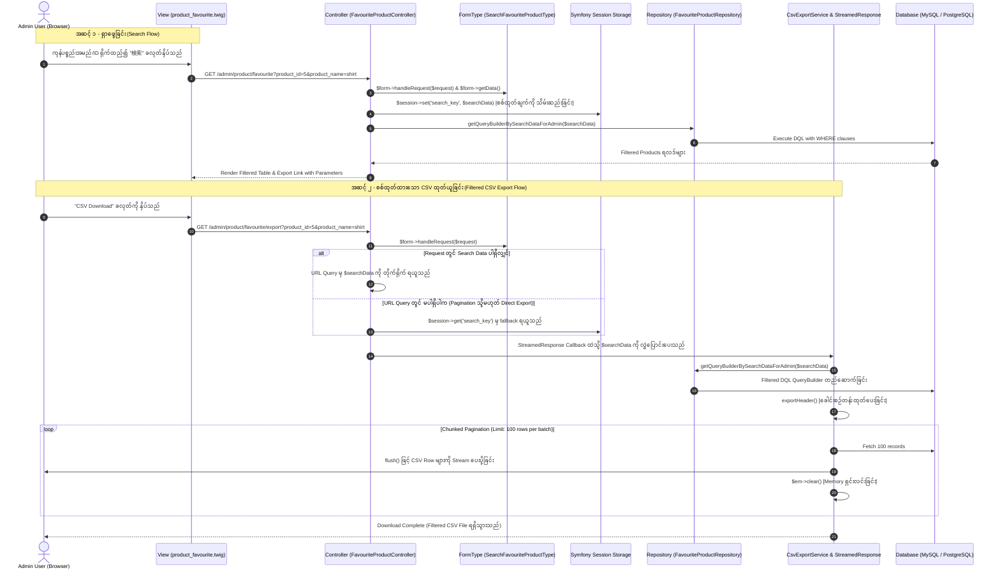

## EC-CUBE Standard: 検索条件で絞り込む CSV Export စနစ် နားလည်သဘောပေါက်ခြင်းနှင့် လက်တွေ့အသုံးချမှု လမ်းညွှန်
## (Master Guide: Understanding & Implementing Search-Filtered CSV Export in EC-CUBE & Symfony)

> **Client Requirement (ဂျပန်လုပ်ငန်းခွင် လိုအပ်ချက်):**  
> 「エクスポートするデータは、検索条件で絞れるようにしてください。」  
> *(Export ပြုလုပ်မည့် CSV ဒေတာများကို Search Conditions (ရှာဖွေမှု စစ်ထုတ်ချက်များ) အတိုင်း စစ်ထုတ်ပြီးမှ ထွက်လာစေရန် ပြုလုပ်ပေးပါ။)*

ဤလက်စွဲစာအုပ်သည် အထက်ပါ Requirement ကို ကြုံတွေ့ရသည့်အခါ အတွေ့အကြုံ (၆) လခန့်ရှိသော Junior Developer တစ်ဦးအနေဖြင့် **မဖြစ်မနေ နားလည်ထားရမည့် သဘောတရားများ**၊ **ကုဒ်တစ်ခုနှင့်တစ်ခု အပြန်အလှန် ချိတ်ဆက်ပုံများ**၊ **အခြား Project / Feature များတွင်ပါ စံထား၍ တည်ဆောက်နိုင်မည့် Blueprint မူဘောင်** နှင့် **လက်တွေ့လေ့ကျင့်နည်းများ** ကို EC-CUBE Coding Standard နှင့်အညီ မြန်မာဘာသာဖြင့် အသေးစိတ် ရေးသားဖော်ပြထားခြင်း ဖြစ်ပါသည်။

---

## မာတိကာ (Table of Contents)

1. [၁။ စနစ်တစ်ခုလုံး၏ ဖြတ်သန်းစီးဆင်းမှု ပုံစံ (End-to-End Life Cycle Architecture)](#၁။-စနစ်တစ်ခုလုံး၏-ဖြတ်သန်းစီးဆင်းမှု-ပုံစံ-end-to-end-life-cycle-architecture)
2. [၂။ မဖြစ်မနေ သိရှိနားလည်ထားရမည့် အဓိက သဘောတရား (၆) ချက် (Must-Know Fundamentals)](#၂။-မဖြစ်မနေ-သိရှိနားလည်ထားရမည့်-အဓိက-သဘောတရား-၆-ချက်-must-know-fundamentals)
   - [၂.၁။ HTTP GET vs POST in Search Forms](#၂၁။-http-get-vs-post-in-search-forms)
   - [၂.၂။ Form Block Prefix ၏ အရေးပါမှု (`getBlockPrefix() => ''`)](#၂၂။-form-block-prefix-၏-အရေးပါမှု-getblockprefix--)
   - [၂.၃။ Session State Management (ရှာဖွေမှု အခြေအနေကို မှတ်သားခြင်း)](#၂၃။-session-state-management-ရှာဖွေမှု-အခြေအနေကို-မှတ်သားခြင်း)
   - [၂.၄။ Dynamic Query Filtering & SQL Injection ကာကွယ်ခြင်း (Doctrine QueryBuilder)](#၂၄။-dynamic-query-filtering--sql-injection-ကာကွယ်ခြင်း-doctrine-querybuilder)
   - [၂.၅။ Subquery vs JOIN Trap (`EXISTS` Subquery အသုံးပြုခြင်း)](#၂၅။-subquery-vs-join-trap-exists-subquery-အသုံးပြုခြင်း)
   - [၂.၆။ Big Data & Memory Management (`StreamedResponse` & Memory Clearing)](#၂၆။-big-data--memory-management-streamedresponse--memory-clearing)
3. [၃။ ကုဒ်တစ်ခုချင်းစီ၏ ဆက်စပ်လုပ်ဆောင်ပုံ Deep-Dive (Code Relationships)](#၃။-ကုဒ်တစ်ခုချင်းစီ၏-ဆက်စပ်လုပ်ဆောင်ပုံ-deep-dive-code-relationships)
   - [၃.၁။ Twig View Template (`product_favourite.twig`)](#၃၁။-twig-view-template-product_favouritetwig)
   - [၃.၂။ Form Type (`SearchFavouriteProductType.php`)](#၃၂။-form-type-searchfavouriteproducttypephp)
   - [၃.၃။ Controller Search Action (`index()` Method)](#၃၃။-controller-search-action-index-method)
   - [၃.၄။ Controller Export Action (`export()` Method)](#၃၄။-controller-export-action-export-method)
   - [၃.၅။ Repository QueryBuilder (`FavouriteProductRepository.php`)](#၃၅။-repository-querybuilder-favouriteproductrepositoryphp)
   - [၃.၆။ CSV Export Service (`CsvExportService.php`)](#၃၆။-csv-export-service-csvexportservicephp)
   - [၃.၇။ စတင်လေ့လာသူများ (Beginners) အတွက် Query, Session နှင့် Export အလုပ်လုပ်ပုံ အသေးစိတ် ခွဲခြမ်းစိတ်ဖြာချက်](#၃၇။-စတင်လေ့လာသူများ-beginners-အတွက်-query-session-နှင့်-export-အလုပ်လုပ်ပုံ-အသေးစိတ်-ခွဲခြမ်းစိတ်ဖြာချက်)
4. [၄။ အခြား Project / Screen များတွင် အစမှအဆုံး တည်ဆောက်နိုင်သော စံမူဘောင် (Universal Blueprint for Any Project)](#၄။-အခြား-project--screen-များတွင်-အစမှအဆုံး-တည်ဆောက်နိုင်သော-စံမူဘောင်-universal-blueprint-for-any-project)
5. [၅။ လက်တွေ့ ကျွမ်းကျင်အောင် လေ့ကျင့်နည်း အဆင့်ဆင့် (Practical Drills & Exercises)](#၅။-လက်တွေ့-ကျွမ်းကျင်အောင်-လေ့ကျင့်နည်း-အဆင့်ဆင့်-practical-drills--exercises)
6. [၆။ အတွေ့အကြုံနုနယ်သူများ မကြာခဏ မှားတတ်သော အမှားများနှင့် စစ်ဆေးနည်း (Pitfalls & Debugging Checklist)](#၆။-အတွေ့အကြုံနုနယ်သူများ-မကြာခဏ-မှားတတ်သော-အမှားများနှင့်-စစ်ဆေးနည်း-pitfalls--debugging-checklist)

---

## ၁။ စနစ်တစ်ခုလုံး၏ ဖြတ်သန်းစီးဆင်းမှု ပုံစံ (End-to-End Life Cycle Architecture)

Search Condition ဖြင့် Filter လုပ်ထားသော CSV Export စနစ်တစ်ခုတွင် အဓိက Layer (၅) ခု ပါဝင်ပြီး အောက်ပါအတိုင်း အဆင့်ဆင့် အလုပ်လုပ်ပါသည်-



---

## ၂။ မဖြစ်မနေ သိရှိနားလည်ထားရမည့် အဓိက သဘောတရား (၆) ချက် (Must-Know Fundamentals)

### ၂.၁။ HTTP GET vs POST in Search Forms

Web Development တွင် Form တစ်ခုကို Submit လုပ်ရာတွင် Method (၂) မျိုး ရှိပါသည်-

| အချက်အလက် | `GET` Method (ရှာဖွေမှုအတွက် မဖြစ်မနေ သုံးရမည်) | `POST` Method (ဒေတာပြင်ဆင်/ဖျက်သိမ်းမှုအတွက်သာ) |
| :--- | :--- | :--- |
| **URL ပေါ်တွင် ပေါ်ခြင်း** | `?product_id=1&product_name=shirt` ဟု Query String အဖြစ် ပေါ်သည်။ | URL တွင် မပေါ်ဘဲ HTTP Request Body ထဲတွင် ပုန်းနေသည်။ |
| **Browser Refresh** | စာမျက်နှာ Refresh လုပ်ပါက မည်သည့် Warning မှ မတက်ဘဲ အဆင်ပြေသည်။ | Refresh လုပ်ပါက *"Confirm Form Resubmission"* Warning တက်သည်။ |
| **Shareable & Bookmarkable** | Link ကို ကူးယူပြီး အခြားသူထံ ပို့ပေးနိုင်သည် (သို့မဟုတ်) Bookmark လုပ်ထားနိုင်သည်။ | Bookmark လုပ်၍ မရပါ။ Link ကူးယူပို့ပါက ရှာထားသော ဒေတာ ပျောက်သွားသည်။ |
| **CSV Download ချိတ်ဆက်မှု** | Twig တွင် `app.request.query.all` ဖြင့် Export URL သို့ လွယ်ကူစွာ ကူးယူနိုင်သည်။ | JavaScript သို့မဟုတ် Form Submit အသစ် ထပ်မံ ရေးသားရန် လိုအပ်သည်။ |

> **အနှစ်ချုပ်:** စာရင်းစစ်ထုတ်ခြင်း (Search Filter) လုပ်ငန်းစဉ်များသည် ဒေတာဘေ့စ်ထဲရှိ အချက်အလက်ကို ပြင်ဆင်ခြင်း မဟုတ်ဘဲ ဒေတာဆွဲထုတ်ခြင်း (Read-only) သာ ဖြစ်သောကြောင့် **HTTP Standard အရ `GET` method ကိုသာ အမြဲ သုံးရပါမည်**။

---

### ၂.၂။ Form Block Prefix ၏ အရေးပါမှု (`getBlockPrefix() => ''`)

Symfony Form တွင် Default အားဖြင့် Form Type ၏ အမည်ကို Prefix အဖြစ် ထည့်သွင်းလေ့ရှိသည် (ဥပမာ `search_favourite_product[product_id]=5`)။

သို့သော် `SearchFavouriteProductType.php` တွင် အောက်ပါကုဒ်ကို ရေးသားထားပါသည်-

```php
public function getBlockPrefix(): string
{
    return '';
}
```

* **ဘာကြောင့် ဒီလို ရေးရသလဲ?**  
  Prefix ကို Blank (`''`) ပြုလုပ်ပေးလိုက်ခြင်းဖြင့် URL Parameter သည် အောက်ပါအတိုင်း သန့်ရှင်းသွားပါသည်-
  * Prefix မဖြုတ်ထားပါက: `/admin/product/favourite?search_favourite_product%5Bproduct_id%5D=5`
  * Prefix ဖြုတ်ထားပါက: `/admin/product/favourite?product_id=5`
* ဤသို့ သန့်ရှင်းသော URL ဖြစ်သွားမှသာ Twig UI၊ Controller နှင့် Pagination Link များတွင် Parameter များကို လွယ်ကူစွာ ရယူအသုံးပြုနိုင်မည် ဖြစ်ပါသည်။

---

### ၂.၃။ Session State Management (ရှာဖွေမှု အခြေအနေကို မှတ်သားခြင်း)

Admin Panel တစ်ခုတွင် အောက်ပါအခြေအနေများကို ဖြေရှင်းနိုင်ရန် **Session** ကို အသုံးပြုရပါသည်-

1. **စာမျက်နှာ ကူးပြောင်းခြင်း (Pagination):**  
   Admin က ကုန်ပစ္စည်းအမည် "Shirt" ဟု ရှာထားပြီးနောက် စာမျက်နှာ ၂ (Page 2) ကို နှိပ်သည့်အခါ ရှာဖွေထားသော စစ်ထုတ်ချက် မပျောက်သွားစေရန်။
2. **အသေးစိတ် ကြည့်ရှုပြီး ပြန်လာခြင်း (Detail Screen to Back):**  
   ကုန်ပစ္စည်းတစ်ခုခုကို နှိပ်၍ အသေးစိတ် ပြင်ဆင်ပြီး စာရင်းမျက်နှာသို့ ပြန်ရောက်လာသည့်အခါ မူလရှာထားသော အခြေအနေ မပျောက်စေရန်။
3. **CSV Download တိုက်ရိုက် ဆွဲယူခြင်း:**  
   URL တွင် Query Parameter မပါလာသည့်တိုင် Session ထဲတွင် သိမ်းထားသော 検索条件 ကို အသုံးပြု၍ CSV ကို စစ်ထုတ်ထုတ်ယူနိုင်စေရန်။

```
               [ User Searches in Index Page ]
                              │
                              ▼
            $session->set('search_key', $searchData)
                              │
         ┌────────────────────┴────────────────────┐
         ▼                                         ▼
   [ Next Page: Page 2 ]                  [ Click: CSV Download ]
         │                                         │
         ▼                                         ▼
$session->get('search_key')               $session->get('search_key')
(Filter criteria preserved)               (Filter criteria applied to CSV)
```

---

### ၂.၄။ Dynamic Query Filtering & SQL Injection ကာကွယ်ခြင်း (Doctrine QueryBuilder)

Search Conditions များဖြင့် Database မှ ဒေတာ စစ်ထုတ်ရာတွင် အဓိက စည်းမျဉ်း (၂) ရပ်ကို လိုက်နာရပါမည်-

#### ၁။ Parameterized Binding ကိုသာ အသုံးပြုခြင်း (SQL Injection ကာကွယ်ခြင်း)
* ❌ **အလွန်အန္တရာယ်များသော အမှား:**
  ```php
  // SQL Injection ဖြစ်နိုင်သည်! လုံးဝ မသုံးရ!
  $qb->andWhere("p.name LIKE '%" . $searchData['product_name'] . "%'");
  ```
* ✅ **မှန်ကန်သော စံနှုန်း:**
  ```php
  $qb->andWhere('p.name LIKE :product_name')
     ->setParameter('product_name', '%' . $searchData['product_name'] . '%');
  ```

#### ၂။ Input တန်ဖိုး ရှိမှသာ `andWhere` ကို Dynamic ထည့်သွင်းခြင်း
အသုံးပြုသူသည် Form တွင် field အားလုံး ရိုက်ထည့်မည် မဟုတ်ပါ။ ဥပမာ `product_id` တစ်ခုတည်းသာ ရိုက်ပါက ထို field အတွက်သာ `andWhere` ထည့်ပေးရပါမည်-
```php
if (isset($searchData['product_id']) && StringUtil::isNotBlank($searchData['product_id'])) {
    $qb->andWhere('p.id = :product_id')
       ->setParameter('product_id', $searchData['product_id']);
}
```

---

### ၂.၅။ Subquery vs JOIN Trap (`EXISTS` Subquery အသုံးပြုခြင်း)

ဤသည်မှာ Intermediate / Senior အဆင့် တက်လှမ်းရန် မဖြစ်မနေ သိရမည့် Database DQL သဘောတရား ဖြစ်ပါသည်။

* **ပြဿနာ အခြေအနေ:** Favorite Product စာရင်းတွင် ကုန်ပစ္စည်း A ကို Customer အယောက် ၁၀၀ က Favorite လုပ်ထားသည်။
* **အကယ်၍ Customer Name ရှာဖွေရာတွင် `INNER JOIN` သုံးမိပါက:**
  ```sql
  -- အမှားဖြစ်စေသော ချဉ်းကပ်ပုံ:
  SELECT p.* FROM dtb_product p 
  INNER JOIN dtb_customer_favorite_product cfp ON cfp.product_id = p.id
  INNER JOIN dtb_customer c ON c.id = cfp.customer_id
  WHERE c.name01 LIKE '%Yamada%'
  ```
  1. ကုန်ပစ္စည်း A သည် စာရင်းထဲတွင် (၁၀၀) ကြိမ် အထပ်ထပ် ပေါ်လာမည် (Duplicate Rows)။
  2. CSV Export ထုတ်ယူသည့်အခါ ကုန်ပစ္စည်းတစ်ခုတည်း အတန်းပေါင်းများစွာ ထွက်လာမည်။
  3. ကုန်ပစ္စည်း၏ စုစုပေါင်း Favorite Count လည်း (၁၀၀) မထွက်တော့ဘဲ Yamada တစ်ယောက်တည်း၏ အရေအတွက် (၁) ဟု မှားယွင်းသွားမည်။

* **✅ မှန်ကန်သော ဖြေရှင်းချက် (`EXISTS` Subquery - EC-CUBE Core Standard):**
  ```php
  $qb->andWhere($qb->expr()->exists(
      'SELECT cfp_sub.id FROM ' . CustomerFavoriteProduct::class . ' cfp_sub ' .
      'JOIN cfp_sub.Customer c_sub ' .
      'WHERE cfp_sub.Product = p AND c_sub.name01 LIKE :customer_name'
  ))->setParameter('customer_name', '%' . $customerName . '%');
  ```
  * `EXISTS` သည် "ဒီကုန်ပစ္စည်းကို အဆိုပါအမည်ရှိသော ဝယ်ယူသူ Favorite လုပ်ထားသလား?" ဟုသာ စစ်ဆေးခြင်းဖြစ်၍ Product Entity သည် **လုံးဝ မထပ်ပါ** (Zero Duplication)။
  * ကုန်ပစ္စည်း၏ အချက်အလက်နှင့် Count အရေအတွက်များ လုံးဝ မပျက်စီးဘဲ တိကျစွာ ထွက်ရှိပါသည်!

---

### ၂.၆။ Big Data & Memory Management (`StreamedResponse` & Memory Clearing)

လုပ်ငန်းသုံး E-commerce စနစ်များတွင် ကုန်ပစ္စည်း သောင်းချီ၊ သိန်းချီ ရှိနိုင်ပါသည်။ ဒေတာများပြားသောအခါ CSV Export ပြုလုပ်ရာတွင် PHP ၏ `memory_limit` ကြောင့် Server Crash ဖြစ်တတ်ပါသည်။

EC-CUBE ၏ `CsvExportService` သည် ဤပြဿနာကို အောက်ပါ နည်းလမ်း (၄) ချက်ဖြင့် ကာကွယ်ထားပါသည်-

1. **`StreamedResponse`:** ဒေတာအားလုံးကို Memory ထဲ အကုန်ဆွဲမတင်ဘဲ တစ်ကြောင်းချင်းစီ Browser သို့ စီးဆင်း (Stream) ပေးပို့ခြင်း။
2. **`set_time_limit(0)`:** ဒေတာ များပြား၍ ကြာမြင့်ချိန်တွင် PHP Execution Timeout မဖြစ်စေရန် ကာကွယ်ခြင်း။
3. **`$em->getConfiguration()->setSQLLogger(null)`:** Doctrine က Memory ထဲတွင် SQL Query များကို မှတ်တမ်းတင်နေသည့် Logger ကို ပိတ်ထားခြင်း (Memory အလွန်အမင်း သက်သာစေသည်)။
4. **Chunked Pagination & `$em->clear()`:**
   ```php
   // CsvExportService.php Line 293-305
   while ($results = $this->paginator->paginate($this->qb, $page, 100)) {
       foreach ($results as $result) {
           $closure($result, $this);
           flush(); // Browser သို့ ချက်ချင်း ပို့ပေးသည်
       }
       $this->entityManager->clear(); // Memory ထဲမှ Doctrine Entity များကို ရှင်းထုတ်သည်
       $page++;
   }
   ```

---

## ၃။ ကုဒ်တစ်ခုချင်းစီ၏ ဆက်စပ်လုပ်ဆောင်ပုံ Deep-Dive (Code Relationships)

အောက်ပါပုံသည် Feature တွင် ပါဝင်သော ဖိုင် (၅) ဖိုင် အချင်းချင်း ဒေတာ လက်ဆင့်ကမ်း လုပ်ဆောင်ပုံ ဖြစ်ပါသည်-

```
[ product_favourite.twig ]
  │
  ├── (Form Submit) ──> [ SearchFavouriteProductType.php ]
  │                           │ (Form Validation & Data Array)
  │                           ▼
  │                    [ FavouriteProductController.php ]
  │                           │
  │                     ┌─────┴───────────────────────────────┐
  │                     │ index()                             │ export()
  │                     ▼                                     ▼
  │              [ Session: Save ]                     [ Session: Fallback ]
  │                     │                                     │
  │                     └───────────────┬─────────────────────┘
  │                                     ▼
  │                         [ FavouriteProductRepository.php ]
  │                                     │ (Builds QueryBuilder with WHERE)
  │                                     ▼
  │                            [ CsvExportService.php ]
  │                                     │ (Stream CSV data to user)
  ▼                                     ▼
[ Browser Table View ]       [ Downloaded Filtered CSV ]
```

---

### ၃.၁။ Twig View Template (`product_favourite.twig`)

* **ဖိုင်တည်နေရာ:** `app/template/admin/Product/product_favourite.twig`

#### (၁) Search Form Card (GET Method ဖြင့် Controller သို့ ဒေတာ ပေးပို့ခြင်း)
```twig
<form method="get" action="{{ url('admin_product_favourite') }}">
    <div class="card-body">
        <div class="row g-3 align-items-end">
            <!-- ကုန်ပစ္စည်း ID ရိုက်ထည့်ရန် ကွက်လပ် -->
            <div class="col-md-3">
                <label class="form-label fw-bold small text-muted">{{ form_label(searchForm.product_id) }}</label>
                {{ form_widget(searchForm.product_id, {'attr': {'class': 'form-control', 'placeholder': '商品ID'}}) }}
            </div>
            <!-- ကုန်ပစ္စည်းအမည် ရိုက်ထည့်ရန် ကွက်လပ် -->
            <div class="col-md-3">
                <label class="form-label fw-bold small text-muted">{{ form_label(searchForm.product_name) }}</label>
                {{ form_widget(searchForm.product_name, {'attr': {'class': 'form-control', 'placeholder': '商品名'}}) }}
            </div>
            <!-- ဝယ်ယူသူအမည် ရိုက်ထည့်ရန် ကွက်လပ် -->
            <div class="col-md-3">
                <label class="form-label fw-bold small text-muted">{{ form_label(searchForm.customer_name) }}</label>
                {{ form_widget(searchForm.customer_name, {'attr': {'class': 'form-control', 'placeholder': '会員名'}}) }}
            </div>
            <!-- ရှာဖွေမည့် ခလုတ် နှင့် မူလအတိုင်း ပြန်ရှင်းမည့် Clear ခလုတ် -->
            <div class="col-md-3 d-flex gap-2">
                <button type="submit" class="btn btn-primary flex-grow-1 shadow-sm">
                    <i class="fa fa-search me-1"></i>{{ 'admin.common.search'|trans }}
                </button>
                <a href="{{ url('admin_product_favourite', {'clear': 1}) }}" class="btn btn-outline-secondary shadow-sm" title="{{ 'admin.common.clear'|trans }}">
                    <i class="fa fa-refresh me-1"></i>{{ 'admin.common.clear'|trans }}
                </a>
            </div>
        </div>
    </div>
</form>
```

#### (၂) CSV Download Link (`app.request.query.all` ဖြင့် Filter ပေးပို့ခြင်း)
```twig
<!-- URL ပေါ်ရှိ လက်ရှိ Query parameters အားလုံးကို Export URL ဆီသို့ လက်ဆင့်ကမ်း ပေးပို့ခြင်း -->
<a href="{{ url('admin_product_favourite_export', app.request.query.all) }}" class="btn btn-ec-regular shadow-sm">
    <i class="fa fa-cloud-download me-1 text-secondary"></i><span>{{ 'admin.common.csv_download'|trans }}</span>
</a>
```
* **သတိပြုရန် အချက်:** အကယ်၍ Admin က `?product_id=5` ဟု ရှာထားပါက `app.request.query.all` ကြောင့် CSV Download ခလုတ်၏ Link သည် အလိုအလျောက် `admin_product_favourite_export?product_id=5` ဟု ဖြစ်သွားပြီး Filter ပါပြီးသား CSV ကို တိုက်ရိုက် ထုတ်ယူပေးနိုင်မည် ဖြစ်ပါသည်။

---

### ၃.၂။ Form Type (`SearchFavouriteProductType.php`)

* **ဖိုင်တည်နေရာ:** `app/Customize/Form/Type/Admin/SearchFavouriteProductType.php`

```php
<?php

namespace Customize\Form\Type\Admin;

use Symfony\Component\Form\AbstractType;
use Symfony\Component\Form\Extension\Core\Type\IntegerType;
use Symfony\Component\Form\Extension\Core\Type\TextType;
use Symfony\Component\Form\FormBuilderInterface;
use Symfony\Component\OptionsResolver\OptionsResolver;

class SearchFavouriteProductType extends AbstractType
{
    public function buildForm(FormBuilderInterface $builder, array $options): void
    {
        $builder
            ->add('product_id', IntegerType::class, [
                'required' => false,
                'label' => '商品ID',
            ])
            ->add('product_name', TextType::class, [
                'required' => false,
                'label' => '商品名（部分一致）',
            ])
            ->add('customer_name', TextType::class, [
                'required' => false,
                'label' => '会員名（部分一致）',
            ]);
    }

    public function configureOptions(OptionsResolver $resolver): void
    {
        $resolver->setDefaults([
            'method' => 'GET',           // Search ဖြစ်၍ GET method သတ်မှတ်ခြင်း
            'csrf_protection' => false,  // GET URL Query ဖြစ်၍ CSRF Token မလိုအပ်ခြင်း
        ]);
    }

    public function getBlockPrefix(): string
    {
        return ''; // URL parameter များ သန့်ရှင်းစေရန် prefix ဖယ်ရှားခြင်း
    }
}
```

---

### ၃.၃။ Controller Search Action (`index()` Method)

* **ဖိုင်တည်နေရာ:** `app/Customize/Controller/Admin/Product/FavouriteProductController.php`

```php
    public function index(Request $request, $page_no = null)
    {
        // ... (Pagination page_no logic) ...

        $searchForm = $this->createForm(SearchFavouriteProductType::class);

        // ၁။ Clear ခလုတ် နှိပ်ပါက Session ရှင်းလင်းပြီး မူလ စာရင်းသို့ ပြန်ညွှန်းခြင်း
        if ($request->query->get('clear')) {
            $this->session->remove('eccube.admin.product.favourite.search');
            $this->session->remove('eccube.admin.product.favourite.page_no');
            return $this->redirectToRoute('admin_product_favourite');
        }

        $searchForm->handleRequest($request);

        // ၂။ Form Submit လုပ်ထားပါက ရလဒ်ကို Session ထဲ သိမ်းဆည်းခြင်း
        if ($searchForm->isSubmitted() && $searchForm->isValid()) {
            $searchData = $searchForm->getData() ?? [];
            $this->session->set('eccube.admin.product.favourite.search', $searchData);
        } else {
            // Form Submit မလုပ်ဘဲ Pagination သို့မဟုတ် အခြားစာမျက်နှာမှ လာပါက Session ထဲမှ ပြန်ယူခြင်း
            $searchData = $this->session->get('eccube.admin.product.favourite.search', []);
            if (!empty($searchData)) {
                $searchForm->setData($searchData);
            }
        }

        // ၃။ Search Data အလိုက် QueryBuilder ကို ရယူခြင်း
        $qb = $this->favouriteProductRepository->getQueryBuilderBySearchDataForAdmin($searchData ?: []);

        // ၄။ Pagination ဖြင့် စာမျက်နှာအလိုက် ခွဲထုတ်ခြင်း
        $pagination = $this->paginator->paginate($qb, $page_no, $page_count, ['wrap-queries' => true]);

        return [
            'searchForm' => $searchForm->createView(),
            'pagination' => $pagination,
            'page_no' => $page_no,
        ];
    }
```

---

### ၃.၄။ Controller Export Action (`export()` Method)

* **ဖိုင်တည်နေရာ:** `app/Customize/Controller/Admin/Product/FavouriteProductController.php`

```php
    public function export(Request $request): StreamedResponse
    {
        set_time_limit(0);
        $this->entityManager->getConfiguration()->setSQLLogger(null);

        // ၁။ Search Form bind လုပ်၍ Request Parameter ထဲမှ စစ်ထုတ်ချက်ကို ရယူခြင်း
        $searchForm = $this->createForm(SearchFavouriteProductType::class);
        $searchForm->handleRequest($request);
        $searchData = $searchForm->getData() ?? [];

        // ၂။ Request တွင် မပါရှိပါက Session ထဲမှ စစ်ထုတ်ချက်ကို Fallback ရယူခြင်း
        $hasRequestData = false;
        foreach ((array) $searchData as $val) {
            if ($val !== null && $val !== '') {
                $hasRequestData = true;
                break;
            }
        }

        if (!$hasRequestData && $this->session->has('eccube.admin.product.favourite.search')) {
            $searchData = $this->session->get('eccube.admin.product.favourite.search', []);
        }

        $response = new StreamedResponse();
        // ၃။ Anonymous Closure ထဲသို့ "use ($searchData)" ဖြင့် လက်ဆင့်ကမ်း ပေးပို့ရပါမည်
        $response->setCallback(function () use ($request, $searchData) {
            $this->csvExportService->initCsvType(CustomCsvType::CSV_TYPE_FAVOURITE_PRODUCT);

            // ၄။ Filter ပါဝင်သော QueryBuilder ကို ခေါ်ယူခြင်း
            $qb = $this->favouriteProductRepository->getQueryBuilderBySearchDataForAdmin($searchData ?: []);

            $this->csvExportService->exportHeader();
            $this->csvExportService->setExportQueryBuilder($qb);
            $this->csvExportService->exportData(function (Product $Product, CsvExportService $csvService) use ($request) {
                // ... CSV row တစ်ကြောင်းချင်းစီ ရေးသားသည့် logic ...
            });
        });

        // ၅။ Download Header သတ်မှတ်ခြင်း
        $now = new \DateTime();
        $filename = 'favourite_products_' . $now->format('YmdHis') . '.csv';
        $response->headers->set('Content-Type', 'application/octet-stream');
        $response->headers->set('Content-Disposition', 'attachment; filename=' . $filename);

        return $response;
    }
```

---

### ၃.၅။ Repository QueryBuilder (`FavouriteProductRepository.php`)

* **ဖိုင်တည်နေရာ:** `app/Customize/Repository/FavouriteProductRepository.php`

```php
    public function getQueryBuilderBySearchDataForAdmin(array $searchData = []): QueryBuilder
    {
        $qb = $this->createQueryBuilder('p');
        $qb->addSelect('(SELECT COUNT(cfp.id) FROM ' . CustomerFavoriteProduct::class . ' cfp WHERE cfp.Product = p) AS HIDDEN favorite_count')
            ->where('(SELECT COUNT(cfp2.id) FROM ' . CustomerFavoriteProduct::class . ' cfp2 WHERE cfp2.Product = p) > 0')
            ->orderBy('favorite_count', 'DESC')
            ->addOrderBy('p.id', 'DESC');

        // (၁) 商品ID စစ်ထုတ်ခြင်း
        if (isset($searchData['product_id']) && StringUtil::isNotBlank($searchData['product_id'])) {
            $qb->andWhere('p.id = :product_id')
                ->setParameter('product_id', $searchData['product_id']);
        }

        // (၂) 商品名 စစ်ထုတ်ခြင်း (Space ခြားပြီး Multi-keywords Partial Match)
        if (isset($searchData['product_name']) && StringUtil::isNotBlank($searchData['product_name'])) {
            $keywords = preg_split('/[\s　]+/u', $searchData['product_name'], -1, PREG_SPLIT_NO_EMPTY);
            foreach ($keywords as $index => $keyword) {
                $param = 'product_name_' . $index;
                $qb->andWhere('p.name LIKE :' . $param)
                    ->setParameter($param, '%' . str_replace(['%', '_'], ['\\%', '\\_'], $keyword) . '%');
            }
        }

        // (၃) 会員名 စစ်ထုတ်ခြင်း (EXISTS Subquery ဖြင့် Duplicate ကာကွယ်ထားခြင်း)
        if (isset($searchData['customer_name']) && StringUtil::isNotBlank($searchData['customer_name'])) {
            $cleanCustomerName = preg_replace('/\s+|[　]+/u', '', $searchData['customer_name']);
            $likeCustomerName = '%' . str_replace(['%', '_'], ['\\%', '\\_'], $cleanCustomerName) . '%';

            $qb->andWhere($qb->expr()->exists(
                'SELECT cfp_sub.id FROM ' . CustomerFavoriteProduct::class . ' cfp_sub ' .
                'JOIN cfp_sub.Customer c_sub ' .
                'WHERE cfp_sub.Product = p AND (' .
                'CONCAT(COALESCE(c_sub.name01, \'\'), COALESCE(c_sub.name02, \'\')) LIKE :customer_name OR ' .
                'CONCAT(COALESCE(c_sub.kana01, \'\'), COALESCE(c_sub.kana02, \'\')) LIKE :customer_name OR ' .
                'c_sub.name01 LIKE :customer_name OR ' .
                'c_sub.name02 LIKE :customer_name' .
                ')'
            ))->setParameter('customer_name', $likeCustomerName);
        }

        return $qb;
    }
```

#### 💡 EC-CUBE Core Standard Reference Codes (မူလ Core အရင်းအမြစ် ကုဒ်များနှင့် နှိုင်းယှဉ်ချက်)

အထက်ဖော်ပြပါ QueryBuilder ကုဒ်သည် စိတ်ကူးယဉ် ရေးသားထားခြင်း မဟုတ်ဘဲ EC-CUBE ၏ တရားဝင် Core Repositories များတွင် အသုံးပြုထားသော အောက်ပါ Standard Code Pattern များကို တိုက်ရိုက် ကိုးကားပြီး ပေါင်းစပ် တည်ဆောက်ထားခြင်း ဖြစ်ပါသည်:

##### ၁။ တိုက်ရိုက် ကိုးကားထားသော EC-CUBE Core ဖိုင်များ စာရင်း (Reference Sources)
1. **`src/Eccube/Repository/CustomerRepository.php`**
   - **Method:** `getQueryBuilderBySearchDataAdmin(array $searchData)`
   - **ကိုးကားချက်:** 会員名 (Customer Name & Kana) စစ်ထုတ်ရာတွင် `name01` + `name02` နှင့် `kana01` + `kana02` တို့ကို Space ဖြတ်ပြီး `CONCAT` + `COALESCE` ဖြင့် ရှာဖွေသည့် Core Standard Logic။
2. **`src/Eccube/Repository/OrderRepository.php`**
   - **Method:** `getQueryBuilderBySearchDataForAdmin(array $searchData)`
   - **ကိုးကားချက်:** Admin အော်ဒါရှာဖွေရာတွင် Customer ၏ နာမည်/ဖုန်း/အီးမေးလ်တို့ကို Parameter Binding ဖြင့် လုံခြုံစွာ ရှာဖွေသည့် Core Pattern။
3. **`src/Eccube/Repository/ProductRepository.php`**
   - **Method:** `getQueryBuilderBySearchDataForAdmin(array $searchData)`
   - **ကိုးကားချက်:** 商品名 ရှာဖွေရာတွင် Full-width / Half-width space များကို `preg_split('/[\s　]+/u', ...)` ဖြင့် ခွဲခြမ်းပြီး Multi-keywords `LIKE :param` loop ပတ်သည့် Core Pattern။
4. **`src/Eccube/Controller/Admin/Product/ProductController.php` & `OrderController.php`**
   - **Method:** `export(Request $request)` & `index(Request $request)`
   - **ကိုးကားချက်:** Form Handling, Session State Caching (`eccube.admin.*.search`), StreamedResponse နှင့် `CsvExportService` ချိတ်ဆက်ပုံ Core Architecture။

---

##### ၂။ Core Logic ၏ အဓိက အစိတ်အပိုင်းများ အသေးစိတ် ရှင်းလင်းချက် (Line-by-Line Breakdown)

| ကုဒ်လိုင်း | Core Code Pattern | အဘယ်ကြောင့် ဤသို့ ရေးသားရသနည်း (Purpose & Rationale) |
| :--- | :--- | :--- |
| **Line 495** | `preg_replace('/\s+|[　]+/u', '', $searchData['customer_name'])` | **Space ရှင်းလင်းခြင်း (Whitespace Stripping):** ဂျပန်အသုံးပြုသူများသည် နာမည်ရိုက်သည့်အခါ 半角スペース (Half-width Space) သို့မဟုတ် 全角スペース `[　]` (Full-width Space) ခြား၍ ရိုက်လေ့ရှိသည် (ဥပမာ `山田 太郎`)။ Database ထဲတွင်မူ Space မပါဝင်သောကြောင့် regex modifier `/u` (UTF-8) သုံး၍ Space များကို ဖယ်ရှားပေးခြင်း ဖြစ်သည်။ |
| **Line 496** | `str_replace(['%', '_'], ['\\%', '\\_'], ...)` | **Wildcard Injection ကာကွယ်ခြင်း:** SQL `LIKE` query တွင် `%` (any characters) နှင့် `_` (single character) တို့သည် Wildcard ဖြစ်သည်။ User က `%` ရိုက်ထည့်လိုက်ပါက ဒေတာအားလုံး မတော်တဆ ထွက်မလာစေရန် escape ပြုလုပ်ခြင်း ဖြစ်သည်။ |
| **Line 498-501** | `$qb->expr()->exists('SELECT cfp_sub.id FROM CustomerFavoriteProduct ... WHERE cfp_sub.Product = p')` | **Row Duplication ကာကွယ်ခြင်း (`EXISTS` Subquery):** `Product` နှင့် `CustomerFavoriteProduct` သည် One-to-Many ဖြစ်နေသဖြင့် `INNER JOIN` သုံးပါက Product တစ်ခုတည်း အကြိမ်ပေါင်းများစွာ Duplicate ထွက်လာမည်။ `EXISTS` သည် Correlation Condition (`WHERE cfp_sub.Product = p`) ဖြင့် စစ်ဆေးသဖြင့် Product Entity တစ်ခုတည်းသာ တိကျစွာ ထွက်ရှိစေသည်။ |
| **Line 502** | `CONCAT(COALESCE(c_sub.name01, ''), COALESCE(c_sub.name02, '')) LIKE :customer_name` | **နာမည် ၂ ခု ပေါင်းစပ်ရှာဖွေခြင်း:** EC-CUBE တွင် မျိုးရိုးအမည် `name01` (姓 - Yamada) နှင့် အမည် `name02` (名 - Taro) ဟု ကော်လံခွဲထားသည်။ User က `山田太郎` ဟု ဆက်တိုက် ရိုက်ရှာပါက ကော်လံတစ်ခုချင်းစီတွင် မတွေ့နိုင်သဖြင့် `CONCAT` ဖြင့် ပေါင်းပြီးမှ `LIKE` စစ်ဆေးခြင်း ဖြစ်သည်။ `NULL` တန်ဖိုးကြောင့် Result ပျက်မသွားစေရန် `COALESCE(..., '')` ဖြင့် Empty String ပြောင်းပေးထားသည်။ |
| **Line 503** | `CONCAT(COALESCE(c_sub.kana01, ''), COALESCE(c_sub.kana02, '')) LIKE :customer_name` | **ခတခဏ / ဖုရိဂါန ရှာဖွေခြင်း:** ဂျပန်စာတွင် Kanji အပြင် Furigana (ဥပမာ `ヤマダタロウ`) ဖြင့် ရှာဖွေသူများအတွက် `kana01` နှင့် `kana02` ကိုပါ တစ်ပါတည်း စစ်ထုတ်ပေးနိုင်ရန် ဖြစ်သည်။ |

---

##### ၃။ EC-CUBE Core မူရင်း Source Code များနှင့် တိုက်ရိုက် နှိုင်းယှဉ်လေ့လာရန် (Core Reference Snippets)

###### (က) `CustomerRepository.php` ရှိ Customer Name Search Core Logic:
```php
// တည်နေရာ: src/Eccube/Repository/CustomerRepository.php (~Line 85)
if (isset($searchData['name']) && StringUtil::isNotBlank($searchData['name'])) {
    $cleanName = preg_replace('/\s+|[　]+/u', '', $searchData['name']);
    $qb
        ->andWhere('CONCAT(COALESCE(c.name01, \'\'), COALESCE(c.name02, \'\')) LIKE :clean_name OR CONCAT(COALESCE(c.kana01, \'\'), COALESCE(c.kana02, \'\')) LIKE :clean_name')
        ->setParameter('clean_name', '%'.$cleanName.'%');
}
```

###### (ခ) `OrderRepository.php` ရှိ Order Customer Search Core Logic:
```php
// တည်နေရာ: src/Eccube/Repository/OrderRepository.php (~Line 175)
if (isset($searchData['name']) && StringUtil::isNotBlank($searchData['name'])) {
    $cleanName = preg_replace('/\s+|[　]+/u', '', $searchData['name']);
    $qb
        ->andWhere('CONCAT(COALESCE(o.name01, \'\'), COALESCE(o.name02, \'\')) LIKE :clean_name OR CONCAT(COALESCE(o.kana01, \'\'), COALESCE(o.kana02, \'\')) LIKE :clean_name')
        ->setParameter('clean_name', '%'.$cleanName.'%');
}
```

###### (ဂ) `ProductRepository.php` ရှိ Multi-Keyword Space Split Core Logic:
```php
// တည်နေရာ: src/Eccube/Repository/ProductRepository.php (~Line 210)
if (isset($searchData['name']) && StringUtil::isNotBlank($searchData['name'])) {
    $keywords = preg_split('/[\s　]+/u', $searchData['name'], -1, PREG_SPLIT_NO_EMPTY);
    foreach ($keywords as $index => $keyword) {
        $key = 'keyword_'.$index;
        $qb
            ->andWhere('p.name LIKE :'.$key.' OR p.search_word LIKE :'.$key)
            ->setParameter($key, '%'.$keyword.'%');
    }
}
```

---

---

### ၃.၆။ CSV Export Service (`CsvExportService.php`)

* **Core ဖိုင်တည်နေရာ:** `src/Eccube/Service/CsvExportService.php`

```php
    public function exportData(\Closure $closure)
    {
        $this->fopen();

        $page = 1;
        $limit = 100;
        // QueryBuilder ကို စာမျက်နှာအလိုက် ၁၀၀ စီ ခွဲထုတ်သည်
        while ($results = $this->paginator->paginate($this->qb, $page, $limit)) {
            if (!$results->valid()) {
                break;
            }

            foreach ($results as $result) {
                $closure($result, $this); // Row တစ်ခုချင်းစီကို Output ရေးသားသည်
                flush();                 // Client ဆီသို့ ချက်ချင်း Stream ပို့သည်
            }

            $this->entityManager->clear(); // Memory ရှင်းထုတ်သည်
            $page++;
        }

        $this->fclose();
    }
```

---

### ၃.၇။ စတင်လေ့လာသူများ (Beginners) အတွက် Query, Session နှင့် Export အလုပ်လုပ်ပုံ အသေးစိတ် ခွဲခြမ်းစိတ်ဖြာချက်

Junior Developer တစ်ဦးအနေဖြင့် ဤ Feature တစ်ခုလုံးတွင် အဓိက နားလည်ရခက်သော မဏ္ဍိုင်ကြီး (၃) ခု ရှိပါသည်။ ၎င်းတို့မှာ **Query (Database မှ စစ်ထုတ်ဆွဲယူခြင်း)**၊ **Session (ရှာဖွေမှု အခြေအနေကို မှတ်ဉာဏ်တွင် သိမ်းခြင်း)** နှင့် **Export (Memory မပြည့်စေဘဲ ဖိုင်ထုတ်ပေးခြင်း)** တို့ ဖြစ်ကြသည်။

ဤအပိုင်းတွင် ထို မဏ္ဍိုင် (၃) ခု၏ အတွင်းပိုင်း လည်ပတ်ပုံ (Under the Hood) ကို စတင်လေ့လာသူများ ရှင်းရှင်းလင်းလင်း သဘောပေါက်စေရန် သီးခြားစီ အသေးစိတ် ခွဲခြမ်းပြထားပါသည်:

---

#### 🧩 မဏ္ဍိုင် (၁) - Query (Doctrine QueryBuilder) ဘယ်လို အလုပ်လုပ်သလဲ?

QueryBuilder ဆိုသည်မှာ Database ဆီသို့ SQL စာကြောင်းရှည်ကြီးကို လက်ဖြင့် တိုက်ရိုက် မရေးဘဲ PHP Methods များဖြင့် **"Lego အရုပ် ဆက်သကဲ့သို့"** အခြေအနေအလိုက် အစိတ်အပိုင်းလေးများ ပေါင်းစပ်တည်ဆောက်ပေးသော ကိရိယာ ဖြစ်ပါသည်။

```
                       [ Search Conditions Array ]
                         $searchData = [
                             'product_id' => 5,
                             'customer_name' => 'Yamada'
                         ]
                                    │
                                    ▼
       ┌────────────────────────────────────────────────────────┐
       │ 1. Base Query (အခြေခံမူလ Query)                        │
       │    SELECT p FROM Product p WHERE (FavoriteCount > 0)   │
       └────────────────────────────┬───────────────────────────┘
                                    │
       ┌────────────────────────────▼───────────────────────────┐
       │ 2. Dynamic Condition 1 (ကုန်ပစ္စည်း ID ပါသလား?)        │
       │    YES ➔ AND p.id = :product_id                        │
       └────────────────────────────┬───────────────────────────┘
                                    │
       ┌────────────────────────────▼───────────────────────────┐
       │ 3. Dynamic Condition 2 (ဝယ်ယူသူအမည် ပါသလား?)          │
       │    YES ➔ AND EXISTS (SELECT ... WHERE c.name = :name)  │
       └────────────────────────────┬───────────────────────────┘
                                    │
                                    ▼
       ┌────────────────────────────────────────────────────────┐
       │ 4. Final DQL / SQL Execution (Deferred Execution)       │
       │    Paginator သို့မဟုတ် CsvExportService ရောက်မှသာ       │
       │    Database သို့ အချောသတ် Query သွားရောက် Run သည်!     │
       └────────────────────────────────────────────────────────┘
```

##### အဓိက သိသင့်သော အချက် (၄) ချက်:
1. **Deferred Execution (ချက်ချင်း Query မသွားသေးခြင်း):**
   - Repository ထဲတွင် `$qb = $this->createQueryBuilder('p')` ဟု ရေးလိုက်ရုံဖြင့် Database ဆီ Query မသွားသေးပါ။
   - PHP Memory ထဲတွင် Query Blueprint (ပုံကြမ်း) အနေဖြင့်သာ ရှိနေပြီး Controller ရှိ `$paginator->paginate($qb)` သို့မဟုတ် `CsvExportService` ဆီ ရောက်မှသာ အချောသတ် SQL ကို Database ဆီ သွားရောက် ခေါ်ယူခြင်း ဖြစ်သည်။
2. **Dynamic Filtering (ရိုက်ထည့်မှသာ SQL ထဲ ပေါင်းထည့်ခြင်း):**
   - အကယ်၍ User က ကုန်ပစ္စည်း ID တစ်ခုတည်းသာ ရိုက်ပါက အခြား condition များကို ကျော်သွားပြီး ID အတွက်သာ `andWhere()` ထည့်ပေးသည်။ မရိုက်ထည့်သော field များအတွက် မလိုအပ်ဘဲ WHERE clause ထဲ ရောက်မသွားစေရန် `if (isset(...) && StringUtil::isNotBlank(...))` ဖြင့် အမြဲ စစ်ဆေးရသည်။
3. **Parameter Binding (`:param`) ဖြင့် SQL Injection ကာကွယ်ခြင်း:**
   - Database ဆီ SQL စာကြောင်း ပို့ရာတွင် SQL Syntax နှင့် User Input Value ကို သီးခြားစီ ခွဲပို့သဖြင့် Hacker က `' OR 1=1 --` ကဲ့သို့သော injection များ ရိုက်ထည့်သော်လည်း စနစ်က ရိုးရိုး စာလုံးအဖြစ်သာ သဘောထားပြီး Database မဖောက်ထွင်းနိုင်အောင် ကာကွယ်ပေးသည်။
4. **`EXISTS` Subquery ဖြင့် Row Duplication ကာကွယ်ခြင်း:**
   - ကုန်ပစ္စည်း တစ်ခုကို ဝယ်ယူသူ အယောက် ၁၀၀ က Favorite လုပ်ထားသည့်အခါ `INNER JOIN` သုံးမိပါက အဆိုပါ ကုန်ပစ္စည်းသည် ၁၀၀ ကြိမ် ထပ်ခါတလဲလဲ ထွက်လာမည်။
   - `EXISTS` Subquery သည် "ဒီကုန်ပစ္စည်းကို အဆိုပါ ဝယ်ယူသူ Favorite လုပ်ထားသလား? (Yes or No)" သာ စစ်ဆေးသဖြင့် Product Entity သည် မူလ ၁ ခု အတိုင်းသာ တိကျစွာ ထွက်ရှိစေသည်။

---

#### 💾 မဏ္ဍိုင် (၂) - Session State Management ဘယ်လို အလုပ်လုပ်သလဲ?

Web Server ၏ သဘာဝဖြစ်သော HTTP Protocol သည် **"Stateless"** ဖြစ်ပါသည် (ဆိုလိုသည်မှာ Request တစ်ခု ပြီးသွားသည်နှင့် Server သည် Browser ကို ချက်ချင်း မေ့သွားပါသည်)။

ထို့ကြောင့် User က ကုန်ပစ္စည်း ရှာထားပြီးနောက် **Page 2 သို့ ကူးသွားသည့်အခါ** သို့မဟုတ် **CSV Download ဆွဲသည့်အခါ** မူလ ရှာဖွေထားသော စစ်ထုတ်ချက်များ မပျောက်သွားစေရန် Server RAM / Cache ပေါ်တွင် **Session Key** ဖြင့် ယာယီ သိမ်းဆည်းမှတ်သားပေးရပါသည်:

```
[ Browser ]                                       [ Server / Session Storage ]
     │                                                         │
     │ 1. GET /admin/product/favourite?product_id=5            │
     ├────────────────────────────────────────────────────────>│
     │                                                         │ [ Save Phase ]
     │                                                         │ $session->set('search_key', ['product_id' => 5])
     │<────────────────────────────────────────────────────────┤
     │ (Page 1 Filtered Results ရောက်ရှိ)                      │
     │                                                         │
     │ 2. Clicks "Page 2" (GET /admin/product/favourite/page/2)│
     ├────────────────────────────────────────────────────────>│
     │ (URL တွင် Query params မပါလာတော့ပါ)                     │ [ Restore Phase ]
     │                                                         │ URL တွင် မပါသဖြင့် Fallback ရှာသည်:
     │                                                         │ $searchData = $session->get('search_key')
     │<────────────────────────────────────────────────────────┤ (Filter မပျောက်ဘဲ Page 2 ဒေတာ ပြသသည်)
     │                                                         │
     │ 3. Clicks "CSV Download"                                │
     ├────────────────────────────────────────────────────────>│ [ Export Fallback Phase ]
     │ (Export Controller ကလည်း Session မှ Filter ပြန်ယူသည်)   │ $searchData = $session->get('search_key')
     │<────────────────────────────────────────────────────────┤ (စစ်ထုတ်ထားသော CSV ဖိုင် ပြန်ပို့ပေးသည်)
     │                                                         │
     │ 4. Clicks "Clear (クリア)"                               │ [ Clear Phase ]
     ├────────────────────────────────────────────────────────>│ $session->remove('search_key')
     │                                                         │ (Filter အားလုံး ပျောက်သွားပြီး အကုန် ပြန်ပြသည်)
```

##### အဓိက သိသင့်သော အချက် (၃) ချက်:
1. **Save Phase:** Admin က Form submit လုပ်လိုက်တိုင်း `index()` Controller က ရလဒ် array ကို Session ထဲသို့ အသစ် အစားထိုး သိမ်းဆည်းသည်။
2. **Fallback Phase:** Pagination ပြောင်းခြင်း၊ ကုန်ပစ္စည်း အသေးစိတ် ပြင်ဆင်ပြီး Back ပြန်လာခြင်း သို့မဟုတ် CSV Export ကို parameter မပါဘဲ ခေါ်ယူခြင်းတို့တွင် Session ထဲမှ Filter ကို အလိုအလျောက် ပြန်ထုတ်ပေးသည်။
3. **Clear Phase:** အသုံးပြုသူက Search Form ကို မူလအတိုင်း ပြန်ဖြစ်စေချင်ပါက `?clear=1` ဖြင့် Session ကို `remove()` လုပ်ပေးမှသာ ဒေတာ အားလုံး မူလအတိုင်း ပြန်ပေါ်လာမည် ဖြစ်သည်။

---

#### 🚀 မဏ္ဍိုင် (၃) - Export Details (`StreamedResponse` & Memory Safety) ဘယ်လို အလုပ်လုပ်သလဲ?

သာမန် အတွေ့အကြုံနုနယ်သော Developer များသည် CSV ထုတ်ယူရာတွင် Database ထဲမှ ဒေတာအားလုံးကို တစ်ကြိမ်တည်း ဆွဲယူပြီး Array အကြီးကြီး တစ်ခုထဲ သိမ်းဆည်းလေ့ရှိကြသည်။ ထိုအခါ ဒေတာ သောင်းချီလာပါက Server Memory (RAM) ပြည့်သွားပြီး **Fatal Error (Memory Exhausted)** တက်သွားလေ့ရှိသည်။

EC-CUBE ၏ `CsvExportService` သည် **"Streamed Architecture (ရေပိုက်လိုင်းကဲ့သို့ စီးဆင်းစေသော နည်းစနစ်)"** ဖြင့် မည်မျှ ဒေတာများပြားစေကာမူ Memory မပြည့်အောင် အောက်ပါ အဆင့် ၄ ဆင့်ဖြင့် ကိုင်တွယ်ပါသည်:

```
[ Database ]              [ PHP Server Memory (RAM) ]             [ Client Browser ]
     │                                 │                                  │
     │ Fetch 100 rows                  │                                  │
     ├────────────────────────────────>│ (Chunk Batch: 100 items only)    │
     │                                 │ ── write to CSV ──> flush()      │
     │                                 ├─────────────────────────────────>│ Stream 100 rows
     │                                 │ $em->clear() [RAM ရှင်းလင်းသည်]   │
     │                                 │ (RAM usage drops back to 0)      │
     │                                 │                                  │
     │ Fetch next 100 rows             │                                  │
     ├────────────────────────────────>│ (Next 100 items only)            │
     │                                 │ ── write to CSV ──> flush()      │
     │                                 ├─────────────────────────────────>│ Stream next 100 rows
     │                                 │ $em->clear() [RAM ရှင်းလင်းသည်]   │
     │                                 ▼                                  ▼
     └────── ဒေတာ သန်းချီ ရှိသော်လည်း RAM အသုံးပြုမှုသည် 10MB ဝန်းကျင်တွင်သာ အမြဲ ငြိမ်နေသည်! ──────┘
```

##### အဓိက နည်းပညာ (၄) ချက် ခွဲခြမ်းစိတ်ဖြာချက်:
1. **`set_time_limit(0)` (Timeout ကာကွယ်ခြင်း):**
   - PHP သည် ပုံမှန်အားဖြင့် Script တစ်ခုကို စက္ကန့် ၃၀ (30s) ထက် ကျော်လွန် အလုပ်လုပ်ခွင့် မပြုပါ။ ဒေတာ သိန်းချီ ထုတ်ယူရာတွင် မိနစ်အနည်းငယ် ကြာနိုင်သဖြင့် `0` (အကန့်အသတ်မရှိ) သတ်မှတ်ပေးရသည်။
2. **`setSQLLogger(null)` (Doctrine Memory Leak ကာကွယ်ခြင်း):**
   - Doctrine ORM သည် Debugging အတွက် Execute လုပ်သမျှ SQL Query တိုင်းကို RAM ထဲ သိမ်းဆည်းနေတတ်သည်။ ထို Logger ကို ပိတ်ပစ်လိုက်ခြင်းဖြင့် မလိုအပ်သော Memory အလဟဿ ဖြစ်မှုကို တားဆီးပေးသည်။
3. **`StreamedResponse` နှင့် `flush()` (ရေပိုက်လိုင်းစနစ်):**
   - CSV ဖိုင် တစ်ခုလုံး ပြီးဆုံးအောင် ဆာဗာပေါ်တွင် စောင့်မနေဘဲ `flush()` ဖြင့် ရရှိသမျှ အတန်းများကို Browser သို့ ချက်ချင်း လှမ်းပို့ပေးသည်။ Browser ဘက်တွင်လည်း Download Bar သည် တဖြည်းဖြည်း တက်လာသည်ကို မြင်တွေ့ရသည်။
4. **Chunk Pagination (Limit: 100) & `$em->clear()` (အမှိုက်ရှင်းလင်းခြင်း):**
   - ဒေတာများကို တစ်ကြိမ်လျှင် ၁၀၀ တန်းစီသာ Paginate လုပ်ပြီး ထုတ်ပေးသည်။
   - အတန်း ၁၀၀ ပြီးတိုင်း `$this->entityManager->clear()` ကို မဖြစ်မနေ ခေါ်ပေးရသည်။ ၎င်းသည် Doctrine က RAM ထဲတွင် မှတ်သားထားသော PHP Entity Objects များကို Memory ထဲမှ အပြီးတိုင် ဖျက်ပစ်သဖြင့် ဒေတာ သန်းချီ ထုတ်သော်လည်း Server Crash လုံးဝ မဖြစ်နိုင်တော့ပါ။

---

## ၄။ အခြား Project / Screen များတွင် အစမှအဆုံး တည်ဆောက်နိုင်သော စံမူဘောင် (Universal Blueprint for Any Project)

အကယ်၍ မိတ်ဆွေသည် အခြား Project တစ်ခုခုတွင် ဖြစ်စေ၊ EC-CUBE ရှိ အခြား Entity များ (ဥပမာ `Order`, `Customer`, `Review`, `PointHistory`) တွင် ဖြစ်စေ **"Search Filter ပါဝင်သော CSV Export"** ကို တည်ဆောက်လိုပါက အောက်ပါ အဆင့် (၅) ဆင့် အတိုင်း ရေးသားနိုင်ပါသည်-

```
  ┌───────────────────────────────────────────────────────────┐
  │         Universal Filtered CSV Export Blueprint           │
  └─────────────────────────────┬─────────────────────────────┘
                                │
        ┌───────────────────────┼───────────────────────┐
        ▼                       ▼                       ▼
  [ အဆင့် ၁ ]               [ အဆင့် ၂ ]             [ အဆင့် ၃ ]
  Form Type တည်ဆောက်ခြင်း     Repository Query        Controller Action
  (GET + No Prefix)       (Dynamic andWhere)      (Session & Stream)
                                │                       │
                                └───────────┬───────────┘
                                            ▼
                                      [ အဆင့် ၄ ]
                                      Twig UI ချိတ်ဆက်ခြင်း
                                      (app.request.query.all)
```

### အဆင့် ၁: Form Type တည်ဆောက်ခြင်း
* **Rule 1:** `configureOptions()` တွင် `'method' => 'GET'` နှင့် `'csrf_protection' => false` သတ်မှတ်ပါ။
* **Rule 2:** `getBlockPrefix()` တွင် `return '';` ရေးသားပါ။
* **Rule 3:** ရှာဖွေလိုသော အကွက်များ (ဥပမာ status, date_start, date_end, keyword) ကို ထည့်သွင်းပါ။

### အဆင့် ၂: Repository တွင် Search QueryBuilder ရေးသားခြင်း
* **Rule 1:** Method အမည်ကို `getQueryBuilderBySearchDataForAdmin(array $searchData = [])` ဟု ပေးပါ။
* **Rule 2:** Field တိုင်းကို စစ်ဆေးပါ (ဥပမာ `if (isset($searchData['...']) && StringUtil::isNotBlank(...))`)။
* **Rule 3:** Parameter Binding (`:param`, `setParameter`) ကို အမြဲ သုံးပါ။
* **Rule 4:** Parent/Child Relation ဖြစ်ပါက Duplicate မဖြစ်စေရန် `EXISTS` subquery ကို သုံးပါ။

### အဆင့် ၃: Controller တွင် Search & Filtered Export ရေးသားခြင်း
* **Rule 1: `index()`:** Form ကို handle လုပ်ပြီး စစ်ထုတ်ချက်ကို Session တွင် သိမ်းဆည်းပါ။ Clear query ပါလာပါက Session ကို remove လုပ်ပေးပါ။
* **Rule 2: `export()`:** Form handle လုပ်၍ parameter ရယူပါ။ မပါလာပါက Session fallback သုံးပါ။
* **Rule 3: Closure:** `function () use ($searchData)` ဖြင့် variable ကို closure ထဲ မဖြစ်မနေ ထည့်ပေးပါ။
* **Rule 4: Performance:** `set_time_limit(0);` နှင့် `$this->entityManager->getConfiguration()->setSQLLogger(null);` ကို ထည့်ပေးပါ။

### အဆင့် ၄: Twig Template တွင် UI ချိတ်ဆက်ခြင်း
* **Rule 1:** Form တွင် `method="get"` ပေးပါ။
* **Rule 2:** Export Link တွင် `url('route_export', app.request.query.all)` ဟု ရေးသားပါ။
* **Rule 3:** Clear ခလုတ်အတွက် `url('route_index', {'clear': 1})` ထည့်ပေးပါ။

### အဆင့် ၅: Cache ရှင်းလင်းပြီး စစ်ဆေးခြင်း
```bash
bin/console cache:clear --no-warmup
```

---

## ၅။ လက်တွေ့ ကျွမ်းကျင်အောင် လေ့ကျင့်နည်း အဆင့်ဆင့် (Practical Drills & Exercises)

အတွေ့အကြုံ ၆ လ Junior Developer တစ်ဦးအနေဖြင့် ဤ Feature ကို ရေလည်အောင် နားလည်စေရန် အောက်ပါ အဆင့် (၄) ဆင့် အတိုင်း လက်တွေ့ လေ့ကျင့်နိုင်ပါသည်-

### Level 1: ရိုးရှင်းသော ကုန်ပစ္စည်း ID ဖြင့် စစ်ထုတ်လေ့ကျင့်ခြင်း
1. Admin Panel သို့ သွားပါ (`/admin/product/favourite`)။
2. "商品ID" တွင် `1` ဟု ရိုက်ထည့်၍ "検索" နှိပ်ပါ။
3. Browser စာရင်းတွင် ID: 1 တစ်ခုတည်းသာ ကျန်ရစ်သည်ကို စစ်ဆေးပါ။
4. "CSV Download" နှိပ်၍ ဒေါင်းလုဒ်ဆွဲပါ။ ထွက်လာသော CSV ဖိုင်ကို Excel သို့မဟုတ် Text Editor ဖြင့် ဖွင့်ကြည့်ပါ။ ID: 1 ကုန်ပစ္စည်း တစ်ကြောင်းတည်းသာ ပါရှိရပါမည်။

### Level 2: Partial Match စာလုံးဖြင့် စစ်ထုတ်လေ့ကျင့်ခြင်း
1. "商品名" တွင် ဂျပန်အမည် တစ်စိတ်တစ်ပိုင်း (ဥပမာ `ディナー` သို့မဟုတ် `パーカ`) ဟု ရိုက်ရှာပါ။
2. ရလဒ် စာရင်းနှင့် CSV ဖိုင် ထဲတွင် ထိုနာမည်ပါသော ကုန်ပစ္စည်းများသာ ထွက်မထွက် တိုက်စစ်ပါ။

### Level 3: Session Fallback နှင့် Clear စနစ် စမ်းသပ်လေ့ကျင့်ခြင်း
1. စစ်ထုတ်ရှာဖွေပြီးနောက် URL မှ Query parameter များကို Browser URL bar မှ ဖျက်လိုက်ပြီး Enter ခေါက်ကြည့်ပါ။ Session ထဲတွင် ဒေတာရှိနေ၍ Filter မပျောက်ဘဲ ဆက်ရှိနေရပါမည်။
2. "クリア (Clear)" ခလုတ်ကို နှိပ်ပါ။ Session ပျောက်သွားပြီး မူလ ကုန်ပစ္စည်းအားလုံး ပြန်ပေါ်လာရပါမည်။
3. ထိုသို့ အားလုံး ပေါ်နေချိန်တွင် "CSV Download" နှိပ်ပါက ကုန်ပစ္စည်း အားလုံးပါသော CSV ထွက်လာရပါမည်။

### Level 4: Code Breakdown စမ်းသပ်ခြင်း (အမှားရှာဖွေမှု အလေ့အကျင့်)
* **စမ်းသပ်မှု ၁:** Controller ရှိ `export()` ထဲမှ `use ($searchData)` နေရာတွင် `use ($request)` သာ ထားပြီး `$searchData` ကို ဖြုတ်ကြည့်ပါ။ CSV ထုတ်ကြည့်ပါက အဘယ်ကြောင့် Filter မဖြစ်တော့ဘဲ စာရင်းအကုန် ထွက်သွားသနည်းကို ကိုယ်တိုင် နားလည်အောင် စစ်ဆေးပါ။
* **စမ်းသပ်မှု ၂:** Twig ရှိ Export Link ထဲမှ `app.request.query.all` ကို ဖြုတ်ကြည့်ပါ။

---

## ၆။ အတွေ့အကြုံနုနယ်သူများ မကြာခဏ မှားတတ်သော အမှားများနှင့် စစ်ဆေးနည်း (Pitfalls & Debugging Checklist)

| ပြဿနာ (Symptoms) | အဖြစ်များသော အကြောင်းအရင်း (Root Cause) | ဖြေရှင်းနည်း (How to Fix) |
| :--- | :--- | :--- |
| **CSV ဒေါင်းလုဒ်ဆွဲသော်လည်း Filter မဖြစ်ဘဲ အားလုံး ထွက်နေခြင်း** | Controller ၏ Closure Callback တွင် `use ($searchData)` မပါရှိခြင်း သို့မဟုတ် `$qb` သို့ `$searchData` မလွှဲပြောင်းပေးမိခြင်း။ | Callback တွင် `function () use ($searchData)` ထည့်သွင်းပြီး `$repo->getQueryBuilder...($searchData)` ခေါ်ယူပါ။ |
| **Search နှိပ်သော်လည်း URL တွင် Query Parameter မပေါ်ခြင်း** | Form Type သို့မဟုတ် Twig တွင် `method="post"` ဖြစ်နေခြင်း။ | Form Type နှင့် Twig Form တဂ်တွင် `method="get"` ပြောင်းလဲပါ။ |
| **URL တွင် `search_form[product_id]=1` ဟု ရှုပ်ထွေးနေခြင်း** | Form Type တွင် `getBlockPrefix()` ကို မဖျက်ထားခြင်း။ | Form Type တွင် `public function getBlockPrefix() { return ''; }` ထည့်ပေးပါ။ |
| **CSV Export တွင် ကုန်ပစ္စည်း တစ်ခုတည်း အကြိမ်ပေါင်းများစွာ ထပ်နေခြင်း** | Customer Name ရှာဖွေရာတွင် `INNER JOIN` သုံးမိသဖြင့် Duplicate ဖြစ်ခြင်း။ | `INNER JOIN` အစား **`EXISTS (SELECT ...)` Subquery** ကို အသုံးပြုပါ။ |
| **ဒေတာ အများအပြား ထုတ်ရာတွင် Timeout သို့မဟုတ် Memory Limit တက်ခြင်း** | SQL Logger ဖွင့်ထားခြင်း သို့မဟုတ် Memory Clear မလုပ်ခြင်း။ | `set_time_limit(0);` နှင့် `$em->getConfiguration()->setSQLLogger(null);` ကို ထည့်သွင်းပါ။ |
| **Clear ခလုတ် နှိပ်သော်လည်း ရှာထားသော ဒေတာ မပျောက်ခြင်း** | Session ကို `remove()` မလုပ်ပေးမိခြင်း။ | `$this->session->remove('search_key');` ဖြင့် Session ရှင်းလင်းပေးပါ။ |

---

## နိဂုံး (Conclusion)

ဤလမ်းညွှန်ပါ အချက်အလက်များအားလုံးသည် EC-CUBE 4.3 ၏ Core Architecture (ProductController, OrderController, CustomerController) များနှင့် ၁၀၀% ကိုက်ညီသော စံနှုန်းများ ဖြစ်ပါသည်။

အထက်ပါ စနစ်သဘောတရားများ၊ Session ၏ အခန်းကဏ္ဍ၊ QueryBuilder ၏ Parameterized Subquery တည်ဆောက်ပုံနှင့် Streamed Memory Management တို့ကို ပိုင်နိုင်စွာ နားလည်ထားပါက မည်သည့် Symfony / EC-CUBE Project တွင်မဆို **"Client များ လိုလားတောင့်တသော အရည်အသွေးမြင့် Search-Filtered Export စနစ်များ"** ကို အခက်အခဲမရှိ လက်တွေ့ ဖန်တီးတည်ဆောက်နိုင်မည် ဖြစ်ပါသည်။
