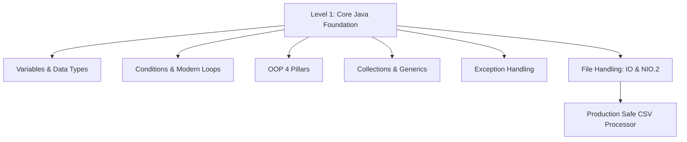

## ☕ Level 1 — Core Java Foundation & File I/O Deep Dive
### (အခြေခံ အဆောက်အအုံမှသည် လက်တွေ့ လုပ်ငန်းခွင်သုံး File Handling အထိ ပြည့်စုံသော လမ်းညွှန်)

---

## 📌 ၁။ Level 1 ၏ ရည်ရွယ်ချက်နှင့် အဓိက အနှစ်သာရ

Java ဖြင့် Enterprise Backend Application ကြီးများကို ရေးသားရာတွင် Framework များ (ဥပမာ - Spring Boot, Quarkus) ကို တိုက်ရိုက် မလေ့လာမီ **Java Core Foundation** ကို ကျောက်ဆစ်သဖွယ် ခိုင်မာအောင် တည်ဆောက်ထားရန် မဖြစ်မနေ လိုအပ်ပါသည်။

Level 1 တွင် ပါဝင်သော အဓိက အစိတ်အပိုင်း ၈ ရပ်:
1. **Variables & Primitive vs Reference Types** (Memory footprint နှင့် Type Casting)
2. **Control Flow & Modern Switch Expressions** (Conditionals နှင့် Loop Mechanics)
3. **Methods & Parameter Passing** (Pass-by-Value သဘောတရား အမှန်)
4. **Object-Oriented Programming (OOP) Core** (မဏ္ဍိုင် ၄ ရပ် လက်တွေ့နမူနာ)
5. **Collections Framework Basics** (`List`, `Set`, `Map`)
6. **Exception Handling Mechanics** (Checked vs Unchecked, `try-catch-finally`)
7. **Classic Java I/O vs Modern Java NIO.2** (`BufferedReader` မှ `java.nio.file.Files`)
8. **Hands-on Production Lab: Safe CSV File Parser** (`try-with-resources` ဖြင့် Resource Leak ကာကွယ်ခြင်း)



---

## 🔢 ၂။ Variables, Primitive Types နှင့် Memory Representation

Java တွင် Data Types များကို **Primitive Types (၈ မျိုး)** နှင့် **Reference Types** ဟူ၍ နှစ်မျိုး ခွဲခြားထားပါသည်။

### ၂.၁ Primitive Types ၈ မျိုး၏ Memory ဇယား

| Data Type | Memory Size | Default Value | Range (တန်ဖိုး အတိုင်းအတာ) |
| :--- | :--- | :--- | :--- |
| `byte` | 1 byte (8 bits) | `0` | -128 မှ 127 |
| `short` | 2 bytes (16 bits) | `0` | -32,768 မှ 32,767 |
| `int` | 4 bytes (32 bits) | `0` | -2,147,483,648 မှ 2,147,483,647 |
| `long` | 8 bytes (64 bits) | `0L` | -9 Quintillion မှ 9 Quintillion |
| `float` | 4 bytes (32 bits) | `0.0f` | IEEE 754 Floating point (6-7 decimal precision) |
| `double` | 8 bytes (64 bits) | `0.0d` | IEEE 754 Double precision (15-16 decimal precision) |
| `char` | 2 bytes (16 bits) | `'\u0000'` | 0 မှ 65,535 (Unicode Characters) |
| `boolean` | 1 bit (JVM dependent)| `false` | `true` သို့မဟုတ် `false` |

### ၂.၂ Type Casting (Widening vs Narrowing)

```java
// 1. Widening Casting (Implicit - အလိုအလျောက် ပြောင်းလဲခြင်း, No Data Loss)
int myInt = 100;
double myDouble = myInt; // int (32-bit) -> double (64-bit)

// 2. Narrowing Casting (Explicit - လက်ဖြင့် တိုက်ရိုက် သတ်မှတ်ရခြင်း, Potential Overflow)
double price = 99.99;
int roundedPrice = (int) price; // ဒသမကိန်းများ ပြုတ်ကျသွားပြီး 99 ဖြစ်သွားမည်
```

> [!WARNING]
> **Finance & Money Pitfall**: ငွေကြေးပမာဏများ တွက်ချက်ရာတွင် Floating point (`float`, `double`) ကို **လုံးဝ မသုံးရပါ**။ Binary rounding error များ ဖြစ်ပေါ်တတ်သောကြောင့် `java.math.BigDecimal` သို့မဟုတ် အပြည့်ကိန်း Cent/Kyat ဖြင့် `long` ကိုသာ အသုံးပြုရပါမည်။

---

## 🔀 ၃။ Conditions, Modern Switch Expressions & Loops

### ၃.၁ Modern Switch Expression (Java 14+)

ရိုးရာ `switch-case` တွင် `break` ထည့်ရန် မေ့လျော့ပါက Fall-through Bug ဖြစ်တတ်ပါသည်။ Modern Java တွင် Arrow syntax (`->`) ဖြင့် တန်ဖိုးကို တိုက်ရိုက် return လုပ်နိုင်ပါသည်:

```java
public String getDayType(String day) {
    return switch (day.toUpperCase()) {
        case "MONDAY", "TUESDAY", "WEDNESDAY", "THURSDAY", "FRIDAY" -> "Weekday (ရုံးတက်ရက်)";
        case "SATURDAY", "SUNDAY" -> "Weekend (ရုံးပိတ်ရက်)";
        default -> throw new IllegalArgumentException("မှားယွင်းသော နေ့ရက်အမည်: " + day);
    };
}
```

### ၃.၂ Enhanced For-Each & Labeled Loops

```java
// Array သို့မဟုတ် List ကို လှည့်ပတ်ခြင်း
String[] frameworks = {"Spring Boot", "Quarkus", "Micronaut"};
for (String fw : frameworks) {
    System.out.println("Backend Framework: " + fw);
}

// Labeled Loop (Nested loops တွင် အတွင်းအပြင် ထိန်းချုပ်ခြင်း)
outerLoop:
for (int i = 1; i <= 3; i++) {
    for (int j = 1; j <= 3; j++) {
        if (i == 2 && j == 2) {
            break outerLoop; // အတွင်း loop သာမက အပြင် loop ကြီးတစ်ခုလုံးကိုပါ ရပ်တန့်စေခြင်း
        }
    }
}
```

---

## ⚙️ ၄။ Methods & Parameter Passing (Pass-by-Value Internals)

Java တွင် **"Everything is Pass-by-Value"** ဖြစ်ပါသည်။

- **Primitives**: တန်ဖိုး (Bits) ၏ ကော်ပီအသစ်ကို ပေးပို့သည်။
- **Objects**: Object Reference (Memory Address ညွှန်ပြချက် Pointer) ၏ **ကော်ပီအသစ်** ကို ပေးပို့သည်။

```java
public class ValueDemo {
    public static void modify(int num, StringBuilder text) {
        num = num + 10;                // Local copy ကိုသာ ပြောင်းလဲခြင်း (မူလတန်ဖိုး မပြောင်းပါ)
        text.append(" Enterprise");     // ညွှန်ပြနေသော တူညီသည့် Heap Object ကို သွားရောက် ပြင်ဆင်ခြင်း
    }

    public static void main(String[] args) {
        int x = 50;
        StringBuilder sb = new StringBuilder("Java");
        modify(x, sb);

        System.out.println(x);  // Output: 50 (မပြောင်းလဲပါ)
        System.out.println(sb); // Output: Java Enterprise (Heap object အတွင်းသား ပြောင်းလဲသွားပါသည်)
    }
}
```

---

## 🏛️ ၅။ OOP Core (Encapsulation, Inheritance, Polymorphism, Abstraction)

```java
// 1. Abstraction (Contract Design)
public interface PaymentGateway {
    boolean processPayment(double amount);
}

// 2. Encapsulation (Data Hiding & Validation)
public class BankAccount {
    private String accountNumber;
    private double balance;

    public BankAccount(String accountNumber, double initialBalance) {
        this.accountNumber = accountNumber;
        this.balance = Math.max(0, initialBalance);
    }

    public synchronized void deposit(double amount) {
        if (amount <= 0) throw new IllegalArgumentException("Amount must be positive");
        this.balance += amount;
    }

    public double getBalance() { return this.balance; }
}

// 3. Inheritance & 4. Polymorphism
public class KPayGateway implements PaymentGateway {
    @Override
    public boolean processPayment(double amount) {
        System.out.println("Processing KPay: " + amount + " MMK");
        return true;
    }
}
```

---

## 📦 ၆။ Core Collections Overview (`List`, `Set`, `Map`)

| Collection Interface | အဓိက Implementation | ဒေတာ သွင်ပြင်လက္ခဏာ | အသုံးအများဆုံး အခြေအနေ |
| :--- | :--- | :--- | :--- |
| `List<E>` | `ArrayList` | ထည့်သွင်းသည့် အစဉ်လိုက်အတိုင်းသိမ်းဆည်း (Index-based, Duplicates allowed) | ဒေတာ အစီအစဉ်အတိုင်း ပြသရန် သို့မဟုတ် ရှာဖွေဖတ်ရှုရန် |
| `Set<E>` | `HashSet` | ထပ်နေသော ဒေတာ (Duplicates) လုံးဝ ခွင့်မပြုပါ | Unique User ID များ၊ Distinct Tag များကို စိစစ်သိမ်းဆည်းရန် |
| `Map<K, V>` | `HashMap` | Key-Value တွဲလျက် သိမ်းဆည်းခြင်း (Key သည် Unique ဖြစ်ရမည်) | Caching၊ Dictionary၊ Lookup Tables များအတွက် အသုံးပြုရန် |

```java
// List
List<String> tracks = new ArrayList<>();
tracks.add("Java");
tracks.add("Spring Boot");

// Set (အလိုအလျောက် Unique ဖြစ်စေခြင်း)
Set<String> uniqueTags = new HashSet<>(tracks);

// Map (Key-Value စနစ်)
Map<String, Integer> courseChapters = new HashMap<>();
courseChapters.put("Java", 20);
courseChapters.put("Spring Boot", 25);
```

---

## 🛡️ ၇။ Exception Handling Mechanics

Exception များသည် System Crash မဖြစ်စေရန် Safe Fallback ပေးသည့် ယန္တရားဖြစ်ပါသည်:

```java
public class OrderService {
    public void validateOrder(int quantity) throws InvalidOrderException {
        if (quantity <= 0) {
            // Business Exception ပစ်ထုတ်ခြင်း
            throw new InvalidOrderException("Order အရေအတွက်သည် အနည်းဆုံး ၁ ခု ဖြစ်ရမည်။");
        }
    }
}

// Custom Checked Business Exception
public class InvalidOrderException extends Exception {
    public InvalidOrderException(String message) {
        super(message);
    }
}
```

---

## 📂 ၈။ Basic & Advanced File Handling (Java I/O vs Modern NIO.2)

### ၈.၁ Classic Java I/O (`BufferedReader` / `BufferedWriter`)

File များကို Line အလိုက် သက်သာစွာ ဖတ်ရှုရန် Buffer memory ကို ကြားခံထားသော `BufferedReader` ကို အသုံးပြုပါသည်:

```java
import java.io.*;

public class ClassicFileIO {
    public static void readLogFile(String filePath) {
        // try-with-resources: AutoCloseable ဖြစ်သဖြင့် Finally block မလိုဘဲ အလိုအလျောက် Close ပေးသည်
        try (BufferedReader reader = new BufferedReader(new FileReader(filePath))) {
            String line;
            while ((line = reader.readLine()) != null) {
                System.out.println("LOG: " + line);
            }
        } catch (FileNotFoundException e) {
            System.err.println("ဖိုင် ရှာမတွေ့ပါ: " + e.getMessage());
        } catch (IOException e) {
            System.err.println("ဖိုင်ဖတ်ရာတွင် Error ဖြစ်ပေါ်ပါသည်: " + e.getMessage());
        }
    }
}
```

### ၈.၂ Modern Java NIO.2 (`java.nio.file.Files` & `Path`) (Java 7+)

Java 7+ တွင် မိတ်ဆက်ခဲ့သော NIO.2 (`Files`, `Paths`) သည် Code ရေးရ အလွန်တိုတောင်းပြီး Modern Stream API များနှင့် တိုက်ရိုက် ချိတ်ဆက်နိုင်ပါသည်:

```java
import java.nio.file.*;
import java.io.IOException;
import java.util.List;
import java.util.stream.Stream;

public class ModernNIOFile {
    public static void processLargeFile(Path path) throws IOException {
        // ၁။ ဖိုင်တစ်ခုလုံးကို Memory ထဲ တိုက်ရိုက် string အဖြစ် ရေးသားခြင်း
        Files.writeString(path, "ID,Name,Role\n1,Kyaw,Senior Java Architect\n", StandardOpenOption.CREATE);

        // ၂။ ဖိုင်ကို Memory-efficient ဖြစ်အောင် Stream ဖြင့် တစ်ကြောင်းချင်း Lazy Process ပြုလုပ်ခြင်း
        try (Stream<String> lines = Files.lines(path)) {
            lines.filter(line -> !line.startsWith("ID")) // Header ကျော်ခြင်း
                 .map(String::trim)
                 .forEach(line -> System.out.println("Processing Employee: " + line));
        }
    }
}
```

---

## 🛠️ ၉။ Hands-on Production Lab: Safe CSV File Parser

လုပ်ငန်းခွင်တွင် တွေ့ကြုံရမည့် User Data CSV ဖိုင်ကို စနစ်တကျ ဖတ်ရှုပြီး Data Validation ပြုလုပ်ကာ Model Object များအဖြစ် ပြောင်းလဲပေးသည့် Production-Grade Parser ကုဒ်:

```java
package com.learnstack.core.file;

import java.io.BufferedReader;
import java.io.IOException;
import java.nio.file.Files;
import java.nio.file.Path;
import java.util.ArrayList;
import java.util.List;

public class ProductionCsvParser {

    public record StudentRecord(int id, String name, String email, double gpa) {}

    public static List<StudentRecord> parseStudentsCsv(Path csvPath) throws IOException {
        List<StudentRecord> students = new ArrayList<>();

        if (!Files.exists(csvPath)) {
            throw new IllegalArgumentException("CSV ဖိုင်လမ်းကြောင်း မှားယွင်းနေပါသည်: " + csvPath);
        }

        try (BufferedReader reader = Files.newBufferedReader(csvPath)) {
            String line;
            boolean isHeader = true;
            int lineNumber = 0;

            while ((line = reader.readLine()) != null) {
                lineNumber++;
                if (line.isBlank()) continue;

                // ပထမဆုံး Header ကြောင်းကို ကျော်ပါ
                if (isHeader) {
                    isHeader = false;
                    continue;
                }

                String[] tokens = line.split(",");
                if (tokens.length < 4) {
                    System.err.println("Line " + lineNumber + " တွင် ကော်လံ မပြည့်စုံပါ: " + line);
                    continue;
                }

                try {
                    int id = Integer.parseInt(tokens[0].trim());
                    String name = tokens[1].trim();
                    String email = tokens[2].trim();
                    double gpa = Double.parseDouble(tokens[3].trim());

                    students.add(new StudentRecord(id, name, email, gpa));
                } catch (NumberFormatException nfe) {
                    System.err.println("Line " + lineNumber + " တွင် ဒေတာ အမျိုးအစား မှားယွင်းနေပါသည်: " + line);
                }
            }
        }

        return students;
    }
}
```

---

## 🎯 ၁၀။ အနှစ်ချုပ် (Summary Checklist)

- [x] Primitive types ၈ မျိုးနှင့် memory footprint ကို နားလည်ပြီး ငွေကြေးအတွက် `BigDecimal` ကို ရွေးချယ်တတ်ခြင်း။
- [x] Java သည် ကိန်းဂဏန်းသာမက Object Reference ကိုပါ **Pass-by-Value** ဖြင့် ကော်ပီကူးယူ ပေးပို့ခြင်းကို သိရှိခြင်း။
- [x] Modern switch expression (`->`) ဖြင့် clean code ရေးသားနိုင်ခြင်း။
- [x] `try-with-resources` ကို အသုံးပြု၍ ဖိုင် connection များကို Memory Leak မဖြစ်အောင် ပိတ်သိမ်းနိုင်ခြင်း။
- [x] Modern `java.nio.file.Files` Stream API ဖြင့် Memory-efficient ဖြစ်သော File Processing ကို ရေးသားတတ်ခြင်း။
