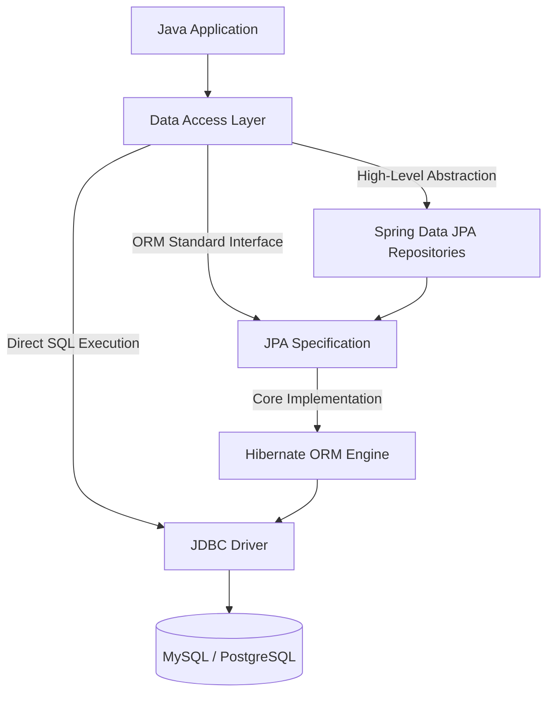

## 🗄️ Level 2 — SQL, Database Architecture & Java Persistence
### (Relational Data Modeling မှသည် Enterprise ORM Frameworks အထိ အသေးစိတ် လမ်းညွှန်)

---

## 📌 ၁။ Level 2 ၏ ရည်ရွယ်ချက်နှင့် အဓိက အနှစ်သာရ

Backend Developer တစ်ယောက်၏ အဓိက တာဝန်သည် စီးပွားရေး လုပ်ငန်းသုံး ဒေတာများကို မှန်ကန်၊ လုံခြုံ၊ မြန်ဆန်စွာ သိမ်းဆည်းခြင်းနှင့် ပြန်လည် ထုတ်ယူခြင်း (Store & Retrieve) ဖြစ်ပါသည်။

Level 2 တွင် အောက်ပါ အရေးပါသော အပိုင်း ၂ ပိုင်းကို အသေးစိတ် လေ့လာပါမည်:
1. **Must-Know SQL & Relational Database Design** (MySQL / PostgreSQL)
2. **Java Data Access Spectrum** (**JDBC** vs **JPA** vs **Hibernate** vs **Spring Data JPA**)



---

## 📝 ၂။ Must-Know Production SQL Commands

### ၂.၁ Basic CRUD Operations (Create, Read, Update, Delete)

```sql
-- 1. INSERT (အချက်အလက် အသစ်ထည့်သွင်းခြင်း)
INSERT INTO users (username, email, status, created_at)
VALUES ('kyawwaiyan', 'kyaw@learnstack.dev', 'ACTIVE', NOW());

-- 2. SELECT (ဒေတာ ရွေးချယ်ဖတ်ရှုခြင်း)
SELECT id, username, email FROM users WHERE status = 'ACTIVE';

-- 3. UPDATE (ဒေတာ ပြင်ဆင်ခြင်း - WHERE မပါပါက တစ်ဇယားလုံး ပြောင်းလဲသွားတတ်သဖြင့် သတိပြုရန်)
UPDATE users SET status = 'SUSPENDED' WHERE id = 101;

-- 4. DELETE (ဒေတာ ဖျက်ထုတ်ခြင်း)
DELETE FROM users WHERE id = 101;
```

### ၂.၂ Filtering, Grouping & Aggregations (`WHERE`, `GROUP BY`, `HAVING`)

> [!IMPORTANT]
> **WHERE vs HAVING ကွာခြားချက်**:
> - `WHERE`: Table ထဲရှိ Row များကို Group မဖွဲ့မီ ဦးစွာ စစ်ထုတ်သည် (Filter before grouping)။ Aggregate functions (`COUNT`, `SUM`, `AVG`) ကို တိုက်ရိုက် မသုံးနိုင်ပါ။
> - `HAVING`: `GROUP BY` ပြုလုပ်ပြီးမှ ထွက်ပေါ်လာသော Group ရလဒ်များကို စစ်ထုတ်သည် (Filter after grouping)။

```sql
-- ဌာနအလိုက် ဝန်ထမ်းအနည်းဆုံး ၅ ယောက်ရှိပြီး ပျမ်းမျှလစာ $3,000 ကျော်သော ဌာနများကိုသာ ရှာဖွေခြင်း
SELECT department_id, COUNT(*) AS total_employees, AVG(salary) AS avg_salary
FROM employees
WHERE is_active = 1                           -- ၁။ Row အဆင့် စစ်ထုတ်ခြင်း
GROUP BY department_id                        -- ၂။ ဌာနအလိုက် စုစည်းခြင်း
HAVING COUNT(*) >= 5 AND AVG(salary) > 3000   -- ၃။ Group အဆင့် စစ်ထုတ်ခြင်း
ORDER BY avg_salary DESC;                     -- ၄။ လစာအများဆုံးမှ အနည်းဆုံးသို့ စီစဉ်ခြင်း
```

---

## 🔗 ၃။ Database Relationships & Joins

### ၃.၁ Relationships ၃ မျိုး (Data Cardinality)

1. **One-to-One (1:1)**:
   - ဥပမာ: `users` (User အကောင့်) နှင့် `user_profiles` (အသေးစိတ် ကိုယ်ရေးမှတ်တမ်း)။
   - Foreign Key တွင် `UNIQUE` constraint ထည့်သွင်း၍ ချိတ်ဆက်သည်။
2. **One-to-Many (1:N)**:
   - ဥပမာ: `orders` (အမှာစာ ၁ ခု) တွင် `order_items` (ပစ္စည်းမျိုးစုံ N ခု) ပါဝင်ခြင်း။
   - Many ဘက်ခြမ်း (`order_items`) တွင် Foreign Key `order_id` ထည့်သွင်းသည်။
3. **Many-to-Many (M:N)**:
   - ဥပမာ: `students` နှင့် `courses` (ကျောင်းသားတစ်ယောက် ဘာသာရပ်များစွာ တက်ရောက်နိုင်သလို၊ ဘာသာရပ်တစ်ခုတွင်လည်း ကျောင်းသားများစွာ ရှိနိုင်သည်)။
   - ကြားခံ Junction Table (`enrollments` table: `student_id`, `course_id`) ဖြင့် ချိတ်ဆက်ရသည်။

### ၃.၂ INNER JOIN vs LEFT JOIN

```sql
-- INNER JOIN: နှစ်ဖက်စလုံးတွင် ကိုက်ညီသော ဒေတာရှိမှသာ ထုတ်ပေးသည်
SELECT o.id, o.order_number, c.customer_name
FROM orders o
INNER JOIN customers c ON o.customer_id = c.id;

-- LEFT JOIN (Left Outer Join): ဘယ်ဘက် Table (users) ရှိ ဒေတာအားလုံးပါမည်။ 
-- ညာဘက်တွင် Order မရှိသေးပါက NULL အဖြစ် ပြသမည်
SELECT u.id, u.username, o.id AS order_id
FROM users u
LEFT JOIN orders o ON u.id = o.user_id;
```

---

## ⚡ ၄။ Database Performance: Indexes, ACID & Pagination

### ၄.၁ B-Tree Indexing Deep Dive

- **Clustered Index**: Primary Key အတွက် Default ဖြစ်ပြီး Table ရှိ Physical Data များကို disk ပေါ်တွင် အစဉ်လိုက် စီစဉ်သိမ်းဆည်းပေးသည်။ (Table တစ်ခုတွင် ၁ ခုသာ ရှိနိုင်သည်)။
- **Secondary Index**: Search မြန်ဆန်စေရန် သီးခြား B-Tree Table ဆောက်ထားခြင်း ဖြစ်သည် (ဥပမာ: `email`, `created_at` ပေါ်တွင် index ဆောက်ခြင်း)။

```sql
-- Performance တက်စေရန် Index တည်ဆောက်ခြင်း
CREATE INDEX idx_users_email ON users(email);

-- Composite Index (ကော်လံ နှစ်ခုတွဲ စစ်ဆေးခြင်း)
CREATE INDEX idx_orders_customer_date ON orders(customer_id, order_date);
```

> [!TIP]
> **Index Trade-off**: Index များပြားပါက `SELECT` ရှာဖွေမှု အလွန်မြန်ဆန်သော်လည်း၊ `INSERT`, `UPDATE`, `DELETE` ပြုလုပ်သည့်အခါ Index Tree ကို ပြန်လည်ပြင်ဆင်ရသဖြင့် Write Performance အနည်းငယ် နှေးကွေးနိုင်ပါသည်။

### ၄.၂ Transactions & ACID Properties

Transaction ဆိုသည်မှာ အလုပ်အားလုံး အောင်မြင်မှသာ အတည်ပြုမည့် သို့မဟုတ် တစ်ခုမှားပါက မူလအတိုင်း ပြန်ဖျက်မည့် Unit of Work ဖြစ်ပါသည်:

- **Atomicity (All or Nothing)**: အဆင့်အားလုံး ပြီးဆုံးမှ အောင်မြင်မည်။ တစ်ခုခု error တက်ပါက `ROLLBACK` ဖြစ်မည်။
- **Consistency**: Database ၏ Rules, Constraints, Data types များကို မချိုးဖောက်စေရ။
- **Isolation**: ပြိုင်တူ run နေသော transaction တစ်ခုနှင့်တစ်ခု မရှုပ်ထွေးစေရန် သီးခြားစီ ခွဲထုတ်ထားခြင်း။
- **Durability**: Commit ပြီးသွားသော ဒေတာများသည် Server မီးပျက်သွားလျှင်ပင် ပျောက်ပျက်မသွားခြင်း။

```sql
START TRANSACTION;

-- အကောင့် A မှ ဒေါ်လာ ၁၀၀ နုတ်ယူခြင်း
UPDATE accounts SET balance = balance - 100 WHERE id = 1;

-- အကောင့် B သို့ ဒေါ်လာ ၁၀၀ ပေါင်းထည့်ခြင်း
UPDATE accounts SET balance = balance + 100 WHERE id = 2;

-- အားလုံးအောင်မြင်မှ အတည်ပြုခြင်း
COMMIT;
-- ပြဿနာတစ်ခုခုဖြစ်ပါက: ROLLBACK;
```

---

## 🏛️ ၅။ Java Persistence Architecture: 4 Pillars နှိုင်းယှဉ်ချက်

လုပ်ငန်းခွင် Java Backend တွင် အသုံးအများဆုံး အလွှာ ၄ ခု၏ အဓိက သဘောတရား:

| နည်းပညာ | အမျိုးအစား | အဓိက အားသာချက် | အားနည်းချက် |
| :--- | :--- | :--- | :--- |
| **JDBC** | Low-Level Java Standard API | အမြန်ဆုံး Execution Speed၊ Query အားလုံးကို တိုက်ရိုက် ထိန်းချုပ်နိုင်ခြင်း | Boilerplate Code များခြင်း၊ Manual Mapping ရေးရခြင်း |
| **JPA** | Official Standard Specification | Java Interface Specification သာဖြစ်ပြီး Vendor Lock-in မရှိခြင်း | Specification သာဖြစ်၍ အမှန်တကယ် run ရန် Engine (Hibernate) လိုအပ် |
| **Hibernate** | JPA Implementation (ORM Engine) | Object-Relational Mapping အပြည့်အစုံ၊ Caching (1st/2nd level), Dirty Checking | အလွန်နက်နဲပြီး N+1 Query Problem ဖြစ်တတ်ခြင်း |
| **Spring Data JPA** | High-Level Framework Abstraction | Repository Interface ရေးရုံဖြင့် CRUD အားလုံး အလိုအလျောက် ရရှိခြင်း | အတွင်းပိုင်း Hibernate အလုပ်လုပ်ပုံကို နားမလည်ပါက Performance leak ဖြစ်နိုင် |

---

## 💻 ၆။ Hands-on Implementation: JDBC vs Spring Data JPA

### ၆.၁ Raw JDBC (PreparedStatement ဖြင့် SQL Injection ကာကွယ်ခြင်း)

```java
import java.sql.*;
import java.util.Optional;

public class RawJdbcUserRepository {
    private final String dbUrl = "jdbc:mysql://localhost:3306/enterprise_db";
    private final String dbUser = "root";
    private final String dbPass = "secret123";

    public Optional<User> findUserByEmail(String email) {
        // SQL Injection ကာကွယ်ရန် ? Placeholder သုံးရသည်
        String sql = "SELECT id, username, email FROM users WHERE email = ?";

        try (Connection conn = DriverManager.getConnection(dbUrl, dbUser, dbPass);
             PreparedStatement stmt = conn.prepareStatement(sql)) {

            stmt.setString(1, email);

            try (ResultSet rs = stmt.executeQuery()) {
                if (rs.next()) {
                    User user = new User(
                        rs.getLong("id"),
                        rs.getString("username"),
                        rs.getString("email")
                    );
                    return Optional.of(user);
                }
            }
        } catch (SQLException e) {
            e.printStackTrace();
        }
        return Optional.empty();
    }
}
```

### ၆.၂ Modern Spring Data JPA (Entity & Repository Pattern)

Spring Data JPA တွင် Boilerplate Connection ကုဒ်များ ရေးသားရန် မလိုဘဲ Interface ကြေညာရုံဖြင့် အလုပ်လုပ်ပါသည်:

```java
package com.learnstack.enterprise.entity;

import jakarta.persistence.*;
import lombok.Getter;
import lombok.NoArgsConstructor;
import lombok.Setter;
import java.time.LocalDateTime;

@Entity
@Table(name = "users")
@Getter @Setter @NoArgsConstructor
public class User {

    @Id
    @GeneratedValue(strategy = GenerationType.IDENTITY)
    private Long id;

    @Column(nullable = false, unique = true, length = 50)
    private String username;

    @Column(nullable = false, unique = true, length = 100)
    private String email;

    @Enumerated(EnumType.STRING)
    @Column(nullable = false)
    private UserStatus status = UserStatus.ACTIVE;

    @Column(name = "created_at", updatable = false)
    private LocalDateTime createdAt = LocalDateTime.now();
}
```

```java
package com.learnstack.enterprise.repository;

import com.learnstack.enterprise.entity.User;
import org.springframework.data.domain.Page;
import org.springframework.data.domain.Pageable;
import org.springframework.data.jpa.repository.JpaRepository;
import org.springframework.data.jpa.repository.Query;
import org.springframework.data.repository.query.Param;
import org.springframework.stereotype.Repository;

import java.util.Optional;

@Repository
public interface UserRepository extends JpaRepository<User, Long> {

    // 1. Derived Query Method (Spring မှ အလိုအလျောက် SQL ဖန်တီးပေးခြင်း)
    Optional<User> findByEmail(String email);

    // 2. Pagination & Sorting အလိုအလျောက် ထောက်ပံ့မှု
    Page<User> findByStatus(UserStatus status, Pageable pageable);

    // 3. Custom JPQL Query
    @Query("SELECT u FROM User u WHERE u.username LIKE %:keyword% AND u.status = 'ACTIVE'")
    Page<User> searchActiveUsers(@Param("keyword") String keyword, Pageable pageable);
}
```

---

## 🎯 ၇။ အနှစ်ချုပ် (Summary Checklist)

- [x] CRUD SQL နှင့် `WHERE` vs `HAVING` အသုံးပြုပုံကို သဲသဲကွဲကွဲ နားလည်ခြင်း။
- [x] `INNER JOIN` နှင့် `LEFT JOIN` ကို အသုံးပြု၍ 1:1, 1:N, M:N Data များကို ဆက်စပ်ဆွဲယူနိုင်ခြင်း။
- [x] B-Tree Index ၏ အားသာချက်/အားနည်းချက်နှင့် ACID Transaction ကို နားလည်ခြင်း။
- [x] **JDBC** (Low-level Connection), **JPA** (Standard API), **Hibernate** (ORM Engine) နှင့် **Spring Data JPA** (Repository Abstraction) တို့၏ ကွာခြားချက်ကို ရှင်းလင်းစွာ ခွဲခြားနိုင်ခြင်း။
- [x] Spring Data JPA ဖြင့် Clean & Maintainable ဖြစ်သော Entity/Repository Layer ကို တည်ဆောက်တတ်ခြင်း။
