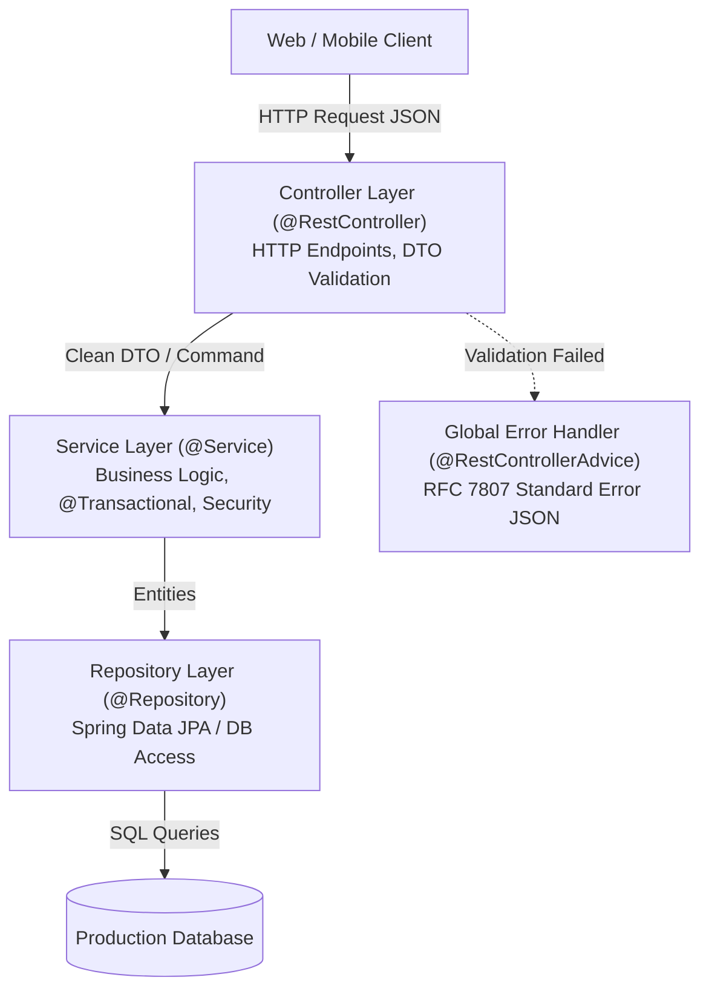

## 🍃 Level 3 — Spring Boot Enterprise Backend Development
### (REST APIs, IoC/DI, Layered Architecture, Validation, Transactions & Error Handling)

---

## 📌 ၁။ Level 3 ၏ ရည်ရွယ်ချက်နှင့် အဓိက အနှစ်သာရ

Modern Enterprise Java Backend တွင် **Spring Boot** သည် ကမ္ဘာ့အသုံးအများဆုံး စံသတ်မှတ်ချက် Framework ဖြစ်ပါသည်။

ဤ Level 3 တွင် Production-grade Backend Application တစ်ခု တည်ဆောက်ရာတွင် မရှိမဖြစ် ကျွမ်းကျင်ထားရမည့် မဏ္ဍိုင်ကြီး ၆ ရပ်ကို လက်တွေ့ သင်ယူပါမည်:
1. **Spring Core: Inversion of Control (IoC) & Dependency Injection (DI)**
2. **Spring Boot Project Layout & Multi-Profile Configuration (`application.yml`)**
3. **RESTful API Standards & Controller Layer (`@RestController`, HTTP Methods)**
4. **Business Logic & Service Layer (`@Service`, Separation of Concerns)**
5. **Request Validation (`@Valid`) & Global Error Handling (`@RestControllerAdvice`)**
6. **Declarative Transactions (`@Transactional`) & Spring Security Overview**



---

## 🧩 ၂။ Spring Core: IoC, Dependency Injection & Beans

### ၂.၁ Inversion of Control (IoC) ဆိုသည်မှာ အဘယ်နည်း?
သမားရိုးကျ Java တွင် Object တစ်ခုကို `new` keyword ဖြင့် ကိုယ်တိုင်ဆောက်ရသည် (`OrderService s = new OrderService()`)။
Spring တွင်မူ Object များ၏ Lifecycle (ဖန်တီးခြင်း၊ ဆက်စပ်ပေးခြင်း၊ ဖျက်သိမ်းခြင်း) ကို **Spring IoC Container** က တာဝန်ယူပေးပါသည်။ ဤသို့ ထိန်းချုပ်မှုကို Framework ထံ လွှဲပြောင်းပေးခြင်းကို **Inversion of Control** ဟု ခေါ်ပါသည်။

### ၂.၂ Constructor Injection (Best Practice)
Spring တွင် Injection နည်းလမ်း ၃ မျိုးရှိသော်လည်း လုပ်ငန်းခွင်တွင် **Constructor Injection** ကိုသာ စံအဖြစ် သတ်မှတ်သုံးစွဲပါသည်:

```java
package com.learnstack.service;

import com.learnstack.repository.UserRepository;
import org.springframework.stereotype.Service;

@Service
public class UserService {

    // final ဖြင့် immutability ရရှိစေပြီး Unit Testing တွင် Mock ထည့်သွင်းရ လွယ်ကူစေသည်
    private final UserRepository userRepository;
    private final EmailNotificationService emailService;

    // Spring 4.3+ တွင် Constructor တစ်ခုတည်းရှိပါက @Autowired ရေးရန် မလိုပါ
    public UserService(UserRepository userRepository, EmailNotificationService emailService) {
        this.userRepository = userRepository;
        this.emailService = emailService;
    }
}
```

---

## 📁 ၃။ Production Package Layout & Multi-Profile Configuration

### ၃.၁ Clean Package Structure

```
src/main/java/com/learnstack/ecommerce/
  ├── config/             # Spring Security, Swagger/OpenAPI, WebMvc configs
  ├── controller/         # REST Controllers (@RestController)
  ├── dto/                # Request & Response Data Transfer Objects
  ├── entity/             # JPA Entities mapped to Database Tables
  ├── exception/          # Custom Exceptions & Global @RestControllerAdvice
  ├── repository/         # Spring Data JPA Repositories
  └── service/            # Business Logic Interfaces & Implementations
src/main/resources/
  ├── application.yml         # Base Configuration (Common settings)
  ├── application-dev.yml     # Local Development Environment (H2 / Local MySQL)
  └── application-prod.yml    # Production Cloud Environment (AWS RDS, Secret Manager)
```

### ၃.၂ `application.yml` Multi-Profile Configuration

```yaml
spring:
  profiles:
    active: dev # လက်ရှိ Run မည့် Profile (dev သို့မဟုတ် prod)
  application:
    name: learnstack-ecommerce-api

---
# Development Environment
spring:
  config:
    activate:
      on-profile: dev
  datasource:
    url: jdbc:mysql://localhost:3306/dev_db?useSSL=false
    username: root
    password: ${DB_PASSWORD:devpassword}
  jpa:
    hibernate:
      ddl-auto: update
    show-sql: true

---
# Production Environment
spring:
  config:
    activate:
      on-profile: prod
  datasource:
    url: jdbc:mysql://${DB_HOST:prod-db.internal}:3306/prod_db
    username: ${DB_USER}
    password: ${DB_PASS}
    hikari:
      maximum-pool-size: 20
      minimum-idle: 5
  jpa:
    hibernate:
      ddl-auto: validate # Production တွင် Schema အလိုအလျောက် မပြင်ဆင်စေရန် validate သာထားရမည်
    show-sql: false
```

---

## 🌐 ၄။ REST API Layer: Controller, DTOs & Validation

### ၄.၁ DTO (Data Transfer Object) ဖြင့် Request စစ်ဆေးခြင်း

```java
package com.learnstack.dto;

import jakarta.validation.constraints.*;
import java.math.BigDecimal;

public record CreateProductRequest(
    @NotBlank(message = "Product အမည် မဖြစ်မနေ ထည့်သွင်းရပါမည်")
    @Size(min = 3, max = 100, message = "Product အမည်သည် ၃ လုံးမှ ၁၀၀ လုံးအတွင်း ဖြစ်ရမည်")
    String name,

    @NotNull(message = "စျေးနှုန်း မဖြစ်မနေ လိုအပ်ပါသည်")
    @DecimalMin(value = "0.01", message = "စျေးနှုန်းသည် အနည်းဆုံး 0.01 ဖြစ်ရပါမည်")
    BigDecimal price,

    @Min(value = 0, message = "Stock အရေအတွက်သည် အနှုတ်မဖြစ်ရပါ")
    int stockQuantity
) {}
```

### ၄.၂ `@RestController` Implementation

```java
package com.learnstack.controller;

import com.learnstack.dto.CreateProductRequest;
import com.learnstack.dto.ProductResponse;
import com.learnstack.service.ProductService;
import jakarta.validation.Valid;
import org.springframework.http.HttpStatus;
import org.springframework.http.ResponseEntity;
import org.springframework.web.bind.annotation.*;

import java.util.List;

@RestController
@RequestMapping("/api/v1/products")
public class ProductController {

    private final ProductService productService;

    public ProductController(ProductService productService) {
        this.productService = productService;
    }

    // 1. POST: Create Resource (HTTP 201 Created)
    @PostMapping
    public ResponseEntity<ProductResponse> createProduct(@Valid @RequestBody CreateProductRequest request) {
        ProductResponse response = productService.createProduct(request);
        return ResponseEntity.status(HttpStatus.CREATED).body(response);
    }

    // 2. GET: Read Single Resource by ID (HTTP 200 OK)
    @GetMapping("/{id}")
    public ResponseEntity<ProductResponse> getProductById(@PathVariable Long id) {
        return ResponseEntity.ok(productService.getProductById(id));
    }

    // 3. DELETE: Remove Resource (HTTP 204 No Content)
    @DeleteMapping("/{id}")
    public ResponseEntity<Void> deleteProduct(@PathVariable Long id) {
        productService.deleteProduct(id);
        return ResponseEntity.noContent().build();
    }
}
```

---

## 💼 ၅။ Service Layer & Declarative Transactions (`@Transactional`)

Service Layer သည် စီးပွားရေး စည်းမျဉ်းများ (Business Rules) အားလုံးကို ထိန်းကျောင်းပြီး Database Transaction ၏ အစအဆုံးကို တာဝန်ယူပါသည်:

```java
package com.learnstack.service;

import com.learnstack.dto.CreateProductRequest;
import com.learnstack.dto.ProductResponse;
import com.learnstack.entity.Product;
import com.learnstack.exception.ResourceNotFoundException;
import com.learnstack.repository.ProductRepository;
import org.springframework.stereotype.Service;
import org.springframework.transaction.annotation.Transactional;

@Service
public class ProductServiceImpl implements ProductService {

    private final ProductRepository productRepository;

    public ProductServiceImpl(ProductRepository productRepository) {
        this.productRepository = productRepository;
    }

    // Read Operations တွင် readOnly = true ထားရှိခြင်းဖြင့် DB Performance သက်သာစေသည်
    @Override
    @Transactional(readOnly = true)
    public ProductResponse getProductById(Long id) {
        Product product = productRepository.findById(id)
            .orElseThrow(() -> new ResourceNotFoundException("Product ID " + id + " ရှာမတွေ့ပါ"));
        return ProductResponse.fromEntity(product);
    }

    // Write Operations တွင် Exception တက်ပါက အလိုအလျောက် Rollback ဖြစ်စေသည်
    @Override
    @Transactional(rollbackFor = Exception.class)
    public ProductResponse createProduct(CreateProductRequest request) {
        Product product = new Product();
        product.setName(request.name());
        product.setPrice(request.price());
        product.setStockQuantity(request.stockQuantity());

        Product saved = productRepository.save(product);
        return ProductResponse.fromEntity(saved);
    }
}
```

---

## 🚨 ၆။ Global Error Handling (`@RestControllerAdvice`)

API client များထံသို့ ညီညွတ်မျှတသော Error JSON Response ပေးနိုင်ရန် Controller Advice ကို အသုံးပြုပါသည်:

```java
package com.learnstack.exception;

import org.springframework.http.HttpStatus;
import org.springframework.http.ResponseEntity;
import org.springframework.web.bind.MethodArgumentNotValidException;
import org.springframework.web.bind.annotation.ExceptionHandler;
import org.springframework.web.bind.annotation.RestControllerAdvice;

import java.time.LocalDateTime;
import java.util.HashMap;
import java.util.Map;

@RestControllerAdvice
public class GlobalExceptionHandler {

    // 1. Handle Resource Not Found (HTTP 404)
    @ExceptionHandler(ResourceNotFoundException.class)
    public ResponseEntity<Map<String, Object>> handleNotFound(ResourceNotFoundException ex) {
        Map<String, Object> error = new HashMap<>();
        error.put("timestamp", LocalDateTime.now());
        error.put("status", HttpStatus.NOT_FOUND.value());
        error.put("error", "Not Found");
        error.put("message", ex.getMessage());
        return ResponseEntity.status(HttpStatus.NOT_FOUND).body(error);
    }

    // 2. Handle DTO Validation Failures (HTTP 400 Bad Request)
    @ExceptionHandler(MethodArgumentNotValidException.class)
    public ResponseEntity<Map<String, Object>> handleValidationErrors(MethodArgumentNotValidException ex) {
        Map<String, Object> response = new HashMap<>();
        Map<String, String> fieldErrors = new HashMap<>();

        ex.getBindingResult().getFieldErrors().forEach(err -> 
            fieldErrors.put(err.getField(), err.getDefaultMessage())
        );

        response.put("timestamp", LocalDateTime.now());
        error.put("status", HttpStatus.BAD_REQUEST.value());
        response.put("error", "Validation Failed");
        response.put("fieldErrors", fieldErrors);

        return ResponseEntity.badRequest().body(response);
    }
}
```

---

## 🔒 ၇။ Production Spring Security Overview

Spring Boot 3+ တွင် Functional Lambda DSL ဖြင့် Stateless JWT Security Filter Chain ကို တည်ဆောက်ပါသည်:

```java
package com.learnstack.config;

import org.springframework.context.annotation.Bean;
import org.springframework.context.annotation.Configuration;
import org.springframework.security.config.annotation.web.builders.HttpSecurity;
import org.springframework.security.config.annotation.web.configuration.EnableWebSecurity;
import org.springframework.security.config.http.SessionCreationPolicy;
import org.springframework.security.crypto.bcrypt.BCryptPasswordEncoder;
import org.springframework.security.crypto.password.PasswordEncoder;
import org.springframework.security.web.SecurityFilterChain;

@Configuration
@EnableWebSecurity
public class SecurityConfig {

    @Bean
    public SecurityFilterChain filterChain(HttpSecurity http) throws Exception {
        return http
            .csrf(csrf -> csrf.disable()) // Stateless REST API ဖြစ်သဖြင့် CSRF ပိတ်ထားနိုင်သည်
            .sessionManagement(sm -> sm.sessionCreationPolicy(SessionCreationPolicy.STATELESS))
            .authorizeHttpRequests(auth -> auth
                .requestMatchers("/api/v1/auth/**", "/public/**").permitAll() // အများပြည်သူ ဝင်ခွင့်
                .requestMatchers("/api/v1/admin/**").hasRole("ADMIN")           // Admin သာ ဝင်ခွင့်
                .anyRequest().authenticated()                                   // ကျန် API များ Token လိုအပ်
            )
            .build();
    }

    @Bean
    public PasswordEncoder passwordEncoder() {
        return new BCryptPasswordEncoder(); // စကားဝှက်များကို လုံခြုံစွာ Hash ပြုလုပ်ပေးသည့် Encoder
    }
}
```

---

## 🎯 ၈။ အနှစ်ချုပ် (Summary Checklist)

- [x] IoC Container နှင့် Constructor Injection ၏ အားသာချက်များကို ရှင်းလင်းစွာ နားလည်ခြင်း။
- [x] Multi-Environment Configuration (`application.yml`) ဖြင့် `dev` နှင့် `prod` profiles ခွဲခြားသတ်မှတ်နိုင်ခြင်း။
- [x] `@RestController` ဖြင့် Clean REST APIs (HTTP Status Codes, PathVariables, RequestBody) တည်ဆောက်တတ်ခြင်း။
- [x] `@Valid` annotations ဖြင့် User input များကို စနစ်တကျ စစ်ဆေးနိုင်ခြင်း။
- [x] `@Transactional` ဖြင့် Database Transaction များကို အလိုအလျောက် commit/rollback စီမံခန့်ခွဲနိုင်ခြင်း။
- [x] `@RestControllerAdvice` ဖြင့် Standard Error JSON format ပြန်လည်ထုတ်ပေးနိုင်ခြင်း။
