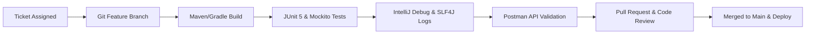

## 🛠️ Level 4 — Professional Development Tools & Daily Workflow
### (Git, Build Automation, Unit Testing, Mocking, Logging, Postman & Code Review Standards)

---

## 📌 ၁။ Level 4 ၏ ရည်ရွယ်ချက်နှင့် အဓိက အနှစ်သာရ

ကုဒ်ရေးတတ်ရုံမျှဖြင့် လုပ်ငန်းခွင်တွင် အောင်မြင်သော Software Engineer မဖြစ်နိုင်ပါ။ အသင်းအဖွဲ့ (Team Environment) ဖြင့် လုပ်ကိုင်ရာတွင် အသုံးပြုရသည့် **Professional Developer Tools & Workflow** များကို ကျွမ်းကျင်စွာ အသုံးချနိုင်ရန် လိုအပ်ပါသည်။

ဤ Level 4 တွင် နေ့စဉ် လုပ်ငန်းခွင်သုံး ကိရိယာ ၇ မျိုးကို လေ့လာပါမည်:
1. **Git & Branching Workflow** (Feature Branches, Conventional Commits & Merge Conflicts)
2. **Build Tools: Maven vs Gradle** (`pom.xml`, Lifecycle Phases & Dependency Management)
3. **Automated Testing: JUnit 5 & Mockito** (Unit Tests, Mocking & Assertions)
4. **IntelliJ Debugging & Stack Trace Analysis** (Breakpoints & Root Cause Investigation)
5. **Enterprise Logging with SLF4J & Logback** (Log Levels & Production Formatting)
6. **API Testing with Postman** (Collections, Environments & Test Scripts)
7. **Clean Code & Professional Code Review Standards** (Pull Request Etiquette)



---

## 🌿 ၂။ Git Version Control & Production Branching Workflow

### ၂.၁ Feature Branch Workflow
Production code (`main`) ပေါ်တွင် တိုက်ရိုက် commit မလုပ်ရပါ။ Ticket အလိုက် Branch အသစ်ခွဲ၍ အလုပ်လုပ်ရသည်:

```bash
# 1. Main branch မှ နောက်ဆုံး update ဆွဲယူခြင်း
git checkout main
git pull origin main

# 2. Feature branch အသစ်ဖွင့်ခြင်း (Ticket ID ဖြင့်)
git checkout -b feature/JIRA-102-user-registration

# 3. Conventional Commit ဖြင့် သပ်ရပ်စွာ commit ရေးသားခြင်း
git add .
git commit -m "feat(auth): implement user registration with bcrypt password hashing"

# 4. Remote repository သို့ push ပြုလုပ်ခြင်း
git push origin feature/JIRA-102-user-registration
```

### ၂.၂ Merge Conflicts ဖြေရှင်းနည်း (Rebase Over Merge)
အခြား developer တစ်ဦးမှ `main` ပေါ်သို့ ကုဒ်အရင်တင်သွားပါက conflict ဖြစ်ပေါ်တတ်သည်။ အောက်ပါအတိုင်း rebase ဖြင့် ဖြေရှင်းပါ:

```bash
git fetch origin
git rebase origin/main

# Conflict ဖြစ်သော ဖိုင်များကို IntelliJ တွင် ဖြေရှင်းပြီးပါက:
git add <resolved-files>
git rebase --continue
```

---

## 📦 ၃။ Build Tools: Maven (`pom.xml`) vs Gradle

### ၃.၁ Maven Dependency Scopes & Build Lifecycle

```xml
<!-- pom.xml Example -->
<dependencies>
    <!-- 1. Compile Scope (Default - Runtime နှင့် Compilation နှစ်ခုစလုံး လိုအပ်သည်) -->
    <dependency>
        <groupId>org.springframework.boot</groupId>
        <artifactId>spring-boot-starter-web</artifactId>
    </dependency>

    <!-- 2. Test Scope (Unit Testing အတွက်သာ သုံးမည်၊ Production JAR တွင် မပါဝင်ပါ) -->
    <dependency>
        <groupId>org.springframework.boot</groupId>
        <artifactId>spring-boot-starter-test</artifactId>
        <scope>test</scope>
    </dependency>

    <!-- 3. Provided Scope (Lombok ကဲ့သို့ compile ချိန်တွင်သာ လိုအပ်သော ကိရိယာ) -->
    <dependency>
        <groupId>org.projectlombok</groupId>
        <artifactId>lombok</artifactId>
        <scope>provided</scope>
    </dependency>
</dependencies>
```

**အဓိက Maven Commands များ:**
- `mvn clean`: ယခင် build လုပ်ထားသော `target/` folder အဟောင်းများကို ဖျက်ထုတ်သည်။
- `mvn test`: Unit Test အားလုံးကို run ပေးသည်။
- `mvn clean package`: Test များ စစ်ဆေးပြီး Production Executable `.jar` ဖိုင် ထုတ်ပေးသည်။

---

## 🧪 ၄။ Automated Testing: JUnit 5 & Mockito

လုပ်ငန်းခွင်တွင် Database အစစ်မလိုဘဲ Business Logic ကို မြန်ဆန်စွာ စစ်ဆေးနိုင်ရန် **Mockito** ဖြင့် Mock ပြုလုပ်ပြီး **JUnit 5** ဖြင့် Test ရေးသားပါသည်:

```java
package com.learnstack.service;

import com.learnstack.dto.CreateProductRequest;
import com.learnstack.dto.ProductResponse;
import com.learnstack.entity.Product;
import com.learnstack.repository.ProductRepository;
import org.junit.jupiter.api.DisplayName;
import org.junit.jupiter.api.Test;
import org.junit.jupiter.api.extension.ExtendWith;
import org.mockito.InjectMocks;
import org.mockito.Mock;
import org.mockito.junit.jupiter.MockitoExtension;

import java.math.BigDecimal;

import static org.junit.jupiter.api.Assertions.*;
import static org.mockito.ArgumentMatchers.any;
import static org.mockito.Mockito.*;

@ExtendWith(MockitoExtension.class)
class ProductServiceTest {

    @Mock
    private ProductRepository productRepository; // Mock Database Repository

    @InjectMocks
    private ProductServiceImpl productService; // Mock များကို Inject ခံယူမည့် Service

    @Test
    @DisplayName("Product အသစ်ဖန်တီးခြင်း အောင်မြင်စွာ လုပ်ဆောင်နိုင်ရမည်")
    void shouldCreateProductSuccessfully() {
        // 1. Arrange (အချက်အလက် ပြင်ဆင်ခြင်း)
        CreateProductRequest request = new CreateProductRequest("MacBook Pro", new BigDecimal("1999.00"), 10);
        
        Product savedProduct = new Product();
        savedProduct.setId(1L);
        savedProduct.setName("MacBook Pro");
        savedProduct.setPrice(new BigDecimal("1999.00"));

        // Mock Behavior: repository.save ခေါ်ပါက savedProduct ပြန်ပေးရန် သတ်မှတ်ခြင်း
        when(productRepository.save(any(Product.class))).thenReturn(savedProduct);

        // 2. Act (လက်တွေ့ စမ်းသပ်မှု ပြုလုပ်ခြင်း)
        ProductResponse response = productService.createProduct(request);

        // 3. Assert (ရလဒ် မှန်ကန်မှု စစ်ဆေးခြင်း)
        assertNotNull(response);
        assertEquals(1L, response.id());
        assertEquals("MacBook Pro", response.name());
        
        // Repository save method သည် အတိအကျ ၁ ကြိမ်သာ ခေါ်ယူခဲ့ကြောင်း စစ်ဆေးခြင်း
        verify(productRepository, times(1)).save(any(Product.class));
    }
}
```

---

## 🐞 ၅။ Debugging & Stack Trace Analysis

### ၅.၁ IntelliJ IDEA Debugging Shortcuts
- **F8 (Step Over)**: လက်ရှိ code လိုင်းကို execute လုပ်ပြီး နောက်တစ်လိုင်းသို့ ကူးပြောင်းသည်။
- **F7 (Step Into)**: Function သို့မဟုတ် Method အတွင်းပိုင်းထဲသို့ ဝင်ရောက်စစ်ဆေးသည်။
- **Shift + F8 (Step Out)**: လက်ရှိ method ထဲမှ အပြင်သို့ ပြန်ထွက်သည်။
- **Alt + F8 (Evaluate Expression)**: Debug လုပ်နေစဉ်အတွင်း variable တန်ဖိုးများကို လက်ငင်း တွက်ချက်စမ်းသပ်သည်။

### ၅.၂ Stack Trace ကို ဖတ်ရှုခြင်း (Bottom-to-Top Rule)
Java Exception တက်ပါက Stack trace ၏ အောက်ဆုံးနားရှိ **`Caused by:`** ကို အမြဲ ဦးစွာ ရှာဖွေဖတ်ရှုရပါသည်:

```
org.springframework.dao.DataIntegrityViolationException: could not execute statement
    at org.hibernate.exception.internal.SQLStateConverter.convert(...)
Caused by: java.sql.SQLIntegrityConstraintViolationException: Duplicate entry 'kyaw@dev.com' for key 'users.email'
    at com.mysql.cj.jdbc.exceptions.SQLError.createSQLException(...)
```
👉 **Root Cause**: `users` table ရှိ `email` ကော်လံတွင် `kyaw@dev.com` ထပ်နေသောကြောင့် ဖြစ်ကြောင်း ချက်ချင်း သိရှိနိုင်ပါသည်။

---

## 📜 ၆။ Enterprise Logging (SLF4J & Logback)

> [!CAUTION]
> **No System.out.println in Production**:
> `System.out.println` သည် I/O Blocking ဖြစ်ပြီး Log File များသို့ စနစ်တကျ မပို့ဆောင်နိုင်သဖြင့် Production တွင် လုံးဝ မသုံးရပါ။ **SLF4J Facade** ကိုသာ အသုံးပြုရမည်။

```java
package com.learnstack.service;

import org.slf4j.Logger;
import org.slf4j.LoggerFactory;
import org.springframework.stereotype.Service;

@Service
public class PaymentProcessingService {

    private static final Logger log = LoggerFactory.getLogger(PaymentProcessingService.class);

    public void processPayment(String orderId, double amount, String customerId) {
        // String Concat (+) မသုံးဘဲ Parameterized {} သုံးခြင်းဖြင့် Performance ကောင်းမွန်စေသည်
        log.info("Starting payment for Order: {}, Customer: {}, Amount: {} MMK", orderId, customerId, amount);

        try {
            // Business Logic...
            log.debug("Payment gateway connection established successfully.");
        } catch (Exception ex) {
            // Exception Object ကို နောက်ဆုံးတွင် ထည့်သွင်းပေးခြင်းဖြင့် Full Stack Trace သိမ်းဆည်းနိုင်သည်
            log.error("Payment failed for Order: {}. Error: {}", orderId, ex.getMessage(), ex);
            throw ex;
        }
    }
}
```

---

## 📮 ၇။ Postman API Testing & Environments

1. **Environment Variables**: Local (`http://localhost:8080`), Staging (`https://staging-api.dev`), Production (`https://api.dev`) ဟူ၍ ခွဲခြားထားရှိပြီး `{{baseUrl}}` ဖြင့် ခေါ်ယူခြင်း။
2. **Automated Token Chaining**: Login request အောင်မြင်ပါက `Tests` tab တွင် Token ကို Environment ထဲ အလိုအလျောက် သိမ်းဆည်းရန် script ထည့်သွင်းခြင်း:
```javascript
// Postman Post-response script
var jsonData = pm.response.json();
pm.environment.set("jwt_token", jsonData.accessToken);
```

---

## 🤝 ၈။ Professional Code Review Standards

Pull Request (PR) စစ်ဆေးရာတွင် ကြည့်ရှုရမည့် အဓိက အချက်များ:
1. **SOLID Principles**: Class တစ်ခုသည် တာဝန်တစ်ခုတည်းသာ ယူထားသလား (Single Responsibility)?
2. **Resource Management**: Database connection သို့မဟုတ် File Stream များကို `try-with-resources` သို့မဟုတ် Spring `@Transactional` ဖြင့် ပိတ်ထားသလား?
3. **Security**: Password များကို Plain text ဖြင့် Log မထုတ်မိစေရန် စစ်ဆေးခြင်း။
4. **Test Coverage**: အရေးကြီးသော Business Logic များအတွက် Unit Test ရေးထားသလား?
5. **N+1 Query Issue**: JPA Entity ချိတ်ဆက်ရာတွင် Lazy Loading ကြောင့် Query များ အကြိမ်ရာချီ run နေခြင်း ရှိ/မရှိ စစ်ဆေးခြင်း။

---

## 🎯 ၉။ အနှစ်ချုပ် (Summary Checklist)

- [x] Feature Branch Workflow နှင့် Conventional Commits ရေးသားနိုင်ခြင်း။
- [x] Maven Build Lifecycle (`clean`, `test`, `package`) နှင့် Dependencies စီမံခန့်ခွဲတတ်ခြင်း။
- [x] JUnit 5 နှင့် Mockito ဖြင့် Database အစစ်မလိုဘဲ Fast Unit Tests များ ရေးသားနိုင်ခြင်း။
- [x] IntelliJ IDEA ဖြင့် Breakpoint ထောက်ကာ Code Bug များကို အဆင့်ဆင့် ရှာဖွေနိုင်ခြင်း။
- [x] SLF4J Parameterized Logging (`{}`) ဖြင့် Production-safe logs များ ရေးသားတတ်ခြင်း။
- [x] Postman ဖြင့် API များကို Environment အလိုက် စနစ်တကျ စမ်းသပ်နိုင်ခြင်း။
