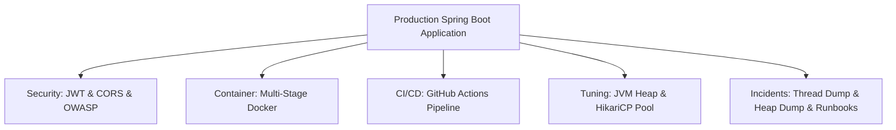
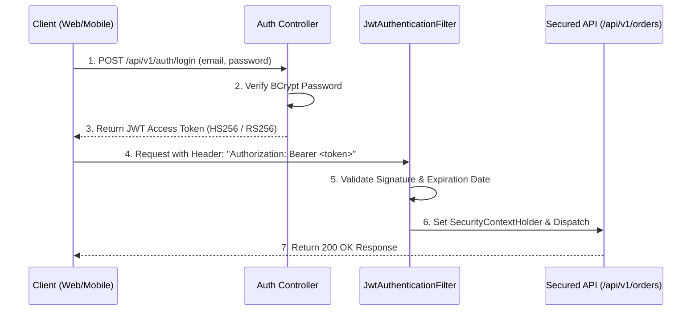

## 🚀 Level 5 — Production, Security, Docker & Troubleshooting
### (Production Hardening, Containerization, CI/CD Pipelines, JVM Performance & Incident Troubleshooting)

---

## 📌 ၁။ Level 5 ၏ ရည်ရွယ်ချက်နှင့် အဓိက အနှစ်သာရ

Developer တစ်ယောက်အနေဖြင့် Localhost တွင် Code ရေးသား Run နိုင်ရုံဖြင့် မလုံလောက်ပါ။ နေ့ညမပြတ် User သန်းချီ အသုံးပြုနေသော **Mission-Critical Production Systems** များကို လုံခြုံ၊ တည်ငြိမ်၊ မြန်ဆန်စွာ Deploy ပြုလုပ်နိုင်ပြီး ပြဿနာဖြစ်ပေါ်ပါက ချက်ချင်း ဖြေရှင်းနိုင်သော **Working-Level Senior Experience** လိုအပ်ပါသည်။

Level 5 တွင် လေ့လာမည့် အဓိက ကဏ္ဍ ၅ ရပ်:
1. **Production Security Architecture** (Stateless JWT, BCrypt, CORS, OWASP Top 10)
2. **Containerization with Multi-Stage Dockerfile** (Alpine JRE & Non-root User)
3. **CI/CD Automation with GitHub Actions** (Automated Test, Build & Container Deployment)
4. **JVM & Database Connection Pool Performance Tuning** (Heap Memory & HikariCP Formula)
5. **Production Incident Troubleshooting (障害対応 Runbooks)** (Thread Dumps, Deadlocks & Heap Dumps)



---

## 🔒 ၂။ Production Security Architecture (Spring Security + JWT)

### ၂.၁ Stateless JWT Authentication Pipeline



### ၂.၂ Production CORS Configuration

Cross-Origin Resource Sharing (CORS) ကို လုံခြုံစွာ ခွင့်ပြုပေးရန် Configuration Bean တည်ဆောက်ခြင်း:

```java
package com.learnstack.config;

import org.springframework.context.annotation.Bean;
import org.springframework.context.annotation.Configuration;
import org.springframework.web.cors.CorsConfiguration;
import org.springframework.web.cors.UrlBasedCorsConfigurationSource;
import org.springframework.web.filter.CorsFilter;

import java.util.List;

@Configuration
public class CorsConfig {

    @Bean
    public CorsFilter corsFilter() {
        CorsConfiguration config = new CorsConfiguration();
        // Production တွင် မည်သည့် Domain များကိုသာ ခွင့်ပြုမည်ကို အတိအကျ သတ်မှတ်ရပါမည်
        config.setAllowedOrigins(List.of("https://app.learnstack.dev", "https://admin.learnstack.dev"));
        config.setAllowedMethods(List.of("GET", "POST", "PUT", "DELETE", "PATCH", "OPTIONS"));
        config.setAllowedHeaders(List.of("Authorization", "Content-Type", "X-Requested-With"));
        config.setAllowCredentials(true);
        config.setMaxAge(3600L); // 1 Hour Preflight Caching

        UrlBasedCorsConfigurationSource source = new UrlBasedCorsConfigurationSource();
        source.registerCorsConfiguration("/**", config);
        return new CorsFilter(source);
    }
}
```

---

## 🐳 ၃။ Multi-Stage Dockerfile (Production Hardening)

Single-stage Dockerfile များသည် Source Code နှင့် Maven Cache များပါဝင်သဖြင့် အရွယ်အစား ကြီးမားတတ်ပါသည် (500MB+)။ Multi-stage ကို အသုံးပြုပါက JRE သာပါဝင်သဖြင့် **150MB အောက်သာ ရှိပြီး အလွန်လုံခြုံမြန်ဆန်ပါသည်**:

```dockerfile
# -------------------------------------------------------------
# Stage 1: Build the Application JAR using Maven
# -------------------------------------------------------------
FROM maven:3.9.6-eclipse-temurin-21-alpine AS builder
WORKDIR /build

# Cache dependencies first (Docker Layer Caching)
COPY pom.xml .
RUN mvn dependency:go-offline -B

# Copy source code and package
COPY src ./src
RUN mvn clean package -DskipTests

# -------------------------------------------------------------
# Stage 2: Minimalist Lightweight Production Runtime Image
# -------------------------------------------------------------
FROM eclipse-temurin:21-jre-alpine AS runner
WORKDIR /app

# Security: Root user ဖြင့် မ run ဘဲ Unprivileged User အသစ်ဆောက်ခြင်း
RUN addgroup -S springgroup && adduser -S springuser -G springgroup

# Copy compiled JAR from Stage 1 builder
COPY --from=builder /build/target/*.jar app.jar
RUN chown -R springuser:springgroup /app

# Run as non-root user
USER springuser

# Default Spring Boot Port
EXPOSE 8080

# Production JVM Flags
ENTRYPOINT ["java", \
  "-XX:+UseContainerSupport", \
  "-XX:MaxRAMPercentage=75.0", \
  "-XX:+UseG1GC", \
  "-Djava.security.egd=file:/dev/./urandom", \
  "-jar", "app.jar"]
```

---

## 🔄 ၄။ CI/CD Pipeline Automation (GitHub Actions)

Code push သို့မဟုတ် Pull Request လုပ်တိုင်း အလိုအလျောက် Test စစ်ဆေးပြီး Docker Image တည်ဆောက်ပေးသည့် Workflow (`.github/workflows/deploy.yml`):

```yaml
name: Java CI/CD Production Pipeline

on:
  push:
    branches: [ main ]
  pull_request:
    branches: [ main ]

jobs:
  build-and-test:
    runs-on: ubuntu-latest
    steps:
      - name: Checkout Source Code
        uses: actions/checkout@v4

      - name: Set up JDK 21
        uses: actions/setup-java@v4
        with:
          java-version: '21'
          distribution: 'temurin'
          cache: maven

      - name: Run Unit & Integration Tests
        run: mvn clean test

      - name: Build Executable JAR
        run: mvn package -DskipTests

      - name: Build Docker Image
        run: docker build -t learnstack/backend-api:latest .
```

---

## ⚙️ ၅။ Performance Tuning: JVM Heap & HikariCP Formula

### ၅.၁ JVM Heap Parameters
- `-Xms`: Application စတင်ချိန်တွင် JVM စတင်ယူမည့် Initial Heap Size (ဥပမာ: `-Xms2g`)။
- `-Xmx`: Application တက်ရောက်နိုင်သည့် အမြင့်ဆုံး Max Heap Size (ဥပမာ: `-Xmx2g`)။
- **Production Tip**: Enterprise Server များတွင် Memory Allocation Resizing Overhead မဖြစ်ပေါ်စေရန် `-Xms` နှင့် `-Xmx` ကို **အရွယ်အစား တူညီစွာ ထားရှိရပါသည်**။

### ၅.၂ HikariCP Database Connection Pool Sizing Formula

> [!IMPORTANT]
> **အထင်မှားမှု (Common Myth)**: Connection များများဖွင့်ထားလေ (ဥပမာ: 200 connections) Database ပိုမြန်လေဟု ထင်တတ်ကြသည်။
> လက်တွေ့တွင် CPU Core အရေအတွက်ထက် များလွန်းပါက CPU Context Switching ဖြစ်ပြီး Database ပိုမို နှေးကွေးသွားတတ်ပါသည်။

PostgreSQL / MySQL ပညာရှင်များ သတ်မှတ်ထားသော တရားဝင် Formula:
$$\text{Pool Size} = (\text{CPU Cores} \times 2) + \text{Effective Spindle Count}$$

ဥပမာ: 4-Core CPU ရှိသော Database Server အတွက်:
$$\text{Pool Size} = (4 \times 2) + 1 = 9 \text{ မှ } 10 \text{ connections သာ အကောင်းဆုံး ဖြစ်သည်!}$$

```yaml
# application-prod.yml
spring:
  datasource:
    hikari:
      maximum-pool-size: 15
      minimum-idle: 5
      connection-timeout: 30000 # 30 Seconds
      idle-timeout: 600000      # 10 Minutes
      max-lifetime: 1800000     # 30 Minutes
```

---

## 🚨 ၆။ Production Incident Troubleshooting (障害対応 Runbooks)

### ၆.၁ CPU 100% သို့မဟုတ် Thread Deadlock ဖြစ်ပွားပါက (Thread Dump)

Application ရုတ်တရက် freeze ဖြစ်သွားပါက Thread များ တစ်ခုနှင့်တစ်ခု Lock စောင့်ဆိုင်းနေသော **Deadlock** ဖြစ်နိုင်ပါသည်:

```bash
# 1. Java Process ID ကို ရှာဖွေပါ
jps -l
# သို့မဟုတ်: ps aux | grep java

# 2. Thread Dump ထုတ်ယူပါ (PID: 1234)
jstack 1234 > /tmp/thread_dump.txt

# 3. Deadlock ရှာဖွေပါ
grep -A 10 "Found one Java-level deadlock" /tmp/thread_dump.txt
```

### ၆.၂ `java.lang.OutOfMemoryError: Java heap space` ဖြေရှင်းနည်း (Heap Dump)

Memory Leak ဖြစ်ပေါ်ပြီး Heap ပြည့်သွားပါက မည်သည့် Object များ မလိုအပ်ဘဲ နေရာယူနေသည်ကို သိရှိရန်:

```bash
# Production JVM တွင် OutOfMemoryError ဖြစ်ပါက အလိုအလျောက် Dump ထုတ်ရန် ထည့်သွင်းထားရမည့် Flag:
-XX:+HeapDumpOnOutOfMemoryError -XX:HeapDumpPath=/var/log/heap_dump.hprof

# သို့မဟုတ် Manual Dump ထုတ်ယူခြင်း:
jcmd <PID> GC.heap_dump /var/log/manual_heap_dump.hprof
```

👉 ထွက်ပေါ်လာသော `.hprof` ဖိုင်ကို **Eclipse Memory Analyzer Tool (MAT)** သို့မဟုတ် **IntelliJ Profiler** တွင် ဖွင့်လှစ်ပြီး **"Leak Suspects Report"** ကို ကြည့်ရှုကာ Memory စားနေသော Class ကို ချက်ချင်း ဖော်ထုတ်နိုင်ပါသည်။

---

## 🎯 ၇။ အနှစ်ချုပ် (Summary Checklist)

- [x] Stateless JWT Pipeline ဖြင့် လုံခြုံသော Authentication စနစ် တည်ဆောက်နိုင်ခြင်း။
- [x] Multi-stage Dockerfile ဖြင့် Alpine JRE နှင့် Non-root User သုံးပြီး Image Size ကို 150MB အထိ လျှော့ချတတ်ခြင်း။
- [x] GitHub Actions CI/CD Pipeline ဖြင့် Automated Testing & Container Build ပြုလုပ်နိုင်ခြင်း။
- [x] Formula အတိုင်း သင့်လျော်သော HikariCP Connection Pool Size ကို တွက်ချက်သတ်မှတ်နိုင်ခြင်း။
- [x] Production တွင် `jstack` ဖြင့် Thread Deadlock နှင့် `jcmd` ဖြင့် OutOfMemory Heap Dump များကို စနစ်တကျ စစ်ဆေးဖြေရှင်းတတ်ခြင်း (障害対応 Runbooks)။
