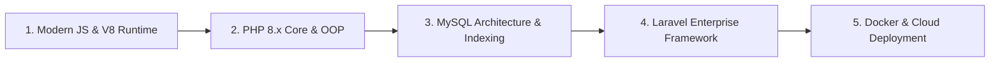
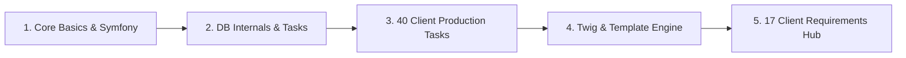
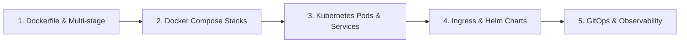
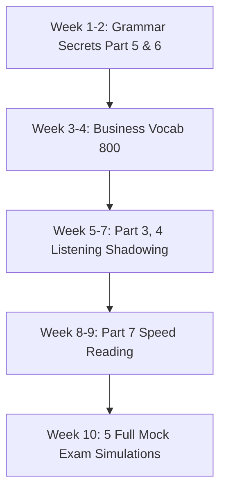
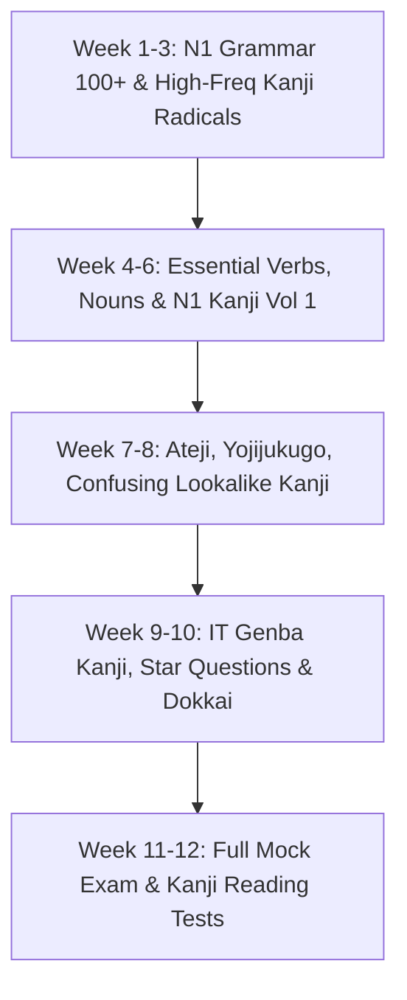
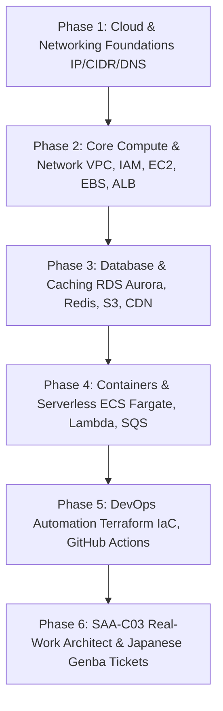
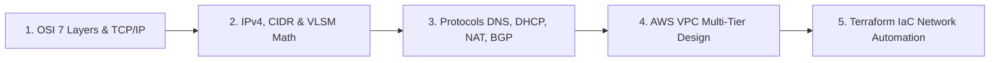
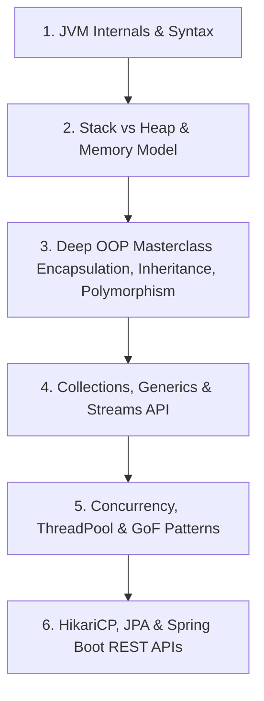

  

    LearnStack ၏ သင်ရိုးညွှန်းတမ်းများကို အခြေခံမှ စတင်၍ Senior Engineer အဆင့်ထိ စနစ်တကျ လေ့လာနိုင်မည့် အထူးပြု Career Roadmaps များ ဖြစ်ပါသည်။
  

---

## 🗺️ Roadmap 1: Full-Stack Web Developer (PHP 8 + Modern JS + Laravel + MySQL)

ကမ္ဘာသုံး Web Application များနှင့် Enterprise API များကို စတင်တည်ဆောက်နိုင်မည့် အဓိက လမ်းကြောင်း:

### အဆင့်ဆင့် လေ့လာရမည့် အစီအစဉ်:
1. **Frontend & Runtime Core**: [Modern JavaScript Track](/javascript/00_overview/) မှ ES6+, Closures, Async/Await, DOM Manipulation နှင့် Event Loop ကို အရင်ဆုံး ကျွမ်းကျင်အောင် လေ့ကျင့်ပါ။
2. **Backend Fundamentals**: [PHP Core & Design Patterns Track](/php/00_overview/) မှ PHP 8.x Features, OOP Architecture, MVC Pattern နှင့် Database PDO ဆက်သွယ်မှုများကို လေ့လာပါ။
3. **Database Engineering**: [MySQL Production Database Track](/mysql/00_overview/) မှ InnoDB Engine, B-Tree Indexing, EXPLAIN Query Plan နှင့် ACID Transactions များကို စနစ်တကျ ရေးဆွဲပါ။
4. **Enterprise Framework**: [Laravel Track](/laravel/00_overview/) မှ Service Container, Eloquent ORM, Sanctum RESTful API, Redis Caching နှင့် Async Queues များကို လေ့လာပါ။
5. **Containerization**: [Docker & DevOps Track](/devops/00_overview/) ဖြင့် LEMP Production Stack ပြင်ဆင်ပြီး Cloud ပေါ်သို့ တင်ပါ။

---

## 🛍️ Roadmap 2: Japanese E-Commerce Specialist (EC-CUBE 4 + Symfony)

ဂျပန်နိုင်ငံ နံပါတ် ၁ E-Commerce CMS ဖြစ်သော EC-CUBE ဖြင့် ဂျပန် IT ပရောဂျက်များတွင် အလုပ်လုပ်နိုင်မည့် လမ်းကြောင်း:

### အဆင့်ဆင့် လေ့လာရမည့် အစီအစဉ် (5 Stages):
1. **Prerequisites & Core Architecture**: [PHP OOP](/php/04_oop_and_objects/) နှင့် [EC-CUBE Architecture Overview](/eccube/00_overview/) မှ Symfony Controller, Doctrine ORM, DI Container ကို လေ့လာပါ။
2. **Work Tasks & Database Internals**: [Work Tasks & Database Architecture](/eccube/10_work_tasks_and_database/readme/) မှ Product, Checkout, Order, Delivery, Payment သံသရာနှင့် `PurchaseFlow` Engine ကို မျက်စိထဲ မြင်အောင် ကြည့်ပါ။
3. **40 Real-World Client Tasks**: [40 Client Tasks Complete Index](/eccube/02_client_tasks/01_display_product_code/) တွင် ဂျပန် Client များ အပ်နှံလေ့ရှိသော Task ၄၀ ကျော် (Delivery Fee Zero, Point Rules, Multi-tax, CSV Export) ကို လက်တွေ့ ဖြေရှင်းပါ။
4. **Twig & Template Design Customization**: [Template Engine & UI/UX Optimization](/eccube/09_template_design/00-course-overview-and-roadmap/01-course-overview-and-roadmap/) ဖြင့် Layout Frame နှင့် Twig Blocks များကို လေ့လာပါ။
5. **17 Client Requirements Master Hub**: [17 Client Requirements Master Hub](/eccube/requirements/readme/) တွင် Order, Payment, Shipping, Search/Filter, Wishlist, LINE Marketing, Security, Performance စသည့် မော်ဂျူး ၁၇ ခုကို လက်တွေ့ တည်ဆောက်ပါ။

---

## 🐳 Roadmap 3: Cloud & DevOps Infrastructure (Docker + Kubernetes + CI/CD)

Modern Microservices, Container Orchestration နှင့် Production Observability လမ်းကြောင်း:

### အဆင့်ဆင့် လေ့လာရမည့် အစီအစဉ်:
1. **Containers**: [Docker Fundamentals & Architecture](/devops/01_docker_core/01-docker-fundamentals-and-architecture/) မှ စတင်၍ Multi-stage build များဖြင့် ပေါ့ပါးသော Image များ တည်ဆောက်ပါ။
2. **Local Multi-service**: [Docker Compose Mastery](/devops/02_kubernetes_and_cloud/07_docker_compose_mastery/) ဖြင့် Nginx, PHP-FPM, MySQL, Redis, Mailpit ဝန်ဆောင်မှုများကို ချိတ်ဆက်ပါ။
3. **Orchestration**: [Kubernetes Pods & Declarative YAML](/devops/02_kubernetes_and_cloud/12_pods_and_declarative_yaml/) မှ Deployments, Services, ConfigMaps, Persistent Volumes များကို စီမံပါ။
4. **Production Readiness**: Helm Package Manager, Ingress Controllers, GitOps နှင့် Monitoring Stacks များကို လေ့လာပါ။

---

## 🎯 Roadmap 4: TOEIC 800+ 10-Week Fast-Track

ဂျပန်နိုင်ငံနှင့် နိုင်ငံတကာ IT ကုမ္ပဏီများတွင် ရာထူးတိုးနှင့် လစာတိုးအတွက် မဖြစ်မနေ လိုအပ်သော TOEIC 800+ ရမှတ် ရရှိစေမည့် Roadmap:

### အဓိက အဆင့်များ:
1. **Week 1 - 2**: [Score Breakdown & Test Strategy](/toeic/00_study_plan_roadmap/01_score_breakdown_and_strategy/) ကို ကြည့်ပြီး ၁၀ စက္ကန့် သဒ္ဒါ လျှို့ဝှက်ချက်များကို လေ့လာပါ။
2. **Week 3 - 4**: လုပ်ငန်းခွင်သုံး Essential Vocabulary 800 စာရင်းနှင့် Collocations များကို အလွတ်ကျက်ပါ။
3. **Week 5 - 7**: Listening Dialogue Scripts များကို Shadowing (အသံနှင့် တစ်ပြိုင်နက် ရွတ်ဆိုလေ့ကျင့်ခြင်း) ပြုလုပ်ပါ။
4. **Week 8 - 9**: Part 7 Triple Passages များကို အချိန်တိုင်းတာ၍ Paraphrasing ရှာဖွေဖတ်ရှုပါ။
5. **Week 10**: Real Exam Full Mock Tests ၂ နာရီ မနားတမ်း စာမေးပွဲပုံစံအတိုင်း ၅ ကြိမ် ဖြေဆိုပါ။

---

## ⛩️ Roadmap 5: JLPT N1 12-Week Strategic Roadmap (Grammar, Vocab & Kanji)

ဂျပန်နိုင်ငံရှိ ထိပ်တန်း IT ကုမ္ပဏီများနှင့် လုပ်ငန်းခွင်များတွင် အဆင့်မြင့် စာချုပ်စာတမ်းများနှင့် ပညာရပ်ဆိုင်ရာ ကျွမ်းကျင်မှုကို အသိအမှတ်ပြုသော JLPT N1 အောင်မြင်ရေး Roadmap:

### အဓိက အဆင့်များ:
1. **Week 1 - 3**: [N1 Grammar Mastery 7 Modules](/japanese-grammar/01_n1_grammar_mastery/01_time_relationship_and_simultaneity/) ရှိ သဒ္ဒါ ၁၀၀ ကျော်နှင့် [N1 Kanji Strategy & Radicals](/japanese-kanji/00_n1_kanji_overview_and_strategy/) ကို အခြေခံမှ စတင်လေ့လာပါ။
2. **Week 4 - 6**: [High-Frequency N1 Verbs](/japanese-vocab/01_high_frequency_verbs/)၊ [Nouns](/japanese-vocab/02_high_frequency_nouns_and_concepts/) နှင့် [High-Frequency N1 Kanji Vol 1](/japanese-kanji/01_high_frequency_n1_kanji_vol1/) ရှိ စာမေးပွဲသုံး စကားလုံးများနှင့် Onyomi/Kunyomi များကို Romaji ဖြင့် အသံထွက်ကျက်မှတ်ပါ။
3. **Week 7 - 8**: [Confusing Similar Radicals & Lookalike Kanji](/japanese-kanji/05_confusing_similar_radicals_and_lookalikes/)၊ [Ateji & Yojijukugo](/japanese-kanji/06_ateji_special_readings_and_yojijukugo/) နှင့် [Vocab Synonyms](/japanese-vocab/06_confusing_words_nuance_and_synonyms/) ကို နှိုင်းယှဉ်ခွဲခြားလေ့လာပါ။
4. **Week 9 - 10**: [Japanese IT Genba Kanji](/japanese-kanji/07_japanese_workplace_and_it_genba_kanji/)၊ [Star Questions (★ 星付き問題)](/japanese-grammar/02_n1_real_exam_grammar_practice/02_n1_sentence_composition_star_questions/) နှင့် Dokkai စာဖတ်စွမ်းရည်များကို အချိန် ၁ ပုဒ်လျှင် ၁ မိနစ်နှုန်းဖြင့် လေ့ကျင့်ပါ။
5. **Week 11 - 12**: [Kanji Real Exam Reading Test 1 & 2](/japanese-kanji/08_n1_kanji_real_exam_reading_test1/)၊ [Grammar Simulation Test](/japanese-grammar/02_n1_real_exam_grammar_practice/01_n1_grammar_exam_simulation_test1/) နှင့် စာမေးပွဲအစစ် Past Papers များကို မိနစ် ၁၁၀ အချိန်သတ်မှတ်ကာ ဖြေဆိုလေ့ကျင့်ပါ။

---

## ☁️ Roadmap 6: AWS Cloud Solutions Architect & Production DevOps Engineer Roadmap

လုပ်ငန်းခွင်သုံး Enterprise Cloud Infrastructure တည်ဆောက်ခြင်း၊ Automation နှင့် AWS Certified Solutions Architect - Associate (SAA-C03) အောင်မြင်ရေးအတွက် ပြည့်စုံသော Roadmap:

### အဓိက အဆင့်များ:
1. **Week 1 - 2**: [Networking & Security Foundations](/aws/01_networking_and_security/01_ip_addressing_and_ports/) ရှိ IP, Subnetting, CIDR, TCP/UDP, DNS, HTTP/S နှင့် Security Groups/NACL ကွာခြားချက်များကို လက်တွေ့လေ့လာပါ။
2. **Week 3 - 4**: [Level 1-3 Labs](/aws/02_beginner_to_advanced_real_work/02_level2_iam_vpc_ec2_ebs/) မှတစ်ဆင့် Multi-AZ VPC၊ Public/Private Subnets၊ NAT Gateway၊ EC2 Auto Scaling နှင့် ALB (Application Load Balancer) ဖွဲ့စည်းမှုကို တည်ဆောက်ပါ။
3. **Week 5 - 6**: [Level 4-5 Labs](/aws/02_beginner_to_advanced_real_work/04_level4_rds_aurora_elasticache_redis/) ရှိ Multi-AZ RDS MySQL၊ Aurora Cluster၊ ElastiCache Redis နှင့် Dockerized ECS Fargate Container Deployment ကို Hands-on လေ့ကျင့်ပါ။
4. **Week 7 - 8**: [Level 6-9 Labs](/aws/02_beginner_to_advanced_real_work/06_level6_lambda_apigateway_dynamodb/) မှတစ်ဆင့် Serverless (Lambda + API Gateway + DynamoDB)၊ Event-Driven SQS/SNS နှင့် Terraform IaC အသုံးပြု၍ Infrastructure အားလုံးကို Code ဖြင့် အလိုအလျောက် Deploy ပြုလုပ်ပါ။
5. **Week 9 - 10**: [Japanese Workplace IT Tickets](/aws/02_beginner_to_advanced_real_work/11_level11_japanese_workplace_it_and_tickets/) (လက်တွေ့ လုပ်ငန်းခွင်သုံး 障害対応 မေးခွန်း ၂၅ ခု) နှင့် [Troubleshooting Runbook](/aws/02_beginner_to_advanced_real_work/12_level12_production_troubleshooting_runbook/) ကို အသုံးပြု၍ Production Incident ဖြေရှင်းနည်းများကို လေ့ကျင့်ပါ။
6. **Week 11 - 12**: [SAA Solutions Architect Phases](/aws/03_saa_solutions_architect_real_work/00_phase0_foundations_cloud_networking_linux/) နှင့် [SAA-C03 Practice Exams 01-07](/aws/04_saa_c03_practice_exams/exam_set_01_security_iam/) စာမေးပွဲမေးခွန်းများကို မြန်မာလို အသေးစိတ်ရှင်းလင်းချက်များနှင့်အတူ ဖြေဆိုအောင်မြင်အောင် ပြင်ဆင်ပါ။

---

## 🌐 Roadmap 7: Enterprise Networking & Cloud Infrastructure Automation

ကွန်ရက်အခြေခံ သဘောတရားများ၊ Packet Flow၊ CIDR/VLSM တွက်ချက်နည်းများမှသည် AWS Production VPC နှင့် Terraform IaC ဖြင့် အလိုအလျောက် တည်ဆောက်ခြင်း အထိ:

### အဓိက အဆင့်များ:
1. **Stage 1**: [OSI 7 Layers vs TCP/IP Suite](/networking/01_osi_model_and_tcp_ip_layers/) မှတစ်ဆင့် Data Encapsulation, Packet Headers, 3-Way Handshake နှင့် MTU သဘောတရားများကို လေ့လာပါ။
2. **Stage 2**: [IPv4 Subnetting & VLSM Calculation](/networking/02_ip_addressing_subnetting_cidr_vlsm/) တွင် Subnet Mask၊ Slash Notation (/16 to /32) နှင့် Largest-to-Smallest Host Requirement အလိုက် ခွဲခြမ်းတွက်ချက်နည်းကို လက်တွေ့လေ့ကျင့်ပါ။
3. **Stage 3**: [Core Network Protocols & Services](/networking/03_core_network_protocols_dns_dhcp_nat_bgp/) မှတစ်ဆင့် Recursive DNS Resolution၊ DHCP DORA၊ Source/Destination NAT နှင့် BGP Routing ကို နားလည်အောင် လေ့လာပါ။
4. **Stage 4**: [AWS Cloud Networking Architecture](/networking/04_aws_cloud_networking_architecture/) တွင် Multi-AZ Production VPC၊ Route Tables၊ NAT Gateways နှင့် Security Groups / NACLs Defense-in-Depth ကို ဒီဇိုင်းဆွဲပါ။
5. **Stage 5**: [Terraform IaC VPC Automation Lab](/networking/05_terraform_iac_vpc_automation_lab/) ဖြင့် Multi-Tier VPC အားလုံးကို Code ဖြင့် Declarative နည်းလမ်းဖြင့် Deploy ပြုလုပ်ပါ။

---

## ☕ Roadmap 8: Enterprise Java & Spring Boot Backend Engineer (0 to 4-Year Mid/Senior)

Java Core, JVM Memory Model, အဆင့်မြင့် OOP, Concurrency နှင့် Spring Boot Enterprise Microservices တည်ဆောက်နိုင်မည့် ပြည့်စုံသော Roadmap:

### အဓိက အဆင့်များ:
1. **Stage 1 (Foundations & Memory)**: [Java Basics & JVM Architecture](/java/01_java_basics_and_syntax/) နှင့် [Methods, Stack vs Heap & Pass-by-Value](/java/02_methods_and_memory_stack_heap/) ကို စတင်လေ့လာပါ။
2. **Stage 2 (OOP Masterclass)**: [Constructors & Object Lifecycle](/java/03_oop_classes_objects_constructors/)၊ [Encapsulation & Records](/java/04_oop_encapsulation_access_modifiers/)၊ [Inheritance & Polymorphism](/java/05_oop_inheritance_and_polymorphism/) နှင့် [Interfaces & Abstraction](/java/06_oop_abstraction_and_interfaces/) ကို လက်တွေ့ Production Code နမူနာများဖြင့် ကျွမ်းကျင်အောင် တည်ဆောက်ပါ။
3. **Stage 3 (Core Collections & Modern Java)**: [SCP & Wrapper Caching](/java/07_strings_and_wrapper_classes/)၊ [Exception Handling](/java/08_exception_handling_best_practices/)၊ [Collections Deep Dive (HashMap Internals)](/java/09_collections_framework_deep_dive/)၊ [Generics & PECS Rule](/java/10_generics_and_type_safety/) နှင့် [Lambdas & Stream Pipelines](/java/11_java8_lambdas_and_streams/) ကို လေ့လာပါ။
4. **Stage 4 (Enterprise Architecture & Concurrency)**: [Multithreading & Concurrency](/java/12_multithreading_and_concurrency/) (Thread Pools, Race Conditions, CompletableFuture)၊ [GoF Design Patterns](/java/13_design_patterns_in_java/) နှင့် [Database (HikariCP, JPA) & Spring Boot Architecture](/java/14_enterprise_database_and_spring_boot/) သို့ တက်လှမ်းပါ။

